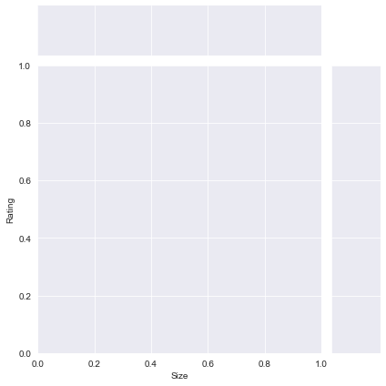

```python
import pandas as pd
```


```python
import numpy as np
```


```python
gp = pd.read_csv('googleplaystore.csv')
gp
```


<div>
<style scoped>
    .dataframe tbody tr th:only-of-type {
        vertical-align: middle;
    }

    .dataframe tbody tr th {
        vertical-align: top;
    }

    .dataframe thead th {
        text-align: right;
    }
</style>
<table border="1" class="dataframe">
  <thead>
    <tr style="text-align: right;">
      <th></th>
      <th>App</th>
      <th>Category</th>
      <th>Rating</th>
      <th>Reviews</th>
      <th>Size</th>
      <th>Installs</th>
      <th>Type</th>
      <th>Price</th>
      <th>Content Rating</th>
      <th>Genres</th>
      <th>Last Updated</th>
      <th>Current Ver</th>
      <th>Android Ver</th>
    </tr>
  </thead>
  <tbody>
    <tr>
      <th>0</th>
      <td>Photo Editor &amp; Candy Camera &amp; Grid &amp; ScrapBook</td>
      <td>ART_AND_DESIGN</td>
      <td>4.1</td>
      <td>159</td>
      <td>19M</td>
      <td>10,000+</td>
      <td>Free</td>
      <td>0</td>
      <td>Everyone</td>
      <td>Art &amp; Design</td>
      <td>January 7, 2018</td>
      <td>1.0.0</td>
      <td>4.0.3 and up</td>
    </tr>
    <tr>
      <th>1</th>
      <td>Coloring book moana</td>
      <td>ART_AND_DESIGN</td>
      <td>3.9</td>
      <td>967</td>
      <td>14M</td>
      <td>500,000+</td>
      <td>Free</td>
      <td>0</td>
      <td>Everyone</td>
      <td>Art &amp; Design;Pretend Play</td>
      <td>January 15, 2018</td>
      <td>2.0.0</td>
      <td>4.0.3 and up</td>
    </tr>
    <tr>
      <th>2</th>
      <td>U Launcher Lite – FREE Live Cool Themes, Hide ...</td>
      <td>ART_AND_DESIGN</td>
      <td>4.7</td>
      <td>87510</td>
      <td>8.7M</td>
      <td>5,000,000+</td>
      <td>Free</td>
      <td>0</td>
      <td>Everyone</td>
      <td>Art &amp; Design</td>
      <td>August 1, 2018</td>
      <td>1.2.4</td>
      <td>4.0.3 and up</td>
    </tr>
    <tr>
      <th>3</th>
      <td>Sketch - Draw &amp; Paint</td>
      <td>ART_AND_DESIGN</td>
      <td>4.5</td>
      <td>215644</td>
      <td>25M</td>
      <td>50,000,000+</td>
      <td>Free</td>
      <td>0</td>
      <td>Teen</td>
      <td>Art &amp; Design</td>
      <td>June 8, 2018</td>
      <td>Varies with device</td>
      <td>4.2 and up</td>
    </tr>
    <tr>
      <th>4</th>
      <td>Pixel Draw - Number Art Coloring Book</td>
      <td>ART_AND_DESIGN</td>
      <td>4.3</td>
      <td>967</td>
      <td>2.8M</td>
      <td>100,000+</td>
      <td>Free</td>
      <td>0</td>
      <td>Everyone</td>
      <td>Art &amp; Design;Creativity</td>
      <td>June 20, 2018</td>
      <td>1.1</td>
      <td>4.4 and up</td>
    </tr>
    <tr>
      <th>...</th>
      <td>...</td>
      <td>...</td>
      <td>...</td>
      <td>...</td>
      <td>...</td>
      <td>...</td>
      <td>...</td>
      <td>...</td>
      <td>...</td>
      <td>...</td>
      <td>...</td>
      <td>...</td>
      <td>...</td>
    </tr>
    <tr>
      <th>10836</th>
      <td>Sya9a Maroc - FR</td>
      <td>FAMILY</td>
      <td>4.5</td>
      <td>38</td>
      <td>53M</td>
      <td>5,000+</td>
      <td>Free</td>
      <td>0</td>
      <td>Everyone</td>
      <td>Education</td>
      <td>July 25, 2017</td>
      <td>1.48</td>
      <td>4.1 and up</td>
    </tr>
    <tr>
      <th>10837</th>
      <td>Fr. Mike Schmitz Audio Teachings</td>
      <td>FAMILY</td>
      <td>5.0</td>
      <td>4</td>
      <td>3.6M</td>
      <td>100+</td>
      <td>Free</td>
      <td>0</td>
      <td>Everyone</td>
      <td>Education</td>
      <td>July 6, 2018</td>
      <td>1.0</td>
      <td>4.1 and up</td>
    </tr>
    <tr>
      <th>10838</th>
      <td>Parkinson Exercices FR</td>
      <td>MEDICAL</td>
      <td>NaN</td>
      <td>3</td>
      <td>9.5M</td>
      <td>1,000+</td>
      <td>Free</td>
      <td>0</td>
      <td>Everyone</td>
      <td>Medical</td>
      <td>January 20, 2017</td>
      <td>1.0</td>
      <td>2.2 and up</td>
    </tr>
    <tr>
      <th>10839</th>
      <td>The SCP Foundation DB fr nn5n</td>
      <td>BOOKS_AND_REFERENCE</td>
      <td>4.5</td>
      <td>114</td>
      <td>Varies with device</td>
      <td>1,000+</td>
      <td>Free</td>
      <td>0</td>
      <td>Mature 17+</td>
      <td>Books &amp; Reference</td>
      <td>January 19, 2015</td>
      <td>Varies with device</td>
      <td>Varies with device</td>
    </tr>
    <tr>
      <th>10840</th>
      <td>iHoroscope - 2018 Daily Horoscope &amp; Astrology</td>
      <td>LIFESTYLE</td>
      <td>4.5</td>
      <td>398307</td>
      <td>19M</td>
      <td>10,000,000+</td>
      <td>Free</td>
      <td>0</td>
      <td>Everyone</td>
      <td>Lifestyle</td>
      <td>July 25, 2018</td>
      <td>Varies with device</td>
      <td>Varies with device</td>
    </tr>
  </tbody>
</table>
<p>10841 rows × 13 columns</p>
</div>


```python
gp_1 = gp.drop_duplicates()
print('Total number of apps in dataset = ', gp_1)

```

    Total number of apps in dataset =                                                       App             Category  \
    0         Photo Editor & Candy Camera & Grid & ScrapBook       ART_AND_DESIGN   
    1                                    Coloring book moana       ART_AND_DESIGN   
    2      U Launcher Lite – FREE Live Cool Themes, Hide ...       ART_AND_DESIGN   
    3                                  Sketch - Draw & Paint       ART_AND_DESIGN   
    4                  Pixel Draw - Number Art Coloring Book       ART_AND_DESIGN   
    ...                                                  ...                  ...   
    10836                                   Sya9a Maroc - FR               FAMILY   
    10837                   Fr. Mike Schmitz Audio Teachings               FAMILY   
    10838                             Parkinson Exercices FR              MEDICAL   
    10839                      The SCP Foundation DB fr nn5n  BOOKS_AND_REFERENCE   
    10840      iHoroscope - 2018 Daily Horoscope & Astrology            LIFESTYLE   
    
           Rating Reviews                Size     Installs  Type Price  \
    0         4.1     159                 19M      10,000+  Free     0   
    1         3.9     967                 14M     500,000+  Free     0   
    2         4.7   87510                8.7M   5,000,000+  Free     0   
    3         4.5  215644                 25M  50,000,000+  Free     0   
    4         4.3     967                2.8M     100,000+  Free     0   
    ...       ...     ...                 ...          ...   ...   ...   
    10836     4.5      38                 53M       5,000+  Free     0   
    10837     5.0       4                3.6M         100+  Free     0   
    10838     NaN       3                9.5M       1,000+  Free     0   
    10839     4.5     114  Varies with device       1,000+  Free     0   
    10840     4.5  398307                 19M  10,000,000+  Free     0   
    
          Content Rating                     Genres      Last Updated  \
    0           Everyone               Art & Design   January 7, 2018   
    1           Everyone  Art & Design;Pretend Play  January 15, 2018   
    2           Everyone               Art & Design    August 1, 2018   
    3               Teen               Art & Design      June 8, 2018   
    4           Everyone    Art & Design;Creativity     June 20, 2018   
    ...              ...                        ...               ...   
    10836       Everyone                  Education     July 25, 2017   
    10837       Everyone                  Education      July 6, 2018   
    10838       Everyone                    Medical  January 20, 2017   
    10839     Mature 17+          Books & Reference  January 19, 2015   
    10840       Everyone                  Lifestyle     July 25, 2018   
    
                  Current Ver         Android Ver  
    0                   1.0.0        4.0.3 and up  
    1                   2.0.0        4.0.3 and up  
    2                   1.2.4        4.0.3 and up  
    3      Varies with device          4.2 and up  
    4                     1.1          4.4 and up  
    ...                   ...                 ...  
    10836                1.48          4.1 and up  
    10837                 1.0          4.1 and up  
    10838                 1.0          2.2 and up  
    10839  Varies with device  Varies with device  
    10840  Varies with device  Varies with device  
    
    [10358 rows x 13 columns]
    


```python
print(gp_1.info)
```

    <bound method DataFrame.info of                                                      App             Category  \
    0         Photo Editor & Candy Camera & Grid & ScrapBook       ART_AND_DESIGN   
    1                                    Coloring book moana       ART_AND_DESIGN   
    2      U Launcher Lite – FREE Live Cool Themes, Hide ...       ART_AND_DESIGN   
    3                                  Sketch - Draw & Paint       ART_AND_DESIGN   
    4                  Pixel Draw - Number Art Coloring Book       ART_AND_DESIGN   
    ...                                                  ...                  ...   
    10836                                   Sya9a Maroc - FR               FAMILY   
    10837                   Fr. Mike Schmitz Audio Teachings               FAMILY   
    10838                             Parkinson Exercices FR              MEDICAL   
    10839                      The SCP Foundation DB fr nn5n  BOOKS_AND_REFERENCE   
    10840      iHoroscope - 2018 Daily Horoscope & Astrology            LIFESTYLE   
    
           Rating Reviews                Size     Installs  Type Price  \
    0         4.1     159                 19M      10,000+  Free     0   
    1         3.9     967                 14M     500,000+  Free     0   
    2         4.7   87510                8.7M   5,000,000+  Free     0   
    3         4.5  215644                 25M  50,000,000+  Free     0   
    4         4.3     967                2.8M     100,000+  Free     0   
    ...       ...     ...                 ...          ...   ...   ...   
    10836     4.5      38                 53M       5,000+  Free     0   
    10837     5.0       4                3.6M         100+  Free     0   
    10838     NaN       3                9.5M       1,000+  Free     0   
    10839     4.5     114  Varies with device       1,000+  Free     0   
    10840     4.5  398307                 19M  10,000,000+  Free     0   
    
          Content Rating                     Genres      Last Updated  \
    0           Everyone               Art & Design   January 7, 2018   
    1           Everyone  Art & Design;Pretend Play  January 15, 2018   
    2           Everyone               Art & Design    August 1, 2018   
    3               Teen               Art & Design      June 8, 2018   
    4           Everyone    Art & Design;Creativity     June 20, 2018   
    ...              ...                        ...               ...   
    10836       Everyone                  Education     July 25, 2017   
    10837       Everyone                  Education      July 6, 2018   
    10838       Everyone                    Medical  January 20, 2017   
    10839     Mature 17+          Books & Reference  January 19, 2015   
    10840       Everyone                  Lifestyle     July 25, 2018   
    
                  Current Ver         Android Ver  
    0                   1.0.0        4.0.3 and up  
    1                   2.0.0        4.0.3 and up  
    2                   1.2.4        4.0.3 and up  
    3      Varies with device          4.2 and up  
    4                     1.1          4.4 and up  
    ...                   ...                 ...  
    10836                1.48          4.1 and up  
    10837                 1.0          4.1 and up  
    10838                 1.0          2.2 and up  
    10839  Varies with device  Varies with device  
    10840  Varies with device  Varies with device  
    
    [10358 rows x 13 columns]>
    


```python
n = 5
gp_1.sample(n)
```


<div>
<style scoped>
    .dataframe tbody tr th:only-of-type {
        vertical-align: middle;
    }

    .dataframe tbody tr th {
        vertical-align: top;
    }

    .dataframe thead th {
        text-align: right;
    }
</style>
<table border="1" class="dataframe">
  <thead>
    <tr style="text-align: right;">
      <th></th>
      <th>App</th>
      <th>Category</th>
      <th>Rating</th>
      <th>Reviews</th>
      <th>Size</th>
      <th>Installs</th>
      <th>Type</th>
      <th>Price</th>
      <th>Content Rating</th>
      <th>Genres</th>
      <th>Last Updated</th>
      <th>Current Ver</th>
      <th>Android Ver</th>
    </tr>
  </thead>
  <tbody>
    <tr>
      <th>7712</th>
      <td>C.P. CERVANTES (TOBARRA)</td>
      <td>SOCIAL</td>
      <td>NaN</td>
      <td>0</td>
      <td>4.9M</td>
      <td>5+</td>
      <td>Free</td>
      <td>0</td>
      <td>Everyone</td>
      <td>Social</td>
      <td>July 24, 2018</td>
      <td>8.2</td>
      <td>4.0.3 and up</td>
    </tr>
    <tr>
      <th>7117</th>
      <td>C.B. Shop</td>
      <td>SHOPPING</td>
      <td>NaN</td>
      <td>19</td>
      <td>19M</td>
      <td>100+</td>
      <td>Free</td>
      <td>0</td>
      <td>Everyone</td>
      <td>Shopping</td>
      <td>May 9, 2017</td>
      <td>1.0.1</td>
      <td>4.0.3 and up</td>
    </tr>
    <tr>
      <th>9264</th>
      <td>EC Sampler</td>
      <td>PRODUCTIVITY</td>
      <td>NaN</td>
      <td>0</td>
      <td>30M</td>
      <td>1+</td>
      <td>Free</td>
      <td>0</td>
      <td>Everyone</td>
      <td>Productivity</td>
      <td>July 31, 2018</td>
      <td>1.4</td>
      <td>4.0.3 and up</td>
    </tr>
    <tr>
      <th>3954</th>
      <td>B-BLE(BLE4.0 Scan)</td>
      <td>TOOLS</td>
      <td>3.8</td>
      <td>159</td>
      <td>7.5M</td>
      <td>10,000+</td>
      <td>Free</td>
      <td>0</td>
      <td>Everyone</td>
      <td>Tools</td>
      <td>April 20, 2018</td>
      <td>5.5</td>
      <td>5.0 and up</td>
    </tr>
    <tr>
      <th>7641</th>
      <td>Co-op Taxi</td>
      <td>MAPS_AND_NAVIGATION</td>
      <td>3.4</td>
      <td>168</td>
      <td>53M</td>
      <td>10,000+</td>
      <td>Free</td>
      <td>0</td>
      <td>Everyone</td>
      <td>Maps &amp; Navigation</td>
      <td>May 1, 2018</td>
      <td>3.19.34</td>
      <td>5.0 and up</td>
    </tr>
  </tbody>
</table>
</div>


```python
gp_1.dtypes
```


    App                object
    Category           object
    Rating            float64
    Reviews            object
    Size               object
    Installs           object
    Type               object
    Price              object
    Content Rating     object
    Genres             object
    Last Updated       object
    Current Ver        object
    Android Ver        object
    dtype: object


```python
gp_1['Size'] = gp_1['Size'].str.strip('M')
gp_1['Category'] = gp_1['Category'].astype('str')
gp_1['Installs'] = gp_1['Installs'].astype('str')
gp_1['Price'] = gp_1['Price'].astype('str')


```


```python
gp_1
```


<div>
<style scoped>
    .dataframe tbody tr th:only-of-type {
        vertical-align: middle;
    }

    .dataframe tbody tr th {
        vertical-align: top;
    }

    .dataframe thead th {
        text-align: right;
    }
</style>
<table border="1" class="dataframe">
  <thead>
    <tr style="text-align: right;">
      <th></th>
      <th>App</th>
      <th>Category</th>
      <th>Rating</th>
      <th>Reviews</th>
      <th>Size</th>
      <th>Installs</th>
      <th>Type</th>
      <th>Price</th>
      <th>Content Rating</th>
      <th>Genres</th>
      <th>Last Updated</th>
      <th>Current Ver</th>
      <th>Android Ver</th>
    </tr>
  </thead>
  <tbody>
    <tr>
      <th>0</th>
      <td>Photo Editor &amp; Candy Camera &amp; Grid &amp; ScrapBook</td>
      <td>ART_AND_DESIGN</td>
      <td>4.1</td>
      <td>159</td>
      <td>19</td>
      <td>10000</td>
      <td>Free</td>
      <td>0</td>
      <td>Everyone</td>
      <td>Art &amp; Design</td>
      <td>January 7, 2018</td>
      <td>1.0.0</td>
      <td>4.0.3 and up</td>
    </tr>
    <tr>
      <th>1</th>
      <td>Coloring book moana</td>
      <td>ART_AND_DESIGN</td>
      <td>3.9</td>
      <td>967</td>
      <td>14</td>
      <td>500000</td>
      <td>Free</td>
      <td>0</td>
      <td>Everyone</td>
      <td>Art &amp; Design;Pretend Play</td>
      <td>January 15, 2018</td>
      <td>2.0.0</td>
      <td>4.0.3 and up</td>
    </tr>
    <tr>
      <th>2</th>
      <td>U Launcher Lite – FREE Live Cool Themes, Hide ...</td>
      <td>ART_AND_DESIGN</td>
      <td>4.7</td>
      <td>87510</td>
      <td>8.7</td>
      <td>5000000</td>
      <td>Free</td>
      <td>0</td>
      <td>Everyone</td>
      <td>Art &amp; Design</td>
      <td>August 1, 2018</td>
      <td>1.2.4</td>
      <td>4.0.3 and up</td>
    </tr>
    <tr>
      <th>3</th>
      <td>Sketch - Draw &amp; Paint</td>
      <td>ART_AND_DESIGN</td>
      <td>4.5</td>
      <td>215644</td>
      <td>25</td>
      <td>50000000</td>
      <td>Free</td>
      <td>0</td>
      <td>Teen</td>
      <td>Art &amp; Design</td>
      <td>June 8, 2018</td>
      <td>Varies with device</td>
      <td>4.2 and up</td>
    </tr>
    <tr>
      <th>4</th>
      <td>Pixel Draw - Number Art Coloring Book</td>
      <td>ART_AND_DESIGN</td>
      <td>4.3</td>
      <td>967</td>
      <td>2.8</td>
      <td>100000</td>
      <td>Free</td>
      <td>0</td>
      <td>Everyone</td>
      <td>Art &amp; Design;Creativity</td>
      <td>June 20, 2018</td>
      <td>1.1</td>
      <td>4.4 and up</td>
    </tr>
    <tr>
      <th>...</th>
      <td>...</td>
      <td>...</td>
      <td>...</td>
      <td>...</td>
      <td>...</td>
      <td>...</td>
      <td>...</td>
      <td>...</td>
      <td>...</td>
      <td>...</td>
      <td>...</td>
      <td>...</td>
      <td>...</td>
    </tr>
    <tr>
      <th>10836</th>
      <td>Sya9a Maroc - FR</td>
      <td>FAMILY</td>
      <td>4.5</td>
      <td>38</td>
      <td>53</td>
      <td>5000</td>
      <td>Free</td>
      <td>0</td>
      <td>Everyone</td>
      <td>Education</td>
      <td>July 25, 2017</td>
      <td>1.48</td>
      <td>4.1 and up</td>
    </tr>
    <tr>
      <th>10837</th>
      <td>Fr. Mike Schmitz Audio Teachings</td>
      <td>FAMILY</td>
      <td>5.0</td>
      <td>4</td>
      <td>3.6</td>
      <td>100</td>
      <td>Free</td>
      <td>0</td>
      <td>Everyone</td>
      <td>Education</td>
      <td>July 6, 2018</td>
      <td>1.0</td>
      <td>4.1 and up</td>
    </tr>
    <tr>
      <th>10838</th>
      <td>Parkinson Exercices FR</td>
      <td>MEDICAL</td>
      <td>NaN</td>
      <td>3</td>
      <td>9.5</td>
      <td>1000</td>
      <td>Free</td>
      <td>0</td>
      <td>Everyone</td>
      <td>Medical</td>
      <td>January 20, 2017</td>
      <td>1.0</td>
      <td>2.2 and up</td>
    </tr>
    <tr>
      <th>10839</th>
      <td>The SCP Foundation DB fr nn5n</td>
      <td>BOOKS_AND_REFERENCE</td>
      <td>4.5</td>
      <td>114</td>
      <td>Varies with device</td>
      <td>1000</td>
      <td>Free</td>
      <td>0</td>
      <td>Mature 17+</td>
      <td>Books &amp; Reference</td>
      <td>January 19, 2015</td>
      <td>Varies with device</td>
      <td>Varies with device</td>
    </tr>
    <tr>
      <th>10840</th>
      <td>iHoroscope - 2018 Daily Horoscope &amp; Astrology</td>
      <td>LIFESTYLE</td>
      <td>4.5</td>
      <td>398307</td>
      <td>19</td>
      <td>10000000</td>
      <td>Free</td>
      <td>0</td>
      <td>Everyone</td>
      <td>Lifestyle</td>
      <td>July 25, 2018</td>
      <td>Varies with device</td>
      <td>Varies with device</td>
    </tr>
  </tbody>
</table>
<p>10358 rows × 13 columns</p>
</div>


```python
conda install plotly
```

    Collecting package metadata (current_repodata.json): ...working... done
    Solving environment: ...working... done
    
    # All requested packages already installed.
    
    
    Note: you may need to restart the kernel to use updated packages.
    


```python
import plotly
plotly.offline.init_notebook_mode(connected=True)
import plotly.graph_objs as go
```


<script type="text/javascript">
window.PlotlyConfig = {MathJaxConfig: 'local'};
if (window.MathJax) {MathJax.Hub.Config({SVG: {font: "STIX-Web"}});}
if (typeof require !== 'undefined') {
require.undef("plotly");
requirejs.config({
    paths: {
        'plotly': ['https://cdn.plot.ly/plotly-latest.min']
    }
});
require(['plotly'], function(Plotly) {
    window._Plotly = Plotly;
});
}
</script>


```python
num_categories = len(gp_1['Category'].unique())
print('Number of categories = ', num_categories)

num_apps_in_category = gp_1['Category'].value_counts().sort_values(ascending = False)
```

    Number of categories =  34
    


```python

data = [go.Bar(
        x = num_apps_in_category.index, 
        y = num_apps_in_category.values, 
)]

plotly.offline.iplot(data)
```


<div>


            <div id="95140df5-ab3b-425f-94dd-4f585058d13d" class="plotly-graph-div" style="height:525px; width:100%;"></div>
            <script type="text/javascript">
                require(["plotly"], function(Plotly) {
                    window.PLOTLYENV=window.PLOTLYENV || {};

                if (document.getElementById("95140df5-ab3b-425f-94dd-4f585058d13d")) {
                    Plotly.newPlot(
                        '95140df5-ab3b-425f-94dd-4f585058d13d',
                        [{"type": "bar", "x": ["FAMILY", "GAME", "TOOLS", "BUSINESS", "MEDICAL", "PRODUCTIVITY", "PERSONALIZATION", "LIFESTYLE", "COMMUNICATION", "FINANCE", "SPORTS", "PHOTOGRAPHY", "HEALTH_AND_FITNESS", "SOCIAL", "NEWS_AND_MAGAZINES", "TRAVEL_AND_LOCAL", "BOOKS_AND_REFERENCE", "SHOPPING", "DATING", "VIDEO_PLAYERS", "MAPS_AND_NAVIGATION", "EDUCATION", "FOOD_AND_DRINK", "ENTERTAINMENT", "LIBRARIES_AND_DEMO", "AUTO_AND_VEHICLES", "WEATHER", "HOUSE_AND_HOME", "ART_AND_DESIGN", "EVENTS", "COMICS", "PARENTING", "BEAUTY", "1.9"], "y": [1943, 1121, 843, 427, 408, 407, 388, 373, 366, 360, 351, 322, 306, 280, 264, 237, 230, 224, 196, 175, 137, 130, 124, 111, 85, 85, 82, 80, 65, 64, 60, 60, 53, 1]}],
                        {"template": {"data": {"bar": [{"error_x": {"color": "#2a3f5f"}, "error_y": {"color": "#2a3f5f"}, "marker": {"line": {"color": "#E5ECF6", "width": 0.5}}, "type": "bar"}], "barpolar": [{"marker": {"line": {"color": "#E5ECF6", "width": 0.5}}, "type": "barpolar"}], "carpet": [{"aaxis": {"endlinecolor": "#2a3f5f", "gridcolor": "white", "linecolor": "white", "minorgridcolor": "white", "startlinecolor": "#2a3f5f"}, "baxis": {"endlinecolor": "#2a3f5f", "gridcolor": "white", "linecolor": "white", "minorgridcolor": "white", "startlinecolor": "#2a3f5f"}, "type": "carpet"}], "choropleth": [{"colorbar": {"outlinewidth": 0, "ticks": ""}, "type": "choropleth"}], "contour": [{"colorbar": {"outlinewidth": 0, "ticks": ""}, "colorscale": [[0.0, "#0d0887"], [0.1111111111111111, "#46039f"], [0.2222222222222222, "#7201a8"], [0.3333333333333333, "#9c179e"], [0.4444444444444444, "#bd3786"], [0.5555555555555556, "#d8576b"], [0.6666666666666666, "#ed7953"], [0.7777777777777778, "#fb9f3a"], [0.8888888888888888, "#fdca26"], [1.0, "#f0f921"]], "type": "contour"}], "contourcarpet": [{"colorbar": {"outlinewidth": 0, "ticks": ""}, "type": "contourcarpet"}], "heatmap": [{"colorbar": {"outlinewidth": 0, "ticks": ""}, "colorscale": [[0.0, "#0d0887"], [0.1111111111111111, "#46039f"], [0.2222222222222222, "#7201a8"], [0.3333333333333333, "#9c179e"], [0.4444444444444444, "#bd3786"], [0.5555555555555556, "#d8576b"], [0.6666666666666666, "#ed7953"], [0.7777777777777778, "#fb9f3a"], [0.8888888888888888, "#fdca26"], [1.0, "#f0f921"]], "type": "heatmap"}], "heatmapgl": [{"colorbar": {"outlinewidth": 0, "ticks": ""}, "colorscale": [[0.0, "#0d0887"], [0.1111111111111111, "#46039f"], [0.2222222222222222, "#7201a8"], [0.3333333333333333, "#9c179e"], [0.4444444444444444, "#bd3786"], [0.5555555555555556, "#d8576b"], [0.6666666666666666, "#ed7953"], [0.7777777777777778, "#fb9f3a"], [0.8888888888888888, "#fdca26"], [1.0, "#f0f921"]], "type": "heatmapgl"}], "histogram": [{"marker": {"colorbar": {"outlinewidth": 0, "ticks": ""}}, "type": "histogram"}], "histogram2d": [{"colorbar": {"outlinewidth": 0, "ticks": ""}, "colorscale": [[0.0, "#0d0887"], [0.1111111111111111, "#46039f"], [0.2222222222222222, "#7201a8"], [0.3333333333333333, "#9c179e"], [0.4444444444444444, "#bd3786"], [0.5555555555555556, "#d8576b"], [0.6666666666666666, "#ed7953"], [0.7777777777777778, "#fb9f3a"], [0.8888888888888888, "#fdca26"], [1.0, "#f0f921"]], "type": "histogram2d"}], "histogram2dcontour": [{"colorbar": {"outlinewidth": 0, "ticks": ""}, "colorscale": [[0.0, "#0d0887"], [0.1111111111111111, "#46039f"], [0.2222222222222222, "#7201a8"], [0.3333333333333333, "#9c179e"], [0.4444444444444444, "#bd3786"], [0.5555555555555556, "#d8576b"], [0.6666666666666666, "#ed7953"], [0.7777777777777778, "#fb9f3a"], [0.8888888888888888, "#fdca26"], [1.0, "#f0f921"]], "type": "histogram2dcontour"}], "mesh3d": [{"colorbar": {"outlinewidth": 0, "ticks": ""}, "type": "mesh3d"}], "parcoords": [{"line": {"colorbar": {"outlinewidth": 0, "ticks": ""}}, "type": "parcoords"}], "pie": [{"automargin": true, "type": "pie"}], "scatter": [{"marker": {"colorbar": {"outlinewidth": 0, "ticks": ""}}, "type": "scatter"}], "scatter3d": [{"line": {"colorbar": {"outlinewidth": 0, "ticks": ""}}, "marker": {"colorbar": {"outlinewidth": 0, "ticks": ""}}, "type": "scatter3d"}], "scattercarpet": [{"marker": {"colorbar": {"outlinewidth": 0, "ticks": ""}}, "type": "scattercarpet"}], "scattergeo": [{"marker": {"colorbar": {"outlinewidth": 0, "ticks": ""}}, "type": "scattergeo"}], "scattergl": [{"marker": {"colorbar": {"outlinewidth": 0, "ticks": ""}}, "type": "scattergl"}], "scattermapbox": [{"marker": {"colorbar": {"outlinewidth": 0, "ticks": ""}}, "type": "scattermapbox"}], "scatterpolar": [{"marker": {"colorbar": {"outlinewidth": 0, "ticks": ""}}, "type": "scatterpolar"}], "scatterpolargl": [{"marker": {"colorbar": {"outlinewidth": 0, "ticks": ""}}, "type": "scatterpolargl"}], "scatterternary": [{"marker": {"colorbar": {"outlinewidth": 0, "ticks": ""}}, "type": "scatterternary"}], "surface": [{"colorbar": {"outlinewidth": 0, "ticks": ""}, "colorscale": [[0.0, "#0d0887"], [0.1111111111111111, "#46039f"], [0.2222222222222222, "#7201a8"], [0.3333333333333333, "#9c179e"], [0.4444444444444444, "#bd3786"], [0.5555555555555556, "#d8576b"], [0.6666666666666666, "#ed7953"], [0.7777777777777778, "#fb9f3a"], [0.8888888888888888, "#fdca26"], [1.0, "#f0f921"]], "type": "surface"}], "table": [{"cells": {"fill": {"color": "#EBF0F8"}, "line": {"color": "white"}}, "header": {"fill": {"color": "#C8D4E3"}, "line": {"color": "white"}}, "type": "table"}]}, "layout": {"annotationdefaults": {"arrowcolor": "#2a3f5f", "arrowhead": 0, "arrowwidth": 1}, "coloraxis": {"colorbar": {"outlinewidth": 0, "ticks": ""}}, "colorscale": {"diverging": [[0, "#8e0152"], [0.1, "#c51b7d"], [0.2, "#de77ae"], [0.3, "#f1b6da"], [0.4, "#fde0ef"], [0.5, "#f7f7f7"], [0.6, "#e6f5d0"], [0.7, "#b8e186"], [0.8, "#7fbc41"], [0.9, "#4d9221"], [1, "#276419"]], "sequential": [[0.0, "#0d0887"], [0.1111111111111111, "#46039f"], [0.2222222222222222, "#7201a8"], [0.3333333333333333, "#9c179e"], [0.4444444444444444, "#bd3786"], [0.5555555555555556, "#d8576b"], [0.6666666666666666, "#ed7953"], [0.7777777777777778, "#fb9f3a"], [0.8888888888888888, "#fdca26"], [1.0, "#f0f921"]], "sequentialminus": [[0.0, "#0d0887"], [0.1111111111111111, "#46039f"], [0.2222222222222222, "#7201a8"], [0.3333333333333333, "#9c179e"], [0.4444444444444444, "#bd3786"], [0.5555555555555556, "#d8576b"], [0.6666666666666666, "#ed7953"], [0.7777777777777778, "#fb9f3a"], [0.8888888888888888, "#fdca26"], [1.0, "#f0f921"]]}, "colorway": ["#636efa", "#EF553B", "#00cc96", "#ab63fa", "#FFA15A", "#19d3f3", "#FF6692", "#B6E880", "#FF97FF", "#FECB52"], "font": {"color": "#2a3f5f"}, "geo": {"bgcolor": "white", "lakecolor": "white", "landcolor": "#E5ECF6", "showlakes": true, "showland": true, "subunitcolor": "white"}, "hoverlabel": {"align": "left"}, "hovermode": "closest", "mapbox": {"style": "light"}, "paper_bgcolor": "white", "plot_bgcolor": "#E5ECF6", "polar": {"angularaxis": {"gridcolor": "white", "linecolor": "white", "ticks": ""}, "bgcolor": "#E5ECF6", "radialaxis": {"gridcolor": "white", "linecolor": "white", "ticks": ""}}, "scene": {"xaxis": {"backgroundcolor": "#E5ECF6", "gridcolor": "white", "gridwidth": 2, "linecolor": "white", "showbackground": true, "ticks": "", "zerolinecolor": "white"}, "yaxis": {"backgroundcolor": "#E5ECF6", "gridcolor": "white", "gridwidth": 2, "linecolor": "white", "showbackground": true, "ticks": "", "zerolinecolor": "white"}, "zaxis": {"backgroundcolor": "#E5ECF6", "gridcolor": "white", "gridwidth": 2, "linecolor": "white", "showbackground": true, "ticks": "", "zerolinecolor": "white"}}, "shapedefaults": {"line": {"color": "#2a3f5f"}}, "ternary": {"aaxis": {"gridcolor": "white", "linecolor": "white", "ticks": ""}, "baxis": {"gridcolor": "white", "linecolor": "white", "ticks": ""}, "bgcolor": "#E5ECF6", "caxis": {"gridcolor": "white", "linecolor": "white", "ticks": ""}}, "title": {"x": 0.05}, "xaxis": {"automargin": true, "gridcolor": "white", "linecolor": "white", "ticks": "", "title": {"standoff": 15}, "zerolinecolor": "white", "zerolinewidth": 2}, "yaxis": {"automargin": true, "gridcolor": "white", "linecolor": "white", "ticks": "", "title": {"standoff": 15}, "zerolinecolor": "white", "zerolinewidth": 2}}}},
                        {"responsive": true}
                    ).then(function(){

var gd = document.getElementById('95140df5-ab3b-425f-94dd-4f585058d13d');
var x = new MutationObserver(function (mutations, observer) {{
        var display = window.getComputedStyle(gd).display;
        if (!display || display === 'none') {{
            console.log([gd, 'removed!']);
            Plotly.purge(gd);
            observer.disconnect();
        }}
}});

// Listen for the removal of the full notebook cells
var notebookContainer = gd.closest('#notebook-container');
if (notebookContainer) {{
    x.observe(notebookContainer, {childList: true});
}}

// Listen for the clearing of the current output cell
var outputEl = gd.closest('.output');
if (outputEl) {{
    x.observe(outputEl, {childList: true});
}}

                        })
                };
                });
            </script>
        </div>


```python
%matplotlib inline
```


```python
avg_app_rating = gp_1['Rating'].mean()
print('Average app rating = ', avg_app_rating)
avg_app_rating

```

    Average app rating =  4.189542336669298
    


    4.189542336669298


```python
data = [go.Histogram(
        x = gp_1['Rating']
)]


layout = {'shapes': [{
              'type' :'line',
              'x0': avg_app_rating,
              'y0': 0,
              'x1': avg_app_rating,
              'y1': 1000,
              'line': { 'dash': 'dashdot'}
          }]
          }

plotly.offline.iplot({'data': data, 'layout': layout})
```


<div>


            <div id="01c2e8c2-3391-4856-ae1e-d30d5b08fa40" class="plotly-graph-div" style="height:525px; width:100%;"></div>
            <script type="text/javascript">
                require(["plotly"], function(Plotly) {
                    window.PLOTLYENV=window.PLOTLYENV || {};

                if (document.getElementById("01c2e8c2-3391-4856-ae1e-d30d5b08fa40")) {
                    Plotly.newPlot(
                        '01c2e8c2-3391-4856-ae1e-d30d5b08fa40',
                        [{"type": "histogram", "x": [4.1, 3.9, 4.7, 4.5, 4.3, 4.4, 3.8, 4.1, 4.4, 4.7, 4.4, 4.4, 4.2, 4.6, 4.4, 3.2, 4.7, 4.5, 4.3, 4.6, 4.0, 4.1, 4.7, null, 4.7, 4.8, 4.7, 4.1, 3.9, 4.1, 4.2, 4.1, 4.5, 4.2, 4.7, 3.8, 4.7, 4.1, 4.7, 4.0, 4.2, 4.5, 4.4, 3.8, 4.2, 4.7, 4.6, 4.2, 4.3, 4.2, 4.0, 3.8, 4.6, 3.9, 4.3, 4.9, 4.4, 4.2, 4.0, 3.9, 4.6, 4.9, 4.3, 4.6, 4.9, 3.9, 4.0, 4.3, 3.9, 4.2, 4.8, 3.6, 4.2, 4.8, 4.8, 4.6, 4.5, 4.3, 4.5, 4.9, 3.9, 4.4, 4.0, 4.3, 3.7, 4.4, 4.3, 3.2, 4.6, 4.6, 4.5, 3.7, 4.6, 4.6, 4.6, 4.0, 4.4, 4.0, 4.7, 4.9, 4.7, 3.9, 3.9, 4.2, 4.6, 4.3, 4.7, 4.7, 4.8, 4.2, 4.3, 4.5, 4.1, null, 4.2, 4.5, 4.4, 4.0, 4.1, 4.1, 4.4, 4.6, 4.5, null, 3.9, 4.4, null, 4.6, 3.8, null, null, 4.0, 4.3, 4.5, null, 4.1, 3.7, 4.7, 4.2, 4.6, 4.5, 4.6, 4.4, 4.2, 4.5, 4.5, 4.5, 4.5, 4.4, 4.5, 4.6, 4.8, 3.9, 4.6, 4.2, 4.1, 4.7, 4.2, 4.3, 3.3, 4.6, 4.8, 4.7, null, 4.1, 4.6, 4.1, 4.6, 4.7, 4.5, 3.9, 4.4, 4.3, 4.2, 4.5, 4.4, 3.4, 4.9, 4.6, 4.4, null, 4.4, 4.4, 4.4, 3.5, null, 4.4, 4.1, 4.3, 4.4, 4.3, 4.3, 4.1, 4.4, 4.3, 3.9, 4.8, 4.5, 4.4, 4.0, 4.3, 4.0, 4.2, 4.5, 4.2, 4.2, 4.6, 4.1, 4.6, 3.1, 3.9, 4.3, 4.1, 4.4, 4.1, 4.1, 4.5, 4.4, 4.4, 4.3, 4.4, 4.6, 4.2, 4.4, 4.7, 3.8, 3.9, null, 4.3, 4.4, 4.7, 4.5, 4.2, 4.7, 4.8, 4.2, 4.3, 4.4, 4.1, 3.8, 4.3, 3.8, 3.5, 4.1, 4.6, 4.3, 4.5, 4.1, 4.5, 4.6, 4.0, 4.2, 4.4, 4.0, 4.2, 4.2, 4.1, 3.8, 3.9, 3.9, 4.2, 4.3, 4.4, 4.5, 4.5, 4.6, 4.7, 4.7, 4.8, 3.9, 4.1, 4.4, 4.6, 4.5, 4.7, 4.4, 4.5, 3.9, 3.2, 3.2, 4.1, 4.5, 4.2, 4.2, 3.7, 4.5, 4.6, 4.5, null, 4.7, 4.4, 3.5, 3.3, 4.5, 4.4, 4.2, 5.0, 4.4, 4.7, 4.4, 4.4, 4.6, 4.0, 4.4, 4.3, 4.3, 4.4, 4.3, 4.0, 4.3, 4.3, 4.4, 4.3, 4.3, 4.3, 4.3, 4.3, 4.0, 4.5, 4.3, 3.7, 4.5, 3.9, 4.4, 3.6, 4.4, 4.2, 4.4, 4.1, 4.4, 4.3, 4.2, 4.2, 4.4, 4.4, 3.9, 4.2, 4.4, 4.6, 4.3, 4.3, 4.4, 3.7, 4.3, 3.9, 4.5, 3.7, 4.3, 4.0, 4.3, 4.0, 4.3, 4.0, 4.1, 4.2, 4.2, 4.2, 4.1, 4.4, 4.3, 4.4, 4.1, 4.3, 4.3, 4.5, 4.3, 4.2, 4.2, 4.5, 4.3, 4.3, 4.3, 4.4, 4.2, 4.3, 4.3, 4.4, 4.6, 4.4, 4.2, 4.5, 4.5, 4.4, 4.5, 4.1, 4.2, 4.1, 4.3, 4.1, 4.2, 4.0, 4.2, 4.2, 4.3, 4.4, 4.2, 4.4, 4.1, 4.2, 4.8, 4.4, 4.4, 4.4, 4.0, 4.5, 4.4, 4.1, 4.2, 4.5, 4.3, 4.5, 4.0, 4.3, 4.3, 4.2, 4.5, 4.6, 4.1, 4.0, 4.2, 4.6, 4.1, 4.3, 4.2, 4.3, 4.0, 4.3, 4.1, 4.6, 4.2, 2.6, null, null, null, 3.5, 4.0, 4.1, 3.7, 4.1, 4.2, 4.5, 4.4, 4.2, 4.0, 4.1, 3.1, 4.4, 4.2, 4.1, 3.9, 4.3, 4.4, 3.5, 4.0, 3.3, 4.5, 4.4, 4.1, 3.9, 3.9, 3.6, 4.0, 3.6, 3.4, 4.2, 4.1, 3.4, 3.0, 4.6, 4.1, 3.9, 1.9, 3.5, 2.5, 3.9, 3.4, 3.5, 4.4, 3.8, 4.2, 2.5, 2.8, 4.1, 4.2, 3.5, 4.3, 3.3, 4.1, 4.2, 3.5, 4.2, 4.4, 4.1, 4.2, 4.3, 3.0, 4.0, 3.3, 4.1, 3.7, 3.9, 3.5, 3.9, 4.0, 4.6, 4.0, 4.1, 4.2, 3.3, 4.4, 4.3, 4.2, 3.9, 4.3, 3.4, 4.2, 4.1, 4.0, 3.6, 4.2, 3.5, 4.0, 4.1, 4.4, 4.4, 4.2, 4.1, 4.2, 3.9, 4.1, 4.2, 3.9, 4.0, 4.2, 4.5, 3.9, 3.6, 4.4, 3.5, 4.4, 4.8, 4.6, 4.7, 4.8, null, 2.7, 5.0, null, 4.8, 5.0, 4.8, null, 4.9, 3.0, null, null, 4.7, null, null, 1.0, null, null, null, null, null, null, null, 5.0, 4.7, null, 5.0, null, null, null, 5.0, null, null, null, null, 3.0, 4.1, null, null, null, null, null, null, null, 5.0, 3.7, 4.5, 4.2, null, null, null, 4.3, 4.1, 1.9, 4.1, null, 4.0, 3.8, 4.4, 4.4, 4.3, 3.4, 4.7, 4.8, 4.7, 3.5, 4.7, 3.8, 2.9, 4.1, null, 4.7, 4.6, 4.7, 4.6, 4.7, null, 4.5, 4.7, 4.8, 4.6, 4.6, 4.6, 4.2, 4.9, 3.8, 4.2, 4.4, 4.4, 4.3, 4.5, 4.4, 4.6, 3.9, 4.4, 4.3, 4.4, 4.2, 4.4, 4.0, 4.2, 3.8, 4.5, 4.7, 4.5, 4.3, 4.2, 4.3, 4.7, 4.7, 4.6, 4.5, 4.4, 4.6, 4.5, 4.5, 4.4, 4.4, 4.2, 4.5, 4.1, 4.0, 4.1, 4.3, 4.3, 4.3, 4.6, 4.1, 4.6, 4.7, 4.7, 4.3, 4.7, 4.6, 4.6, 4.6, 4.3, 4.2, 4.0, 4.5, 4.2, 4.1, 4.4, 4.0, 4.5, 4.4, 4.0, 4.2, 4.3, 4.2, 4.7, 4.6, 4.5, 4.2, 4.7, 4.6, 4.3, 4.2, 4.7, 4.4, 4.5, 4.4, 4.0, 4.6, 4.4, 4.7, 4.3, 4.1, 4.2, 4.3, 4.3, 4.3, 4.0, 4.2, 4.0, 4.0, 3.8, 4.1, 3.9, 4.1, 4.5, 4.2, 4.4, 4.0, 4.4, 4.7, 4.5, 4.3, 4.3, 4.5, 4.2, 3.5, 4.4, 4.4, 4.8, 4.4, 4.1, 4.9, 4.7, 4.7, 4.7, 4.4, 4.0, 4.2, 4.3, 4.5, 3.5, 4.2, 3.1, 4.6, 4.2, 4.3, 4.3, 4.1, 3.8, 3.4, 4.3, 4.4, 4.4, 4.0, 3.7, 3.9, 4.5, 4.4, 4.3, 4.2, 4.2, 4.5, 4.7, 4.5, 4.5, 3.4, 4.2, 4.3, 4.2, 4.6, 4.1, 4.2, 4.2, 4.3, 4.4, 3.9, 4.1, 4.3, 4.6, 3.6, 4.3, 4.3, 4.2, 4.1, 4.1, 4.2, 3.9, 4.2, 3.7, 4.5, 3.7, 3.8, 4.3, 3.0, 4.1, 4.2, 4.1, 3.9, 4.0, 4.4, 4.2, 4.0, 3.9, 4.0, 4.2, 4.0, 4.3, 3.9, 4.4, 4.3, 3.7, 4.0, 4.5, 4.1, 4.5, 3.6, 3.8, 4.0, 3.7, 3.8, 3.7, 4.1, 3.7, 3.9, 4.4, 3.9, 3.9, 4.3, 4.1, 4.0, 3.9, 4.2, 4.3, 4.6, 4.3, 4.6, 4.5, 4.6, 3.9, 4.2, 4.4, 4.2, 4.3, 4.6, 4.3, 4.5, 4.0, 4.0, 4.5, 4.5, 4.0, 4.0, 4.2, 4.4, 4.6, null, 4.6, 4.1, 4.6, 4.4, 4.6, 4.9, 4.5, 4.6, 4.7, 4.3, null, null, 4.2, 4.3, 5.0, 4.4, 5.0, 4.5, null, null, null, 4.5, 4.8, 4.4, 5.0, null, 3.7, null, 4.1, null, 4.8, null, null, 4.6, 4.4, 4.4, 3.6, 3.7, 3.8, 4.2, 4.2, 4.2, 3.3, 3.4, 4.3, 4.2, 4.7, 4.1, 4.7, 4.0, 3.6, 4.0, 3.6, 4.3, 4.2, 4.2, 4.1, 4.0, 4.1, 4.4, 4.7, 4.5, 4.3, 4.6, 4.3, 4.0, 4.5, 4.5, 3.6, 4.2, 4.1, 3.5, 4.4, 4.0, 4.5, 4.2, 4.6, 4.2, 4.8, 4.5, 4.2, 4.3, 4.4, 4.4, 4.6, 4.6, 4.6, 4.4, 4.3, 4.2, 4.2, 3.8, 4.5, 4.6, 4.6, 4.7, 4.6, 4.6, 4.7, 3.8, 4.3, 4.3, 4.5, 4.6, 4.6, 4.7, 4.5, 4.4, 3.9, 4.5, 4.6, 4.1, 4.5, 4.4, 4.5, 4.6, 4.2, 4.4, 4.1, 3.9, 4.5, 3.7, 4.1, 4.4, 4.6, 4.3, 4.3, 4.3, 4.4, 4.3, 4.4, 4.4, 4.1, 4.4, 4.2, 4.3, 4.3, 4.3, 3.9, 4.1, 4.1, 4.2, 4.5, 4.2, 4.7, 4.4, 4.6, 4.6, 4.4, 4.6, 4.3, 4.0, 4.4, 4.6, 4.2, 4.1, 3.6, null, 4.1, 4.6, null, 4.7, 4.7, 4.7, 4.7, 4.1, 3.4, 3.8, 3.7, 4.2, 3.1, 3.5, 4.7, 4.5, 4.2, 4.3, 4.0, 4.5, 4.6, 4.7, 4.1, 4.3, 3.8, 4.4, 4.3, 4.2, 4.3, 3.8, 4.3, 3.7, 4.5, 3.6, 4.8, 3.3, 4.7, 4.6, 4.6, 3.4, 4.6, 4.0, 4.1, 4.5, 4.4, 4.5, 4.0, 4.1, 4.5, 4.6, 4.1, 4.5, 4.6, 4.5, 4.3, 3.6, 4.4, 4.6, 4.1, 4.3, 3.9, 4.1, 4.3, 4.7, 4.6, 4.4, 4.2, 4.5, 4.3, 4.2, 4.5, 4.5, 4.3, 4.0, 4.3, 4.8, 4.0, 4.9, 4.8, 4.9, 4.8, 4.4, 3.3, 4.7, 4.6, 4.8, 4.8, 4.8, 4.5, 4.4, 4.5, 4.5, 4.5, 4.8, 3.9, 4.6, 4.5, 4.5, 4.7, 4.7, 4.4, 4.2, 3.9, 4.2, 4.4, 4.6, 4.6, 4.2, 4.5, 4.7, 4.5, 4.5, 3.7, 4.5, 4.6, 4.6, 4.7, 4.5, 4.5, 4.6, 4.0, 4.3, 4.4, 4.5, 4.2, 4.6, 4.9, 4.5, 4.5, 4.6, 4.5, 4.6, 4.6, 4.5, 4.5, 4.4, 3.9, 4.5, 4.4, 4.6, 4.4, 4.5, 4.5, 4.5, 4.4, 4.4, 4.4, 4.2, 4.5, 4.5, 4.4, 4.3, 4.6, 4.6, 4.9, 4.4, 4.3, 4.1, 4.6, 4.8, 4.5, 4.7, 4.6, 4.3, 4.6, 4.3, 4.6, 4.6, 4.5, 4.6, 4.6, 4.5, 4.1, 4.5, 4.6, 4.5, 4.8, 4.8, 4.6, 4.5, 4.1, 4.4, 4.2, 4.5, 4.3, 4.6, 4.0, 4.6, 4.6, 4.4, 4.7, 4.4, 4.2, 4.5, 4.4, 4.6, 4.5, 4.4, 4.4, 4.5, 4.5, 4.0, 4.6, 4.1, 4.0, 4.4, 4.4, 4.1, 3.5, 4.3, 4.5, 4.2, 4.5, 4.4, 4.1, 4.5, 3.7, 4.3, 4.5, 4.6, 4.7, 4.6, 4.0, 4.4, 4.8, 4.2, 4.6, 4.1, 4.4, 4.3, 4.5, 4.8, 4.2, 4.5, 4.1, 4.1, 4.0, 4.3, 4.5, null, 4.6, 3.7, 3.7, 4.2, 4.5, 4.3, 3.9, 4.6, 4.3, 4.4, 4.6, 4.5, 3.8, null, 4.4, 4.7, 3.4, 4.3, 4.3, 4.0, 4.0, 3.8, null, 4.3, 3.6, 3.8, 4.5, 4.6, null, 4.5, 4.7, 4.3, 3.7, null, 4.2, 3.4, 3.9, 4.0, 4.0, 4.0, 4.6, 4.0, 4.1, 3.9, 4.4, 4.4, 4.3, 4.2, 4.4, 4.6, 4.1, 3.9, 4.4, 4.6, null, 4.1, null, null, 3.8, 4.6, 3.5, 4.7, 4.3, 4.5, 4.4, 3.4, 4.3, null, 4.3, 4.6, 4.6, null, 4.2, null, null, 4.6, null, null, 4.4, 3.9, 4.5, 3.8, 4.3, 3.7, 5.0, 3.2, 4.5, 4.7, 4.0, null, 4.1, 3.8, 4.7, 4.5, null, 4.2, null, 4.1, 3.1, 4.1, 4.1, 4.3, 4.0, 4.6, 4.4, 4.4, 4.3, 4.6, 3.2, 4.5, 4.6, 4.6, 4.3, 3.0, 4.4, 4.4, 4.3, 3.5, 4.3, 4.5, 3.7, 4.5, 4.2, 4.3, 4.6, 4.5, 3.9, 4.3, 3.3, 4.7, 4.2, 3.2, 4.4, 3.5, 3.7, 3.8, 3.8, 3.7, 4.6, 4.0, 3.6, 3.8, 4.1, 4.7, 3.9, 4.1, 4.6, 4.2, 4.6, 4.2, 4.4, 4.6, 4.1, 3.9, 4.0, 4.1, 4.6, 4.1, 4.1, 4.1, 4.4, 4.3, 4.3, 4.4, 4.2, 4.4, 4.3, 4.1, 4.0, 4.2, 4.1, 3.9, 4.4, 4.6, 4.5, 4.5, 4.8, 4.4, 4.5, 4.5, 4.6, 4.5, 4.5, 4.5, 4.4, 4.7, 4.5, 4.2, 4.4, 4.6, 4.3, 4.3, 4.2, 4.6, 4.4, 4.4, 4.5, 4.4, 4.3, 4.6, 4.3, 4.2, 4.2, 4.5, 4.5, 4.5, 4.7, 4.7, 4.5, 4.4, 4.3, 3.8, 4.6, 4.6, 4.4, 4.3, 4.1, 4.3, 4.4, 4.6, 4.3, 4.4, 4.7, 4.5, 4.4, 4.6, 4.5, 4.4, 4.6, 4.5, 4.5, 4.3, 4.5, 4.4, 4.4, 4.5, 4.7, 4.6, 4.5, 4.5, 4.7, 4.5, 4.8, 4.7, 4.4, 4.5, 4.6, 4.7, 4.6, 4.5, 4.6, 4.5, 4.4, 4.7, 4.3, 4.3, 4.4, 4.3, 4.5, 4.4, 4.5, 4.4, 4.5, 4.6, 4.7, 4.6, 4.4, 4.4, 4.5, 4.6, 4.3, 4.5, 4.5, 4.4, 4.5, 4.2, 4.5, 4.7, 4.2, 4.5, 4.5, 4.4, 4.5, 4.5, 4.7, 4.7, 4.1, 4.8, 4.4, 4.2, 4.4, 4.7, 4.3, 4.7, 4.2, 4.3, 4.4, 4.1, 4.1, 4.2, 4.7, 4.6, 4.5, 3.1, 4.1, 3.4, 4.4, 4.3, 4.6, 4.4, 4.3, 4.6, 4.2, 4.2, 4.5, 4.4, 4.2, 4.5, 4.4, 4.6, 4.5, 4.3, 4.6, 4.4, 4.4, 4.5, 4.6, 4.6, 4.6, 4.1, 4.5, 4.6, 4.4, 4.7, 4.6, 4.3, 4.5, 4.6, 4.2, 4.5, 4.8, 4.1, 4.3, 4.4, 4.0, 4.2, 4.0, 4.2, 4.5, 4.7, 4.2, 4.4, 4.6, 4.9, 4.4, 4.5, 4.6, 4.2, 4.5, 4.6, 4.6, 4.5, 4.4, 4.6, 4.5, 4.6, 4.4, 4.4, 4.3, 4.3, 4.6, 4.3, 4.3, 4.6, 4.5, 4.5, 4.2, 4.7, 4.3, 4.0, 4.4, 4.3, 4.6, 4.7, 4.4, 4.4, 4.3, 4.2, 4.4, 4.5, 4.5, 4.5, 4.4, 4.3, 4.5, 4.7, 4.7, 4.6, 4.6, 4.4, 4.4, 4.7, 4.6, 4.5, 4.3, 4.3, 4.3, 4.6, 4.8, 4.5, 4.4, 4.5, 4.5, 4.6, 4.6, 4.6, 4.6, 4.7, 4.5, 4.5, 4.5, 4.6, 4.5, 4.4, 4.4, 4.6, 4.7, 4.5, 4.4, 4.6, 4.7, 4.6, 4.5, 4.4, 4.5, 4.3, 4.2, 4.5, 4.3, 4.6, 4.7, 4.4, 4.6, 4.5, 4.3, 4.5, 4.5, 4.6, 4.6, 4.3, 4.5, 4.7, 4.5, 4.7, 4.7, 4.6, 4.4, 4.3, 4.5, 4.3, 4.4, 4.2, 4.3, 4.4, 4.7, 4.2, 4.1, 4.5, 4.5, 4.5, 4.1, 4.3, 4.5, 4.4, 4.5, 4.6, 4.0, 4.3, 4.5, 4.2, 4.5, 4.6, 4.5, 4.7, 4.5, 4.5, 4.5, 4.4, 4.6, 4.3, 4.4, 4.7, 4.7, 4.4, 4.3, 4.4, 4.5, 4.4, 4.4, 4.6, 4.6, 4.4, 4.6, 4.2, 4.4, 4.6, 4.6, 4.7, 4.2, 4.6, 4.7, 4.3, 4.6, 4.4, 4.4, 4.5, 4.2, 4.4, 4.3, 4.7, 4.5, 4.4, 4.5, 4.4, 4.4, 4.5, 4.6, 4.5, 4.3, 4.7, 4.4, 4.5, 4.2, 4.5, 4.5, 4.7, 4.4, 4.3, 4.6, 3.9, 4.2, 4.5, 4.3, 4.5, 4.4, 4.4, 4.8, 4.4, 4.4, 4.3, 4.6, 4.1, 4.5, 4.5, 4.5, 4.0, 4.5, 4.6, 4.5, 4.5, 4.5, 4.4, 4.7, 4.5, 4.5, 4.2, 4.3, 4.5, 4.2, 4.3, 4.4, 4.6, 4.5, 4.2, 4.5, 4.6, 4.6, 4.1, 4.5, 4.6, 4.6, 4.5, 4.3, 3.8, 4.5, 4.1, 4.8, 3.9, 4.5, 4.4, 4.3, 4.2, 3.0, 4.5, 4.7, 4.1, 4.5, 4.5, 4.5, 4.6, 4.3, 4.3, 4.5, 4.2, 4.2, 4.4, 4.5, 4.1, 4.2, 4.1, 4.7, 4.3, 4.4, 4.4, null, 4.3, 4.4, 4.3, 4.3, 4.2, 4.2, 4.3, 4.3, 4.1, 4.2, 4.5, 4.3, 4.3, 4.5, 4.1, 4.5, 4.2, 4.4, 4.0, 4.1, 4.4, 4.1, 4.0, 4.3, 4.6, 4.3, 4.7, 4.3, 4.4, 4.2, 4.7, 3.9, 4.1, 4.1, 4.1, 4.2, 4.7, 4.4, 4.3, 4.5, 4.3, 4.3, 4.1, 4.1, 4.1, 4.6, 4.1, 4.4, 4.4, 4.3, 4.0, 4.8, 3.8, 4.7, 4.5, 4.8, 4.4, 4.8, 4.2, 4.2, 4.0, 4.7, 4.7, 3.9, 4.5, 4.1, 4.4, 3.9, 4.4, 3.6, 4.4, 4.1, 3.6, 4.6, 4.3, 4.5, 4.4, 4.5, 4.1, 4.5, 4.1, 3.9, 4.1, 3.9, 4.1, 4.2, 4.7, 3.8, 4.3, 3.9, 4.0, 4.0, 4.3, 4.2, 4.0, 4.3, 4.3, 4.2, 4.3, 4.2, 4.6, 4.1, 4.5, 4.4, 4.5, 4.3, 4.2, 4.4, 4.6, 4.5, 4.8, 4.5, 3.2, 4.6, 4.5, 4.1, 4.6, 4.5, 4.4, 4.4, 4.4, 3.8, 4.6, 2.5, 4.0, 5.0, 4.3, 3.4, null, 3.4, 4.3, 4.4, 4.4, 4.2, 5.0, 4.1, 3.9, 4.6, 4.2, 4.4, 4.2, 3.6, 4.5, null, 4.7, 4.6, 4.5, 4.2, 4.2, 4.3, 4.4, 4.1, 4.4, 4.6, 4.4, 4.2, 4.5, null, 2.6, 4.6, 4.8, 4.2, 4.7, 3.0, 3.5, 4.6, 4.8, 4.2, 4.6, 4.4, 4.8, 4.0, 3.7, 4.2, 4.8, 4.7, 3.5, 3.9, 4.2, 4.8, 2.7, 4.2, 4.7, 4.6, 4.5, 4.7, 4.7, 4.5, 4.7, 4.0, 3.4, 3.5, 3.0, 4.7, 4.6, 4.2, 4.8, 4.5, 4.2, 3.8, 3.0, 4.4, 4.5, 4.0, 3.6, 4.4, 4.7, 4.9, 3.6, 4.5, 4.1, 4.6, 4.7, 4.7, 2.8, 4.3, 4.6, 4.3, 3.4, null, 4.0, 4.8, 4.2, 3.0, 4.5, 3.7, 4.5, 4.5, 3.6, 4.4, 4.4, 4.5, 4.1, 4.6, 4.3, 4.3, 4.7, 4.5, 4.2, 4.4, 3.9, 4.2, 4.1, null, 4.1, 3.5, 4.2, 4.0, 4.3, 4.3, 2.3, 4.5, 4.3, 3.1, 4.4, 2.9, 3.1, 3.7, 4.0, 3.8, 4.4, 4.3, null, null, null, null, 3.7, 5.0, 3.0, 3.7, null, null, null, null, null, null, null, null, null, null, null, null, null, null, 3.7, 5.0, null, null, 5.0, null, 5.0, null, 5.0, null, 5.0, 5.0, null, 5.0, 5.0, 5.0, null, null, null, 4.3, 4.9, null, null, null, null, null, null, null, 5.0, null, null, 4.9, 4.6, 5.0, null, null, null, null, 4.0, null, 5.0, null, 2.6, 4.8, 4.3, 4.7, 2.5, 4.6, 4.5, 4.3, 4.4, null, null, 4.5, 3.8, 4.0, 4.5, 3.7, 4.3, null, 4.4, 3.8, 4.3, 3.8, 5.0, 3.6, 4.0, 4.3, 4.7, 5.0, 4.7, 4.6, 3.1, 4.4, 5.0, 3.6, 2.8, 4.4, 4.6, 4.2, null, 3.8, 3.5, 4.1, 4.5, 4.3, 4.4, 4.4, 4.2, 4.0, 4.3, 4.6, 4.4, 4.2, 4.4, 4.4, 4.3, 4.6, 4.4, 4.5, 4.6, 4.6, 4.6, 4.4, 4.5, 4.5, 4.3, 4.4, 4.6, 4.3, 4.8, 4.2, 4.6, 4.0, 4.6, 4.3, 3.6, 4.0, 4.5, 4.4, 4.5, 4.2, 4.5, 4.3, 4.2, 4.2, 4.3, 4.3, 4.1, 4.5, 4.3, 4.2, 4.1, 4.3, 4.2, 4.1, 4.1, 4.4, 3.7, 3.9, 3.7, 4.0, 4.5, 3.6, 4.1, 4.1, 4.0, 4.1, 4.0, 4.3, 4.3, 4.2, 4.5, 4.2, 4.3, 4.1, 3.8, 4.2, 4.4, 4.2, 4.1, 4.0, 4.3, 4.2, 4.0, 4.4, 4.0, 4.4, 4.1, 4.1, 4.3, 4.0, 4.2, 4.2, 4.1, 4.3, 4.4, 4.2, 4.0, 4.5, 4.6, 4.3, 4.2, 4.3, 4.6, 4.4, 4.4, 4.5, 4.3, 4.2, 4.2, 4.4, 4.6, 4.2, 3.6, 4.5, 4.4, 3.8, 4.7, 3.6, 4.2, 3.6, 4.3, 4.4, 4.5, 4.1, 4.3, 4.3, 4.7, 4.3, 4.2, 4.2, 4.3, 4.2, 4.3, 4.6, 4.4, 4.3, 3.8, 4.6, 4.5, 4.1, 4.4, 4.3, 3.8, 4.0, 3.3, 4.1, 4.1, 4.2, 4.1, 4.4, 4.1, 4.2, 4.5, 4.3, 4.5, 4.1, 4.5, 4.4, 4.6, 4.5, 4.6, 4.7, 4.3, 4.4, 4.4, 4.7, 4.1, 4.2, 4.5, 4.2, 4.6, 4.3, 4.1, 4.6, 4.2, 4.2, 4.2, 4.2, 4.0, 4.4, 4.0, 4.6, 4.5, 3.9, 4.5, 4.2, 4.3, 4.3, 4.4, 4.5, 4.6, 4.3, 4.7, 4.4, 4.0, 4.5, 4.1, 4.4, 4.6, 4.5, 4.4, 4.1, 4.3, 4.5, 3.8, 4.5, 4.7, 4.1, 4.6, 4.8, 4.0, 4.7, 4.7, 4.1, 4.5, 3.6, 4.5, 4.7, 4.7, 4.5, 4.2, 4.5, 4.4, 4.5, 4.5, 4.4, 3.7, 4.3, 4.5, 4.4, 3.3, 4.3, 4.4, 4.5, 4.4, 4.2, 4.5, 4.7, 4.5, 4.6, 4.6, 4.4, 4.3, 4.3, 4.6, 4.4, 4.5, 4.5, 4.2, 4.0, 4.4, 4.7, 4.3, 4.6, 4.4, 4.5, 4.3, 4.3, 4.4, 4.5, 4.4, 4.6, 4.3, 4.3, 4.4, 4.2, 4.3, 4.4, 3.9, 4.3, 4.4, 4.2, 4.3, 4.3, 4.3, 4.1, 4.4, 4.3, 4.0, 4.0, 4.0, 4.4, 4.3, 4.1, 4.2, 3.9, 4.4, 4.4, 4.5, 4.1, 4.0, 4.3, 4.2, 4.0, 4.1, 4.1, 4.0, 4.3, 4.5, 4.0, 4.4, 4.1, 4.3, 4.3, 4.2, 4.3, 4.4, 4.4, 4.3, 3.8, 4.4, 4.4, 4.3, 4.6, 4.0, 4.1, 4.2, 4.3, 4.6, 4.6, 4.3, 4.1, 4.2, 4.6, 4.6, 4.4, 4.7, 4.4, 4.1, 4.3, 4.4, 4.2, 4.4, 4.5, 4.2, 3.8, 4.3, 4.4, 4.6, 4.4, 4.5, 4.2, 4.5, 4.5, 4.3, 4.2, 4.1, 4.3, 4.0, 4.6, 4.3, 4.5, 4.2, 4.3, 4.4, 4.2, 4.1, 4.4, 4.7, 4.6, 4.2, 4.3, 4.3, 4.5, 4.6, 4.5, 4.4, 4.7, 4.2, 4.3, 4.2, 3.9, 3.9, 4.2, 4.3, 4.6, 4.3, 4.0, 4.0, 4.0, 4.6, 4.3, 4.2, 4.3, 4.4, 4.0, 4.6, 4.7, 4.3, 4.0, 4.5, 4.7, 4.4, 4.8, 3.3, 4.3, 3.9, 4.4, 3.9, 4.4, 4.4, 4.2, 4.1, 4.0, 3.1, 2.9, 4.0, 4.5, 4.3, 4.1, 4.3, 4.5, 4.6, 4.4, 4.2, 4.3, 3.4, 4.6, 4.2, 4.0, 4.1, 4.0, 4.6, 4.2, 4.5, 4.4, 4.0, 3.5, 4.2, 4.0, 4.4, 4.8, 4.1, 4.6, 4.3, 4.4, 4.3, 4.6, 4.5, 4.3, 4.2, 4.5, 4.0, 4.7, 4.6, 4.1, 4.1, 3.5, 4.5, 3.9, 4.6, 4.2, 4.6, 4.5, 4.5, 4.4, 4.2, 4.0, 4.2, 3.9, 4.2, 4.5, 4.1, 4.2, 4.4, 4.4, 4.1, 4.3, 4.5, 4.5, 4.4, 4.5, 4.7, 4.4, 4.1, 4.4, 4.4, 4.3, 4.0, 4.7, 4.3, 4.6, 3.9, 3.6, 4.0, 4.1, 4.2, 3.9, 4.1, 4.3, 3.1, 3.7, 3.4, 4.4, 3.6, 4.4, 3.3, 3.7, 3.0, 3.6, 4.8, 3.9, 3.8, 4.3, 4.5, 3.4, 3.7, 4.5, 4.4, 4.1, 4.5, 4.0, 3.9, 4.4, 4.8, 4.7, 4.3, 3.7, 4.2, 3.5, 4.3, 4.7, 4.3, 4.1, 3.1, 4.3, 4.1, 4.2, 4.3, 4.3, 4.3, 4.6, 4.4, 4.2, 4.2, 4.4, 4.4, 4.4, 4.4, 4.4, 4.4, 3.7, 4.4, 3.6, 4.4, 4.0, 4.1, 4.4, 4.4, 4.3, 4.2, 4.3, 4.3, 4.2, 4.5, 4.4, 4.4, 4.1, 4.6, 4.4, 4.1, 4.5, 4.3, 4.5, 4.2, 4.2, 4.2, 4.5, 4.7, 4.0, 4.2, 4.2, 4.1, 4.4, 4.4, 4.2, 4.2, 4.1, 4.5, 4.6, 4.1, 4.3, 4.2, 4.1, 4.0, 4.6, 3.1, 4.6, 4.5, 3.2, 4.3, null, 4.6, 4.4, 4.6, 4.5, 4.6, null, 4.4, 4.2, 4.4, 3.1, 3.6, 4.1, 4.2, 3.5, 3.9, 3.0, 3.9, 4.5, 3.4, 4.4, 3.4, 4.3, 3.7, 3.5, 3.8, 3.6, 3.1, 3.8, 4.2, 4.0, 4.3, 4.3, 4.5, 4.5, 4.5, 4.4, 4.4, 4.3, 4.2, 4.7, 4.4, 4.3, 4.4, 4.3, 4.5, 4.7, 4.5, 4.6, 4.7, 4.6, 4.8, 3.9, 4.5, 4.6, 4.5, 4.4, 4.5, 4.0, 4.3, 4.0, 4.4, 4.1, 4.3, 4.1, 4.3, 4.2, 4.2, 4.2, 4.2, 4.3, 4.5, 4.4, 4.5, 4.2, 4.1, 4.4, 4.5, 4.3, 4.4, 4.1, 4.4, 4.2, 4.1, 4.6, 4.5, 4.3, 4.1, 4.1, 4.2, 4.1, 4.6, 4.5, 4.0, 3.5, 4.4, 4.4, 4.4, 4.1, 4.2, 4.6, 4.4, 4.6, 4.6, 4.5, 4.7, 4.4, 4.5, 4.6, 4.6, 4.0, 4.6, 4.5, 4.7, 4.7, 4.4, 4.3, 4.7, 4.1, 4.7, 4.4, 4.6, 4.5, 4.4, 4.4, 4.3, 4.3, 4.6, 4.7, 4.3, 4.5, 4.6, 4.4, 4.5, 4.7, 4.3, 3.7, 4.7, 4.5, 4.4, 4.3, 4.8, 4.6, 4.1, 4.7, 4.1, 4.2, 4.3, 4.2, 4.0, 4.2, 3.9, 4.3, 4.1, 4.2, 4.4, 4.3, 4.3, 4.4, 4.3, 4.1, 4.2, 4.1, 4.1, 4.2, 4.1, 4.4, 4.1, 4.3, 4.6, 4.1, 4.6, 4.2, 4.1, 4.2, 4.5, 4.3, 4.2, 4.0, 4.2, 4.2, 4.3, 4.4, 4.4, 4.4, 4.3, 4.3, 4.6, 4.5, 4.1, 4.3, 4.4, 4.2, 4.2, 4.1, 4.5, 4.7, 4.3, 4.4, 4.4, 3.8, 4.4, 4.3, 4.2, 4.5, 3.2, 4.5, 4.2, 4.4, 4.7, 4.4, 4.0, 4.4, 4.0, 4.6, 4.5, 4.2, 4.0, 4.4, 4.5, 3.9, 4.2, 4.3, 4.2, 4.2, 4.4, 4.7, 4.6, 3.1, 4.4, 4.1, 4.5, 4.6, 4.3, 3.9, 4.5, 4.3, 3.7, 4.5, 4.4, 4.0, 4.0, 4.4, 4.7, 4.6, 4.2, 4.5, 4.6, 4.0, 4.5, 4.4, 4.3, 4.5, 4.5, 4.4, 4.6, 4.3, 4.6, 4.5, 4.3, 4.1, 4.2, 4.2, 4.6, 4.2, 4.5, 4.4, 4.3, 4.3, 4.5, 4.3, 4.3, 4.5, 4.5, 4.4, 4.2, 4.2, 4.6, 4.4, 4.3, 4.6, 4.2, 4.2, 4.2, 4.0, 4.3, 4.6, 4.6, 4.6, 4.5, 4.4, 4.3, 4.0, 4.2, 4.2, 4.5, 4.2, 4.4, 4.6, 4.3, 4.6, 4.2, 4.4, 4.6, 4.6, 4.4, 4.1, 4.4, 4.4, 4.1, 4.3, 4.1, 4.1, 4.5, 3.9, null, 3.8, null, null, 4.6, 4.7, null, 4.0, null, 4.7, 4.1, 3.7, null, 4.1, 3.7, 4.6, 4.4, 4.6, 4.1, 4.4, 4.7, 4.4, null, 4.8, 4.0, 4.9, null, 4.8, 4.4, 4.7, 4.2, 4.6, 4.6, 4.5, 4.6, 4.1, 3.8, 4.8, 4.8, null, 4.5, 4.0, 4.4, 4.7, null, 3.9, 4.4, 4.4, 4.5, 4.4, 4.8, 4.4, 4.8, 4.5, 4.7, 4.5, 3.5, 4.4, 4.3, 4.4, 4.2, 4.6, 4.4, 4.4, 3.9, 4.3, 4.5, 4.2, 3.7, 4.2, 3.9, 3.6, 4.5, 4.3, 4.3, 4.2, 4.6, 4.5, 4.5, 4.2, 3.9, 4.8, 3.8, 4.5, 4.5, 4.2, 4.0, 4.2, 4.3, 4.3, 4.2, 4.3, 3.6, 3.9, 4.8, 3.9, 3.7, 4.6, 4.4, 4.4, 4.2, 4.1, 3.8, 4.4, 4.5, 4.6, 4.7, 4.3, 4.5, 4.3, 3.7, 3.9, 3.6, 4.5, 4.4, 3.8, 4.6, 4.2, 4.3, 3.8, 4.4, 3.1, 4.6, 4.1, 4.5, 4.0, 4.5, 4.3, null, 3.7, 3.9, 3.5, 3.3, 4.3, 4.5, 4.1, 4.4, 4.4, 4.5, 4.4, 4.3, 4.5, 4.3, 4.6, 4.1, 4.2, 3.5, 4.0, 3.8, 4.3, 4.3, 4.1, 4.3, 4.5, 4.4, 4.0, 4.1, 4.6, 4.3, 3.9, 4.5, 4.7, 4.3, 4.5, 3.1, 4.7, 3.8, 4.0, 4.2, 4.0, 4.2, 3.4, 4.6, 4.5, 4.0, 4.4, 4.2, 4.1, 4.4, 4.0, 3.7, 4.6, 4.5, 4.6, 4.5, 3.9, 4.3, 4.4, 4.3, 4.4, 3.6, 4.5, 3.6, 4.1, 4.4, 4.1, 4.2, 4.7, 3.9, 3.9, 4.4, 4.6, 4.0, 4.3, 4.2, 4.3, 4.0, 4.1, 4.6, 4.5, 4.2, 4.3, 4.2, 4.2, 4.0, 4.2, 4.3, 3.9, 4.0, 4.5, 4.1, 3.9, 4.5, 4.4, 4.6, 4.2, 4.1, 4.4, 4.4, 4.2, 4.5, 4.2, 4.4, 4.4, 4.0, 4.3, 4.4, 4.2, 4.3, 4.1, 4.4, 4.3, 4.4, 4.2, 4.7, 4.3, 4.5, 3.7, 4.3, 4.2, 4.1, 4.5, 4.8, 4.3, 4.7, 4.3, 4.2, 3.7, 4.6, 4.5, 4.3, 4.5, 4.2, 4.2, 4.3, 4.3, 4.4, 3.7, 4.4, 4.4, 4.2, 3.5, 4.2, 4.2, 4.0, 4.5, 4.2, 3.9, 4.3, 3.7, 4.3, 4.3, 4.6, 4.3, 4.2, 4.6, 3.9, 4.4, 4.6, 4.1, 4.8, 4.3, 4.5, 4.4, 4.4, 3.3, 4.2, 3.8, 4.5, 4.3, 4.5, 3.7, 4.5, 4.1, 4.4, 3.7, 4.1, 4.8, 4.4, 4.3, 4.1, 4.4, 4.1, 4.5, 4.5, 4.5, 4.5, 4.2, 4.4, 4.5, 4.3, 3.8, 4.5, 3.7, 4.5, 4.5, 4.3, 4.6, 4.3, 4.4, 4.3, 4.3, 4.3, 4.3, 4.3, 4.4, 4.2, 4.9, 4.5, 4.6, 4.6, 4.6, 3.4, 3.8, 4.4, 4.7, 4.6, 4.1, 3.8, 4.4, 4.4, 3.9, 4.1, 4.5, 3.7, 4.4, 4.5, 4.5, 3.8, 3.1, 4.5, 5.0, 4.4, null, 4.3, 2.9, 3.1, 3.3, 4.1, 4.4, 4.5, 4.3, 4.3, 4.5, 2.2, 4.5, 4.2, 4.5, 4.6, 3.9, 4.1, 3.3, 4.5, 4.1, 4.8, 4.1, 4.5, null, 4.6, 4.6, 4.3, 4.1, 4.5, 4.3, 4.4, 4.7, 4.4, 4.4, 4.3, 4.2, 4.2, 4.6, 4.5, 4.6, 4.7, 4.8, 4.7, 4.7, 1.7, 4.5, 4.0, 3.6, 2.0, 4.7, 4.1, 4.3, 4.3, 4.5, 4.4, 4.4, 4.6, 3.7, 4.5, 4.0, 4.8, 4.0, 4.7, 4.8, 4.6, 4.3, 4.2, 4.8, 4.2, 4.6, 4.2, 4.5, 4.6, 4.5, 4.5, 4.3, 4.8, 4.5, 4.3, 4.2, 4.4, 4.5, 4.2, 4.6, 4.6, 4.4, 4.5, 4.5, 4.6, 4.5, 4.4, 4.1, 4.4, 4.6, 4.6, 4.5, 4.5, 4.3, 4.3, 3.3, 3.7, 4.5, 4.4, 3.1, 4.0, 4.4, 4.2, 3.9, 4.4, 4.6, 4.8, 4.4, 3.9, 4.5, 3.6, 3.4, 4.7, 4.4, 4.4, 4.5, 4.2, 4.6, 4.3, 4.3, 4.3, 4.6, 4.4, 4.5, 4.5, 4.0, 4.3, 4.5, 4.0, 4.3, 4.6, 4.2, 4.4, 4.5, 4.3, 4.3, 4.4, 4.6, 4.4, 4.3, 4.2, 4.3, 4.3, 4.6, 3.6, 4.3, 4.2, 4.2, 4.4, 4.3, 4.9, 4.5, 4.2, 4.2, 3.8, 4.2, 1.0, 4.4, 4.0, null, 4.4, 4.4, 4.5, null, 3.4, 3.8, null, 3.7, null, 4.1, 4.6, 4.4, 4.2, 4.2, 4.4, 4.5, 4.2, 4.5, 4.3, 4.4, 4.2, 3.6, 4.0, 4.4, 4.6, 4.5, 4.4, 4.2, 4.3, 4.6, 1.8, 3.8, 4.4, 3.0, 3.4, 4.6, 3.7, 3.0, 4.6, 4.4, 3.1, 4.3, 4.3, 3.8, 4.5, 3.6, null, 4.2, 4.5, 4.2, 3.3, 4.2, 4.3, 4.2, 3.7, 3.8, 2.9, 4.5, 4.3, 4.9, 4.4, 4.4, 4.4, 2.9, 4.2, 4.0, 4.3, 4.3, 3.9, 4.3, null, 4.0, 4.6, 3.7, 4.0, 4.6, 4.4, 4.5, 3.0, 3.1, 4.3, 4.5, 4.5, 4.5, 4.1, 4.6, 4.2, null, 3.9, 3.9, 3.9, 4.2, 4.2, 3.7, 2.8, 4.4, 4.1, 4.4, 2.7, 4.7, 4.2, 4.2, 4.5, 4.4, 4.0, 4.2, 4.1, 4.0, 4.4, 4.7, 4.3, 4.7, 4.4, 4.0, 4.3, 4.2, 4.4, 4.6, 3.3, 4.5, 2.3, 4.2, 4.1, null, 4.4, 3.2, 3.5, 4.6, 4.3, 4.1, 4.1, 4.1, null, 4.7, 3.5, 3.9, null, null, 4.1, 4.7, null, 4.6, 4.5, 4.7, 4.9, null, 4.3, 4.1, 4.4, 4.2, 4.1, 4.6, 4.3, 4.4, 4.4, 4.5, 4.6, 4.8, 4.3, 4.8, 4.8, 3.7, 4.1, 3.7, 4.2, 4.5, 4.6, 4.5, 4.7, 4.3, null, 4.9, 4.4, 4.6, null, null, 4.0, 4.8, 4.3, 4.4, 4.2, 4.6, null, 4.8, 4.0, 4.3, 4.7, 4.5, 4.6, 4.5, 4.3, 4.0, 4.2, 4.0, 4.5, 4.0, 4.1, 4.6, 3.1, 4.9, 4.5, 4.0, 4.0, 3.6, 4.5, 4.2, 4.3, 3.9, 4.3, 4.3, 4.4, 4.3, 4.4, 4.3, 4.5, 4.4, 3.5, 4.4, 4.4, 4.5, 4.4, 4.4, 4.0, 3.9, 3.9, 4.3, 4.9, 3.7, 3.3, 3.8, 3.5, 4.2, 4.5, 3.5, 3.6, 4.6, 3.9, 4.2, 4.2, 4.0, 3.2, 4.6, 2.4, 4.5, 4.1, 4.2, 3.7, 4.3, 4.2, 4.1, 3.9, 3.8, 4.4, 3.4, 4.0, 4.4, 3.3, 4.8, 4.5, 3.4, 4.3, 4.3, 4.1, 4.0, 4.4, 3.8, 4.4, 3.8, 4.2, 3.8, 4.8, 4.7, 4.3, 3.5, 3.9, 4.2, 4.6, 4.7, 4.5, 3.8, 4.5, 3.7, 3.5, 4.1, 3.9, 4.1, 4.6, 4.4, 4.5, 4.4, 4.6, 4.0, 4.4, 4.4, 4.4, 4.0, 3.8, 3.9, null, 3.7, 4.2, 4.1, 4.3, 4.3, 4.1, 4.4, 3.8, 4.3, 3.8, 4.5, 3.8, 3.9, 4.0, 4.3, 4.5, 4.4, 4.6, null, 5.0, 4.4, 4.4, 4.2, 4.0, null, 4.2, null, 4.6, 4.1, null, 3.9, 4.6, null, 4.4, 3.9, 4.6, 4.5, 3.0, null, 3.6, 4.4, 4.6, null, 4.3, 5.0, 4.5, 4.1, 4.1, 4.5, null, 4.8, 4.5, null, 4.0, 4.8, 3.7, null, 4.5, 4.7, 2.7, 2.9, 4.2, 4.4, 4.2, 3.4, 2.6, 4.1, 4.3, 4.5, 4.2, 4.4, null, 4.0, 4.4, 4.1, 4.8, 2.2, 3.8, 3.1, 3.1, 3.8, 3.8, 4.3, 3.6, 4.0, 4.4, 4.6, null, 4.5, 1.8, 4.7, 3.9, 4.4, 3.6, 4.5, 4.4, 3.9, 3.9, 3.8, null, 4.2, 4.1, 4.4, 4.4, null, null, 5.0, 4.1, 4.5, 4.3, null, 3.9, 3.5, null, 3.2, null, null, null, null, 3.3, 4.8, 4.5, 3.7, 4.8, 4.7, 4.3, 3.8, 4.1, 4.7, null, 4.2, null, null, 4.6, 4.2, 4.6, 4.6, 4.2, 4.1, 3.5, 4.1, 4.4, 4.5, 4.1, 4.5, 4.3, 4.4, 4.3, 4.3, 3.8, 3.9, 4.1, 4.8, 4.4, 4.0, 4.7, 4.6, 4.3, 4.0, 4.4, 3.7, 3.7, 3.3, 4.1, 3.0, 4.1, 3.0, 3.8, 4.0, 4.5, 4.6, 4.1, 3.6, 4.7, 3.5, 3.1, 3.9, 3.7, 4.2, 4.4, 4.4, 3.3, 4.8, 4.2, 4.5, 3.8, 4.1, 4.2, 4.2, 4.0, 4.2, 3.8, 4.5, 3.7, 4.3, 4.5, 4.1, 4.2, 4.5, 4.0, 4.4, 4.2, 4.3, 4.7, 4.1, 3.2, 3.9, 4.1, 3.4, 3.0, 4.6, 4.6, 4.1, 3.1, 3.4, 4.2, 4.2, 3.0, 2.4, 4.1, 2.9, 4.0, 4.0, 3.8, 2.4, 4.4, 3.7, 4.3, 4.6, 4.2, 4.8, 3.6, 3.2, 4.0, 3.5, 4.4, 2.5, 3.9, 4.4, 4.2, 4.2, 4.3, 4.1, 4.3, 4.2, 4.2, 3.9, 3.9, 4.4, 3.8, 4.5, 4.2, 3.7, 4.3, 4.3, 4.6, 3.3, 3.6, 4.1, 3.8, 3.3, 4.5, 4.8, 4.6, null, 4.3, 4.5, 4.2, 3.8, 4.7, 4.2, 4.3, 4.7, 4.7, 3.6, 4.2, 4.0, 4.3, 4.7, 4.2, 4.6, 4.8, 4.6, 3.8, 4.6, 4.3, 4.2, 4.5, 3.2, 4.3, 4.3, 4.5, 4.4, 1.9, 4.4, 2.5, 4.2, 4.3, 4.0, 4.5, 4.8, 4.2, 4.7, 4.4, 4.4, 4.4, 4.6, 4.6, 4.2, 4.5, 4.0, 4.4, 4.2, 4.5, 4.6, 4.4, 4.7, 4.2, 4.4, 3.2, 4.1, 4.0, 4.7, 4.6, 4.6, 4.7, 4.8, 4.6, 4.2, 4.3, 3.3, 4.7, 4.5, 4.0, 4.5, 4.2, 4.6, 4.2, 4.7, 4.7, 4.2, 4.3, 4.3, null, 4.5, 4.4, 4.5, 4.6, 4.3, 3.8, 4.5, 4.5, 3.9, 4.0, 2.7, 4.5, 4.0, 2.9, 4.6, 4.4, 4.5, 4.6, 4.4, 4.3, 4.4, 4.2, 4.8, 4.3, 4.3, 4.6, 4.6, 4.2, 4.2, 4.1, 4.4, 4.5, 4.4, 4.4, 4.2, 4.5, 4.6, 4.5, 4.6, 4.0, 4.5, 4.2, 3.9, 4.7, 4.4, 4.5, 4.3, 4.4, 4.2, 3.9, 4.1, 2.2, 4.2, 4.2, 2.8, 3.9, 4.3, 4.8, 4.3, 4.1, 4.2, 4.4, 4.1, 4.6, 4.3, 4.3, 3.8, 4.8, null, 3.8, 3.9, null, 4.3, 4.3, 4.3, 4.1, 4.2, 4.9, 4.5, 4.6, 3.8, 4.7, 4.5, 4.7, 4.5, 4.8, 4.6, 4.6, 4.3, 4.8, 3.4, 4.6, 4.4, 4.5, 4.4, 4.4, 4.6, 4.2, 4.3, 4.3, 3.8, 3.9, 4.3, 4.8, 4.2, 4.5, 4.8, null, 4.6, 4.2, 4.2, 4.0, null, 4.3, 4.8, 4.1, 4.7, null, 4.8, 4.0, 3.5, 3.8, 3.5, 3.3, 3.7, 3.3, 3.4, 1.8, 1.6, 1.9, 3.6, 3.4, 3.2, 2.5, 4.7, 2.6, 2.8, 3.9, 4.2, 3.9, 4.0, 3.5, 3.1, 3.7, 3.6, 3.4, 4.0, 3.7, 1.7, 2.4, 4.3, 4.2, 3.3, 4.1, 4.1, 3.4, 3.0, 3.0, 2.2, 3.7, 3.7, 4.8, 3.7, 3.6, 3.7, 4.4, 3.8, 3.7, 3.7, 4.8, 4.2, 4.1, 4.6, 4.1, 4.3, 3.9, 3.8, 4.0, 4.5, 4.6, 4.1, 4.4, 3.7, 3.9, 3.9, 4.5, 4.5, 4.4, 4.3, 4.5, 4.7, 4.7, 4.1, 3.3, 4.2, 4.1, 3.4, 4.3, 4.9, 4.5, 4.1, 4.4, 4.3, 4.4, 3.4, 4.1, 4.1, 3.5, 3.8, 4.6, 4.6, 5.0, 4.6, 4.2, 4.0, 3.9, 3.7, 4.3, 1.9, 4.2, 4.2, 4.0, 4.4, 4.2, 4.5, 4.3, 4.4, 4.0, 4.2, 4.3, 4.0, 4.3, 3.9, 4.0, 3.7, 4.1, 3.9, 4.2, 4.4, 4.5, 3.9, 3.9, 4.2, 4.5, 4.1, 4.7, null, 4.4, 4.7, 4.7, 4.0, 3.9, null, 3.8, 3.9, 4.4, 4.5, null, 3.8, 3.5, 4.2, 4.7, 2.0, 4.3, 2.8, 4.0, 3.9, 4.2, 3.4, 4.5, 4.7, 2.0, 4.4, null, null, null, 4.7, 3.3, 4.1, null, 4.2, 4.4, null, 3.7, null, 4.3, 3.9, 5.0, 4.1, 4.8, 4.0, null, 4.1, 3.8, 4.6, null, 4.3, 4.1, 4.6, 4.1, 4.4, 4.2, 4.1, 4.3, 4.3, 4.0, 4.5, 4.1, 3.8, null, 4.5, null, 4.1, null, 3.9, 3.7, null, 4.5, 4.4, null, 3.4, null, null, null, null, 2.3, 4.7, 3.4, 4.7, null, null, 5.0, null, null, null, null, null, null, null, null, 3.6, 5.0, null, null, 4.3, null, null, null, 5.0, null, null, 4.1, 4.1, 4.5, null, null, 3.4, null, null, null, 2.9, 4.6, 5.0, null, null, null, 3.9, 3.9, 5.0, 4.1, 5.0, 3.0, 4.0, 1.0, null, 4.0, null, null, 4.0, null, 3.8, null, null, null, null, null, null, null, null, 3.5, null, null, null, null, null, 2.6, null, 3.4, null, null, 4.5, 3.4, 3.8, 3.0, 4.4, 4.0, 3.9, 4.6, 3.8, 3.8, 4.0, 4.6, 3.6, 4.4, 3.1, 4.2, 4.6, 4.0, 5.0, 3.3, 4.1, 3.6, 3.2, 4.4, 4.0, 4.4, 4.5, 4.3, 4.7, 4.4, null, 4.4, 4.4, 3.7, 3.3, null, 3.7, 3.0, 2.6, null, null, 3.5, 3.9, 4.6, 3.8, 4.6, 4.4, 4.5, 4.5, 4.7, 4.4, null, 5.0, null, null, 2.8, null, 4.6, 2.8, 5.0, 5.0, 2.8, null, 3.8, 4.1, null, 4.8, 5.0, 5.0, null, 4.4, null, null, 5.0, 4.1, null, 4.8, null, null, 4.8, 4.0, null, 5.0, 4.6, null, 5.0, null, null, null, 4.5, 5.0, null, null, null, 4.4, 4.0, null, 3.9, 4.1, 4.8, 4.3, 3.9, 4.5, null, 3.7, 4.3, 4.2, 3.7, 3.8, 4.6, null, null, null, 3.3, 3.0, 3.9, 4.2, 3.9, null, 4.1, null, 4.6, null, null, null, null, 4.4, 3.8, 4.4, null, 4.9, 3.6, 4.3, 3.6, 4.1, 3.4, 4.5, 4.7, 4.5, 4.4, 4.3, 4.6, 4.2, 4.8, 4.6, 4.8, 4.6, 4.6, 4.6, 4.1, 4.7, 4.7, 4.8, 3.6, 4.7, 4.6, 4.5, 4.7, 4.5, 4.3, 4.5, 4.8, 4.7, 4.7, 4.7, 4.7, 4.7, 4.7, 4.7, 4.6, 4.7, 4.7, 4.6, 3.8, 3.9, 4.0, 4.0, 3.8, 4.1, 2.9, 3.8, 3.5, 4.2, 4.6, 4.4, 4.4, 4.1, 3.9, 3.6, 4.0, 3.8, 4.3, 4.6, 3.6, 3.9, 4.0, 4.2, 4.2, 4.2, 4.5, 4.7, 3.5, 4.5, 4.0, 4.6, 4.2, 4.3, 4.1, 4.5, 4.2, 4.5, 4.4, 3.7, 4.4, 4.3, 4.3, 4.3, 4.5, 4.5, 3.8, 4.5, 4.5, 4.4, 4.7, 3.5, 4.9, 4.0, 4.1, 4.2, null, 4.4, 4.1, 4.6, 4.6, 4.7, 4.5, null, 4.6, 4.4, 4.4, 4.2, 4.4, 4.0, 4.2, 4.2, 4.2, 4.8, 3.7, 3.4, 4.3, 4.3, 4.6, 4.2, 4.6, 4.1, 4.4, 4.6, 4.3, 4.4, 4.7, 4.2, 3.8, 4.3, 3.7, 4.3, 2.9, 4.3, 4.3, 4.0, 3.3, 4.5, 4.1, 5.0, 3.9, 4.6, 4.0, 3.6, 4.0, 4.5, null, 2.9, 4.2, 4.5, null, 4.6, 4.7, 4.2, 4.7, 4.7, 3.9, 4.7, 3.7, 4.8, 4.0, 4.6, 4.4, 4.3, 4.7, 3.6, 4.4, 4.6, 2.9, null, 4.5, 5.0, 3.7, null, 3.7, null, 4.2, 3.0, 5.0, 4.4, 4.7, 4.3, 3.9, null, 4.4, 4.3, null, null, null, null, 4.6, 4.5, 3.9, 4.7, 4.3, 5.0, 5.0, null, 5.0, null, null, 4.4, null, 2.7, 4.6, 4.4, 4.4, 4.1, 3.8, 4.4, 4.6, 4.1, 4.5, 4.2, 4.7, 4.3, 4.3, 4.2, 3.8, 4.0, 4.3, 4.6, 4.3, 4.3, 4.3, 4.7, 4.4, 3.8, 4.6, 4.6, 4.5, 4.5, 3.9, 4.4, 3.8, 4.3, 4.3, 3.7, 3.2, 4.0, 3.8, 4.4, 3.8, 3.4, 2.9, 4.5, 3.7, 3.8, 4.1, 4.1, 3.7, 3.6, null, 3.0, 4.1, 3.8, 4.2, 4.4, 4.5, 3.6, 3.6, 3.7, 3.9, null, 4.2, 4.1, 4.5, 2.8, 2.6, 4.3, 4.4, 4.1, 4.0, 4.3, 3.9, 3.5, 3.7, 4.3, 4.3, 4.1, 4.2, 4.3, 4.2, 4.6, 4.3, 4.1, 4.4, 4.4, 4.1, 4.2, 4.4, 4.3, 2.4, 4.5, 4.3, 4.5, 4.5, 4.3, 4.4, 4.3, 4.4, 4.6, 3.4, 3.9, 4.3, 4.4, 4.5, 4.4, 4.2, 4.0, 4.3, 4.4, 4.2, 4.0, 4.4, 4.6, 4.0, 4.4, 3.5, 4.6, 4.0, 4.0, 4.1, 4.1, 3.3, 3.9, 4.1, 4.2, 4.0, 4.5, 3.8, 3.5, 4.3, 4.6, 4.7, 3.8, 4.7, 4.8, 3.2, 4.5, 3.9, 3.6, 3.7, 4.4, 4.1, 4.0, 3.1, 4.0, 2.8, 3.7, 2.7, 3.9, 3.8, 3.6, 4.5, 3.5, 4.0, null, 3.8, 3.6, 4.2, 4.4, 4.0, 4.7, null, null, 4.1, 4.0, null, 4.7, null, null, 3.8, 5.0, 4.4, null, null, 4.0, null, 3.8, 4.1, 4.3, null, 4.5, 4.4, 3.4, 4.1, 4.1, 3.8, 4.3, 4.4, 4.4, 4.8, 3.3, 3.3, 4.4, 3.7, 3.4, 2.3, 3.3, 2.7, null, 4.6, 3.5, 3.4, 4.3, 4.1, 4.7, 4.4, 3.8, 3.0, 4.4, 4.2, 4.5, 3.5, 4.5, 4.3, 4.5, null, 4.5, 4.0, 4.8, null, 4.3, 1.7, 4.3, 4.2, null, 4.2, 4.3, null, 4.0, 4.2, 4.6, 4.1, 4.6, 4.1, 4.0, null, 3.3, 4.1, null, null, 4.0, null, null, 4.4, 4.2, 3.8, 3.1, null, 5.0, 4.2, 4.7, 4.4, 4.6, 4.4, 2.9, 2.7, null, 4.6, 4.0, 3.8, 4.8, 5.0, 3.9, 4.2, 4.1, 4.7, 4.2, 4.2, 3.7, 4.1, 4.1, 3.8, 4.6, null, 4.4, 4.2, 4.4, null, null, 4.6, 5.0, null, 4.5, null, 3.5, null, 3.9, 4.4, 3.0, null, 3.1, 4.4, null, 3.0, null, null, 3.7, null, 3.7, 3.9, 4.8, null, null, 4.6, 4.6, 4.5, 4.3, 5.0, 4.3, null, 4.7, 4.0, 3.8, 5.0, 4.8, 4.5, 4.3, null, null, null, null, 3.7, null, null, null, null, null, 4.3, null, 3.8, null, null, 4.5, 4.6, 4.1, 4.2, null, 5.0, null, null, null, 4.3, null, 3.3, 3.6, 4.0, 4.0, 4.0, 4.3, 4.2, 4.3, 4.2, 4.5, 4.3, 4.6, 4.4, 4.2, 4.2, 4.2, 3.4, 3.2, 4.0, 4.6, 3.2, 4.4, 4.0, 4.7, null, 3.7, 3.9, 4.2, 4.1, 3.5, 4.8, 4.3, 3.9, null, 3.5, 4.3, 4.4, 4.8, 3.9, 3.8, 4.2, 4.0, 4.0, 4.4, 4.7, 4.5, 4.3, 3.3, 4.3, 4.1, 2.1, 3.7, 4.2, 4.4, 4.2, 2.1, 2.4, 4.1, 3.1, 5.0, null, 3.5, 4.2, null, 4.7, null, null, null, 4.8, null, 4.5, 4.6, 4.6, 4.9, 4.8, 4.0, 3.9, 4.1, 4.1, 4.5, 4.2, 4.0, 4.4, 1.9, null, null, 3.7, null, 4.2, 4.0, 4.3, 2.5, 4.4, null, 3.7, 4.7, 4.6, 4.4, 4.3, 4.4, 3.6, 3.8, 4.4, 4.4, 3.0, 4.2, 3.7, 5.0, null, 4.2, 4.8, 4.4, 4.1, 4.7, 4.7, 3.3, 4.0, null, null, 1.0, 4.4, 4.2, 4.4, 4.6, 4.3, 4.4, null, 3.7, 2.9, 4.0, 3.3, null, null, 4.2, 4.5, 2.3, 5.0, 3.6, null, 3.9, 4.4, 4.2, 4.8, 4.3, 4.2, 4.4, 4.3, 4.0, 1.4, 3.3, 4.3, null, 4.6, 4.7, 4.2, 3.9, 3.4, 4.3, 4.8, 4.8, 4.5, 3.3, 4.2, 4.9, 4.2, 4.6, 4.1, 4.6, 4.0, 4.2, 5.0, 4.1, 3.7, 4.1, 3.8, 4.7, 3.5, 4.0, 4.2, 3.3, 3.7, 3.4, 3.7, 5.0, 4.4, 5.0, 4.8, 4.4, 4.9, 4.0, 4.4, 4.5, 4.9, 4.4, 4.4, 5.0, 4.8, 4.6, 4.3, 3.8, 4.3, 4.3, 4.1, 4.5, 4.2, 3.8, 4.3, 4.4, 4.2, 4.2, 3.8, 4.2, 4.0, 4.2, 4.3, 4.3, 4.4, 4.7, 4.1, 4.5, 4.2, 4.3, 4.4, 4.5, 4.3, null, 4.2, 4.0, 3.4, 4.4, 3.8, 3.0, 4.1, 4.4, 4.1, 4.1, 4.1, 4.5, 4.1, 2.2, 3.9, 4.0, 4.3, 3.9, 4.0, 4.2, 4.2, 3.6, 4.3, null, null, 4.4, 2.6, 4.1, null, 3.5, 4.2, null, null, 3.7, 4.5, 2.4, null, 2.9, 4.2, 4.2, 4.0, 2.6, 4.4, 4.8, 4.7, 4.4, 4.6, 2.7, 3.8, 1.7, 4.6, 3.3, null, null, 4.6, 2.3, 4.5, null, 4.8, null, 5.0, null, 4.1, null, null, null, null, null, null, 4.9, 3.0, null, null, 4.8, 4.5, 3.4, null, null, null, null, 4.0, 3.7, 2.2, 4.8, null, 5.0, null, null, null, 4.5, null, 4.3, 3.8, null, 4.5, 4.5, null, 4.8, 4.5, 4.4, null, 3.9, 4.3, 4.3, null, 4.0, null, 4.1, 4.6, 3.7, 3.4, 4.5, 4.4, null, 4.4, 2.4, 4.1, 4.6, 4.6, 4.3, 4.3, 4.7, null, 4.2, 4.3, 4.3, 3.9, 4.7, 4.2, 4.1, 4.6, 4.7, 4.3, 4.5, 4.6, 2.9, 4.0, 3.0, 3.9, null, 4.8, 3.9, 4.0, null, null, null, 5.0, null, null, null, 4.0, null, 5.0, null, null, 4.5, 4.8, null, 4.6, 4.2, null, 3.4, 2.6, 2.4, null, 4.5, 4.6, 3.3, 4.1, 4.6, 3.9, null, null, null, null, null, 4.0, 3.4, 4.5, 4.0, 5.0, 3.6, 3.5, 4.6, 4.9, 3.7, 5.0, 4.0, 3.9, 5.0, 4.0, null, null, 4.9, 4.4, 3.6, 4.7, 4.3, 3.9, 4.5, 4.2, 4.6, 4.1, 4.3, 4.6, null, null, 4.2, 4.6, 4.5, 4.4, 4.2, 4.5, 4.0, 4.2, 4.7, 4.1, 4.4, 4.3, 4.6, 4.2, 4.0, 2.3, 4.5, 3.6, 4.4, 3.9, 3.9, 4.8, 4.2, 3.7, 4.0, null, 1.0, null, 4.4, 4.2, 4.7, 3.6, null, 4.1, 3.3, null, null, 5.0, 4.3, 4.7, null, null, null, null, null, 4.0, null, 4.4, 4.6, 5.0, 4.3, 4.3, null, 3.8, 4.1, 4.6, 4.0, 4.7, 3.6, 4.5, 4.0, 4.1, 4.0, 3.8, null, 4.5, 2.8, null, 4.2, 4.8, 5.0, 5.0, null, null, null, 4.3, 4.3, 4.5, 4.5, 5.0, 3.8, 4.4, 5.0, 4.7, null, 4.7, 2.2, 4.6, 4.6, 4.7, 4.6, 4.4, 3.8, 3.6, 4.9, 4.8, null, 4.4, 5.0, 4.8, null, null, 4.6, 5.0, 4.6, 5.0, null, 4.0, 4.3, 4.5, 4.0, 3.2, 4.6, 4.2, 4.8, 3.0, 4.3, 3.9, 3.2, 3.9, 4.8, 3.5, 4.4, 4.1, 4.2, 4.7, 4.0, 4.4, 4.2, 5.0, 3.5, 3.8, null, 4.5, 4.1, null, 4.3, null, 4.3, 4.4, null, null, null, null, null, 4.0, 4.3, 4.0, 4.9, 4.7, null, null, null, 4.3, 4.2, 4.1, 4.3, 4.7, 3.2, 3.9, 4.2, 4.1, 4.9, null, 3.7, 3.5, 4.9, null, 3.3, 4.9, 3.4, null, 4.5, 4.3, 5.0, 3.5, null, null, 4.4, 3.7, null, 4.8, null, 4.3, 4.9, null, null, null, null, null, null, 5.0, 4.3, 4.3, null, null, 4.4, 1.0, 4.5, null, 4.0, 5.0, 4.9, 4.7, 4.5, 3.9, null, 3.2, 3.5, null, 3.7, 3.0, 4.2, 4.0, 4.1, null, 4.7, 4.0, 3.1, 4.4, 3.2, 3.9, 4.2, 4.7, 4.0, null, null, 4.0, 3.7, 4.1, 4.4, 4.0, 3.9, 3.6, null, null, 4.6, null, 4.4, 1.9, 4.3, 4.5, 4.1, 3.8, 4.1, 4.6, 3.7, 3.9, 4.4, null, 4.5, null, null, 4.3, 4.4, 3.5, 4.3, 4.5, 4.5, 4.4, 4.2, 4.3, null, 3.6, 4.0, 3.8, null, null, 4.4, 3.8, 3.9, 4.1, 4.3, 3.5, null, 4.3, null, 4.7, 4.5, 3.8, 4.5, 4.2, 4.3, 4.1, 4.6, 4.6, 4.5, 4.5, 3.0, 2.6, 3.4, 4.0, 4.7, 3.4, 3.7, 4.5, 3.9, null, 4.0, 4.5, 4.0, 4.4, 1.8, 4.3, 5.0, 5.0, null, 3.2, 4.2, 4.6, 3.8, 3.9, 4.2, null, 4.0, 3.8, 4.1, 3.9, 4.4, 2.1, 1.8, 4.2, 2.0, null, null, 3.4, 4.3, 3.6, 3.7, 4.7, 4.5, 4.6, 3.6, null, null, 4.4, 4.6, null, null, null, 2.3, null, null, 3.8, null, 3.0, 5.0, 4.5, 4.4, 4.5, 4.8, 4.3, 3.8, null, 4.3, 3.7, 4.5, null, 4.3, null, 4.4, 3.4, 4.5, 1.6, null, null, 4.5, null, null, null, null, null, null, 4.4, 3.8, 4.3, 4.3, 3.0, 4.0, 4.2, 4.8, 4.0, 4.5, null, 4.7, 1.9, 4.9, 4.4, 4.7, null, 4.9, 4.8, null, null, 4.5, null, null, 4.6, 4.5, null, 5.0, null, 3.9, null, null, 4.3, null, 4.8, 4.3, 4.6, null, null, 4.1, 4.5, 4.3, 3.8, 2.4, 4.3, 2.8, 4.5, 4.6, 4.1, 4.2, 4.6, 4.3, 4.6, 5.0, 5.0, 3.9, 4.2, 3.9, 4.2, null, null, null, 3.5, null, 4.0, null, 3.7, 3.8, 4.3, null, null, 4.5, 4.6, null, 4.5, 4.3, 4.4, null, null, 4.6, null, 3.9, null, 3.9, 3.1, 3.9, 4.4, 4.4, 4.4, 4.6, 3.9, 4.6, 2.5, 4.6, 2.8, 4.0, 3.4, 3.8, 4.5, 4.8, 3.3, 3.9, 3.5, 4.5, 4.0, null, 3.6, null, 4.7, 3.9, 5.0, 4.6, 3.9, 4.9, 3.6, 3.7, 3.9, 2.7, 3.8, 2.8, 3.5, 4.1, null, 4.7, 4.3, 4.5, 4.1, null, null, 4.8, null, null, null, 3.4, 5.0, null, null, 4.3, 4.4, 1.8, 4.2, 3.3, null, 5.0, null, null, null, 4.8, null, 4.5, 5.0, 4.5, 4.7, null, 4.6, null, null, 4.5, null, null, 3.5, null, null, 3.5, 2.9, null, null, 5.0, null, null, null, null, 4.3, null, 4.8, 4.7, 4.3, 4.1, 5.0, 5.0, null, null, null, 4.0, null, 4.3, null, 4.1, 5.0, null, 5.0, null, null, null, 4.0, null, null, 3.5, null, null, null, 4.1, null, null, 4.6, null, null, null, 4.1, 4.2, 4.2, 2.2, 4.3, 4.7, 3.8, null, 4.1, null, 3.1, 4.2, null, 3.0, 4.8, 3.7, 3.1, 4.6, 2.9, 4.2, 4.7, 4.5, 2.8, null, 4.4, 4.4, 4.1, 4.6, 3.0, 4.1, null, 4.4, 3.9, null, null, null, null, 4.3, 4.5, 4.5, 3.6, 2.0, 4.0, 4.5, 4.0, 4.3, null, 4.5, 4.8, 4.5, null, null, 4.2, 4.5, 4.6, null, null, 3.9, null, null, 4.3, 3.9, 4.3, 3.7, 4.7, 4.3, 1.7, 4.5, null, 4.7, null, 5.0, null, null, null, 4.6, 2.9, null, 4.8, 2.3, null, 3.8, 4.2, null, 4.4, null, 4.0, 4.1, 3.4, 4.3, 4.0, 4.2, 4.1, 4.7, 4.2, 3.9, 3.8, 4.1, 4.2, 3.8, 4.7, 3.7, 4.3, 4.0, 4.2, 4.6, 4.7, 4.7, 4.3, 4.2, 3.5, 4.7, 4.7, 4.5, 4.5, 4.7, 4.6, 4.6, 4.9, 4.2, 4.3, 4.4, 4.4, 4.5, 4.3, 4.4, 4.4, 3.0, 4.8, 4.7, 4.6, 4.0, 3.7, 3.5, 2.7, 4.7, 4.1, 4.5, 4.6, 4.5, 4.4, 4.3, 4.4, 4.5, 4.6, 4.7, 4.6, 3.1, 4.7, 4.6, 4.7, null, 4.4, 4.8, null, 4.1, null, 4.3, 4.4, 4.7, 4.0, 3.4, 4.6, null, 2.8, null, 3.1, null, 3.9, null, 4.2, 4.5, null, 4.1, null, 4.2, null, null, 3.3, 4.4, null, 4.4, 4.6, 4.4, 4.5, 4.1, 2.2, 4.2, 4.8, null, null, 3.2, 4.3, 4.0, 4.6, 4.4, 4.5, null, 3.4, null, null, 3.3, 4.2, null, 2.4, 3.2, 3.1, 3.8, null, 4.8, 3.7, 4.2, 3.7, 3.0, 3.9, 4.0, 5.0, null, 4.0, 2.7, 3.1, 4.1, 4.5, 4.0, 3.8, 3.8, 4.3, 3.5, 4.5, 3.9, null, 4.5, null, null, 3.3, 4.1, null, null, 5.0, null, 3.7, 4.8, 1.5, 5.0, 4.6, null, null, 5.0, 4.7, null, 4.7, null, 5.0, 4.5, null, 5.0, null, null, 5.0, 4.2, 1.0, 4.5, 4.2, 5.0, 4.2, 4.4, 3.9, 4.6, 3.8, null, null, 4.0, null, null, null, 4.6, null, null, 3.4, null, 5.0, 4.6, null, null, null, null, 5.0, null, null, null, null, 3.0, null, 3.8, 4.2, 4.3, null, null, null, null, null, null, 4.4, 3.2, null, null, null, 3.5, 4.4, 4.5, 3.7, 5.0, 4.5, 4.5, 4.1, null, 3.4, 4.1, null, null, 5.0, 4.2, 4.1, 4.1, null, 4.2, 4.3, null, 5.0, 4.4, null, 4.3, 4.5, null, 4.8, 4.4, null, null, null, 4.4, null, null, null, null, null, 4.7, null, null, null, null, null, 4.3, 4.4, 4.6, 2.8, 5.0, 4.4, 4.4, 2.0, 5.0, 4.4, 5.0, null, 3.4, 4.4, null, 3.4, null, null, 3.3, 1.5, null, null, null, 5.0, null, 4.3, 4.3, null, null, null, null, 2.2, 4.6, null, null, 5.0, null, null, 4.7, null, null, null, null, null, null, 4.7, 3.5, 4.3, 3.6, 4.3, 3.6, 2.6, 4.7, 4.5, 4.0, 4.6, 5.0, 4.2, null, null, 4.2, null, 4.7, 4.5, 3.6, 3.8, 4.2, 3.8, 3.5, 4.1, null, null, 5.0, null, 4.2, 4.1, null, null, 3.6, 4.3, 4.1, 4.4, null, null, 4.0, 5.0, 5.0, null, 3.8, 4.3, 4.7, 4.5, 4.4, 4.7, 4.4, 3.7, 4.3, null, 4.0, 3.9, null, 4.9, 3.5, 3.5, null, 4.4, 4.2, null, null, null, 4.3, null, 4.7, 4.5, 4.4, 4.2, 4.4, 3.3, 4.4, 4.9, 4.5, 4.7, 4.7, 3.9, 4.7, 4.7, null, 4.4, 4.8, 4.8, 4.0, 3.7, 5.0, 3.0, 3.9, null, null, 4.6, 4.6, 4.3, 4.2, null, 5.0, null, 4.5, null, 4.2, null, 1.0, null, 4.6, null, null, null, null, null, null, 4.1, 4.7, null, null, null, 4.4, 4.8, 4.2, null, null, 5.0, 4.6, 4.5, 5.0, 2.9, null, 4.4, null, null, 3.0, 4.5, 2.4, 4.3, 3.9, 1.9, 4.4, 5.0, 4.0, 4.7, 3.9, 5.0, 4.2, 4.2, 2.8, 4.2, 1.0, 3.9, 4.1, 4.1, 3.2, null, 5.0, null, 5.0, 4.3, 4.1, 3.8, 4.0, null, 4.2, 5.0, 4.1, 5.0, null, 3.7, null, null, 4.1, 3.5, 3.9, 4.2, 3.8, 3.7, 4.7, 2.8, 4.7, 4.3, 4.1, null, 4.7, 4.2, 4.0, 3.2, 4.6, 5.0, 4.4, 4.5, 4.0, 4.6, 4.7, null, 4.1, 4.5, 4.3, null, 5.0, 5.0, 4.2, 4.0, null, 5.0, 2.7, 4.1, null, null, 4.4, null, 4.3, 4.1, 4.7, 4.4, null, null, 3.6, 4.0, 4.1, 4.0, 4.1, 4.0, 4.6, null, null, null, null, 5.0, 3.6, 4.1, 4.3, 4.1, 2.6, 2.7, 3.8, 5.0, 4.2, null, 5.0, 2.6, 4.4, 4.3, null, null, 4.7, 2.8, 4.1, null, 3.6, null, null, 4.0, null, null, 5.0, 5.0, 4.7, 4.7, 4.6, 4.7, 4.6, 4.6, 4.6, 4.6, 4.6, 4.4, 3.8, 4.1, 3.4, 4.5, 4.5, 4.5, 4.0, 4.7, 4.4, 4.4, 4.7, 4.7, 4.2, 4.2, 4.0, 3.6, 4.7, 4.4, 4.3, 4.4, 4.4, 4.4, 4.3, 3.3, 3.6, 4.5, 4.5, 4.6, 4.3, 3.6, 4.3, 4.4, 4.1, 4.2, 4.8, 4.2, null, 4.0, 3.7, 4.5, 4.1, 4.6, 4.5, 4.7, 4.3, 4.3, 4.6, 4.1, 4.2, 4.3, 4.2, 4.3, 3.6, 4.2, 4.2, 4.0, 4.6, 4.3, 4.4, 4.5, 4.3, 3.7, 4.2, 4.7, 4.6, 4.5, 4.1, 4.5, 4.3, 3.4, 4.2, 3.9, 4.4, 4.1, 4.3, 3.9, 4.0, null, 5.0, 4.2, 4.3, 4.5, 4.5, null, 4.5, 3.5, 3.6, 1.9, 4.3, 3.2, 1.6, 4.2, 4.9, 4.4, 3.6, 3.4, null, 4.7, 2.9, 4.3, 4.4, 4.3, 4.6, 4.6, 4.2, 3.5, null, 2.9, 4.4, 4.7, 4.5, 4.4, 2.0, 4.7, 4.4, 4.4, 4.4, null, 4.5, 3.5, 4.2, 3.7, 4.4, 3.4, 4.3, 3.6, 4.6, 4.6, 4.2, 4.3, 3.8, 1.4, 4.4, null, 4.0, null, 4.6, 3.9, 3.8, 4.7, 4.2, 4.3, 4.1, 4.3, 4.2, null, 3.6, 4.6, null, 4.3, 5.0, 5.0, 5.0, 4.5, 3.8, 3.9, null, null, 4.8, 4.1, 4.0, 4.8, 4.8, 4.4, null, 4.1, null, null, null, 4.4, 4.3, 3.7, 4.3, null, null, 4.3, 2.7, 4.4, null, 4.5, null, 4.2, null, 3.7, null, 5.0, null, 4.2, 3.9, null, 4.5, null, 3.5, 4.7, 4.2, 4.4, 4.7, 4.6, 4.0, null, 2.5, null, null, 3.8, 4.7, 4.5, 4.6, 4.6, 5.0, 3.9, 5.0, null, 2.3, null, 3.6, 4.0, 3.7, 4.2, 4.1, 4.4, 4.6, 4.2, 4.4, 4.3, 4.0, 4.5, 3.9, 3.7, 4.6, null, 3.8, 4.7, null, 3.4, 4.5, 4.1, 4.3, 4.6, 4.3, 4.3, 4.0, null, 3.5, 2.3, null, 3.9, 4.1, 4.5, 4.6, 4.4, 3.1, 4.3, 3.3, 5.0, null, 4.2, 3.8, 3.3, null, 5.0, 1.0, 4.5, 4.6, 4.3, 4.4, 4.1, 4.5, 4.2, 3.7, 4.1, 3.9, 4.5, 3.6, 3.2, 3.5, 3.7, 4.6, 4.8, 4.1, 4.4, 4.3, null, 4.0, 3.1, 4.2, 4.1, null, 3.5, 4.3, 3.8, 4.3, 4.8, 2.3, 4.3, 4.4, 3.6, 5.0, null, 4.3, 4.2, 4.3, 4.7, 3.9, 4.4, 4.4, 4.3, 2.6, 4.3, null, 3.8, 4.2, 4.2, 4.1, 4.0, 4.4, 4.7, null, 2.6, 4.3, 5.0, 3.7, 4.3, 4.1, 4.3, 3.8, 4.5, 5.0, null, null, 3.9, 3.8, 4.6, null, 4.6, 4.7, 5.0, null, 4.5, null, 3.5, 3.3, null, 4.8, 3.9, null, 4.5, null, 3.4, 5.0, 5.0, null, null, 4.8, 3.6, null, 4.3, 4.0, 4.5, 4.6, 4.7, 3.8, 3.4, 4.7, 4.0, 4.6, 2.0, 4.3, 2.0, 3.6, 4.7, 3.5, 4.0, 3.5, 4.3, 4.1, 4.6, 3.8, 4.3, 3.8, 1.0, 3.8, 3.3, 4.8, 3.0, 4.0, 3.6, 3.8, 4.3, 3.9, 4.2, 4.6, 4.0, 4.5, 4.6, 4.6, 4.5, 3.7, 4.4, 4.6, 3.9, 4.4, 4.5, 4.5, 4.3, 3.7, 3.9, 3.9, 4.3, 4.1, 4.1, 4.4, 4.4, 4.2, 4.5, 4.6, 4.4, 4.4, 4.4, 3.8, 2.6, 4.2, 4.4, 4.2, 4.0, 4.2, 4.0, 4.4, 4.5, 3.2, 4.3, 3.4, 2.3, 4.4, 4.3, null, 4.3, 3.6, 4.6, 4.2, 4.0, 4.4, 4.5, 3.2, 1.7, 2.2, 3.8, 4.8, null, 4.4, 4.5, 4.8, 4.6, 3.7, 4.4, 3.5, 3.8, 3.8, 4.3, null, 4.6, null, 4.5, null, 3.7, null, 4.8, 4.3, 5.0, 3.9, 3.0, null, 5.0, null, 4.4, 4.6, 3.9, 3.3, 4.1, 3.0, 4.2, 4.2, 4.2, 4.0, 4.0, 3.2, 4.6, 3.2, 4.1, 3.3, 4.4, 4.0, 4.2, 4.1, 4.3, 3.3, 4.7, 4.4, 3.1, 3.1, 3.3, 3.9, 3.4, 3.9, 4.4, 3.9, 3.7, 4.5, 4.7, null, 4.6, null, 5.0, 3.0, null, 3.9, null, 5.0, 3.9, null, null, null, null, null, null, 3.8, null, 3.6, 3.9, 3.8, null, 4.8, null, null, null, null, 4.4, 4.5, 4.0, 4.7, 4.8, 4.7, 4.7, 4.5, 4.0, null, 3.2, null, null, 4.7, 4.5, null, 4.5, 4.9, 4.2, 5.0, 5.0, null, 5.0, null, null, 4.2, 4.7, null, null, 4.5, null, null, null, 4.5, 4.5, 3.8, 4.5, null, 4.3, 3.9, 3.9, 4.2, 4.5, 4.1, 4.4, 4.1, 4.6, 3.3, 4.5, 2.2, 4.4, 3.9, 4.5, 2.8, 3.3, null, 4.5, null, null, 3.1, 3.2, 4.4, 4.1, null, 5.0, null, null, 3.8, null, null, 4.3, 4.6, null, null, 3.7, 4.9, 4.3, 5.0, null, null, 2.9, 4.4, 4.4, null, 4.6, 4.5, 4.0, null, 3.5, 4.8, 4.8, 3.5, 4.7, 4.6, 4.4, 4.3, 4.7, 4.4, 4.0, 3.5, 4.6, 3.9, 3.5, 4.6, 4.2, 4.4, 4.6, 4.0, 4.2, 3.8, 4.1, 4.3, 4.4, 4.5, 4.1, 4.2, 4.0, 3.6, 3.3, 4.7, 4.6, 4.5, 3.9, 4.3, null, 3.9, 4.3, null, null, 3.1, 4.4, 3.7, 4.6, 4.6, 2.7, null, null, 4.1, 4.2, 1.9, 4.6, null, 4.2, null, 4.4, 4.2, 3.9, 2.4, 5.0, 3.9, null, 3.7, 5.0, 4.0, 3.0, 4.1, 4.8, 4.5, 3.5, null, null, null, 4.5, 4.5, 4.2, 4.3, 4.4, 4.4, 4.3, 4.2, 4.5, 4.3, 4.3, 4.2, 4.9, 4.1, 1.4, 4.0, 5.0, 4.3, null, 4.2, 4.3, 3.8, 4.1, 4.2, 4.3, 4.1, 4.3, 3.6, 4.3, 4.6, 4.4, 5.0, 4.4, 4.5, null, 4.7, null, 5.0, null, null, 3.4, 3.1, 4.5, 5.0, 4.3, 4.4, 4.3, 4.2, 4.0, 4.5, 4.0, 4.1, 3.8, 4.3, 4.6, 4.1, 4.3, 4.3, 4.2, 4.3, 4.4, 4.4, 3.9, 4.3, 4.5, 4.3, 3.5, 4.2, 4.1, 4.1, 4.7, 4.5, 3.3, 4.2, null, null, 4.2, 4.6, null, 4.3, 4.3, 4.0, 4.7, 5.0, null, null, null, null, null, null, null, 5.0, 4.9, null, null, null, null, null, null, 4.3, null, null, null, 4.0, null, null, 4.5, null, 4.1, 4.3, null, null, null, 4.5, null, null, 3.9, 3.7, 4.2, 3.6, 3.6, 2.1, 4.7, 3.2, 3.0, 4.3, 3.0, 4.3, 3.9, 3.3, 4.3, 4.0, 3.7, 2.8, 4.4, 5.0, 3.9, 4.2, 4.8, 4.0, null, 3.0, 4.5, 2.6, 5.0, null, null, 5.0, 4.1, null, 4.5, 5.0, 4.7, 4.5, 4.4, 4.4, 4.3, 4.2, 3.0, 4.1, 4.2, 4.2, 4.0, 4.3, 4.1, 3.6, 4.3, 5.0, 4.2, 3.9, null, 4.1, 3.8, 5.0, 3.7, 4.3, 4.2, 4.3, 2.5, 4.3, 4.4, null, 4.3, 4.2, 4.6, 4.0, 2.9, null, 4.5, 4.7, 3.8, null, 4.7, 3.9, 4.5, 4.7, 4.5, 4.2, 4.3, 4.4, 4.8, 4.2, 4.1, 4.5, 4.5, 4.6, 4.4, 4.1, 4.3, 4.7, 4.4, 4.2, 4.3, 4.5, 4.3, 4.8, 4.5, 4.6, 4.7, 4.4, 4.1, 4.3, 4.2, 4.2, 3.6, 2.8, 3.9, 3.8, 4.4, 3.7, 2.7, 3.8, 3.2, 3.9, 2.3, 4.1, 4.3, 3.1, 4.6, 4.1, 4.4, 3.2, 4.5, 3.7, null, null, null, 4.4, 4.5, 5.0, 4.8, null, 4.6, 4.0, 4.1, null, 4.1, null, null, 4.8, null, null, null, 4.3, 2.8, null, null, 4.7, 4.5, 4.2, 4.3, 3.8, 3.8, 4.2, 3.8, 4.0, 4.0, 4.6, 4.0, 4.3, 4.3, 3.9, 5.0, 4.0, 4.1, 3.9, 4.2, 4.3, 4.5, 4.4, 4.1, 4.2, 4.5, 4.6, 4.1, 3.9, 4.7, 3.9, 4.3, 2.9, 4.4, 3.7, 4.4, 4.1, null, 2.8, 4.9, 3.4, 2.8, 2.5, 4.7, 3.1, null, 3.2, 4.3, 3.9, 3.6, 3.2, null, 3.5, 3.3, null, null, null, null, 2.4, 4.4, 2.8, 5.0, null, 4.4, null, null, null, null, null, null, null, 5.0, null, 3.3, 2.9, 4.1, 4.6, null, 2.2, 4.3, 5.0, 2.5, null, 3.0, 3.7, 5.0, null, null, null, null, 5.0, null, null, 4.1, null, null, null, 4.1, 2.6, 4.6, 4.5, null, 4.5, null, 3.3, null, 4.4, 4.7, 4.7, 4.0, 4.5, 4.3, 4.6, 4.7, 4.4, 4.0, 4.2, 4.1, 4.3, 4.7, 4.1, 3.1, 4.0, 4.5, 4.4, 4.4, 4.6, 4.0, 4.6, 4.3, 4.3, 3.9, 4.5, 4.7, 4.3, 4.6, 4.2, 4.3, 4.2, 4.1, 4.6, 4.4, 3.7, 4.4, 3.9, 4.3, 4.3, 4.3, 4.5, 4.5, 4.5, 4.5, 4.7, 4.3, 4.4, 4.5, 4.3, 4.3, 4.2, 4.2, 4.3, 4.2, 4.7, 4.1, 4.3, 4.1, 3.8, 4.5, 4.1, null, 4.3, 4.5, 4.1, 4.4, 4.3, 4.4, 4.3, null, 4.1, 4.6, 4.7, 4.2, 3.7, 4.7, 4.4, 4.7, 4.2, 4.6, 4.5, 4.8, 3.7, 4.3, 4.2, 3.6, 4.1, 2.3, 4.3, 4.6, 4.5, 4.0, 4.2, 4.6, 4.2, 4.5, 4.3, 4.4, 3.6, 4.0, null, 2.8, 3.8, 4.1, 3.8, 3.4, 4.5, 4.3, 3.1, 4.6, 3.3, 3.9, 4.2, 4.9, 3.9, 3.4, 3.7, 4.2, 3.8, 4.6, 4.4, 4.0, 4.2, null, 4.2, 4.5, 4.6, 4.4, 4.6, 4.5, 3.7, 4.1, 4.2, 4.0, 4.5, 4.6, 4.5, 4.4, 3.3, 4.2, 4.2, 4.0, 4.0, 4.0, 3.5, 4.5, 3.9, 3.9, 4.1, 4.4, 4.2, 4.4, 4.3, 4.1, 4.0, 4.3, 4.4, 4.5, 4.6, 3.7, 3.8, 3.4, 4.3, 3.8, 4.7, 4.4, 4.4, 4.1, 4.4, 4.0, 3.9, 4.3, 4.2, 3.3, 4.0, 4.6, 4.1, 4.1, 3.4, 3.4, 4.1, 4.0, 3.4, 3.2, 3.8, 3.8, 3.9, 3.6, 3.8, 3.9, 3.2, 1.0, 4.6, null, 3.6, 4.9, null, 2.6, 3.9, null, 3.5, 3.2, null, 3.3, null, null, 3.8, 3.9, 4.6, 1.8, null, 4.3, 3.9, null, 4.8, 3.7, 4.0, 4.1, 4.6, 4.0, null, 4.8, null, 4.0, 3.5, null, 3.0, 4.6, 1.6, 3.8, 1.7, 4.6, 5.0, 4.6, 4.4, 4.5, 3.8, 4.0, 4.1, null, 5.0, null, null, null, null, 5.0, 1.0, null, null, 4.4, 4.7, 4.6, 2.4, null, 4.5, null, null, 4.4, 4.3, 5.0, 4.1, 3.8, 3.9, 3.1, 4.7, 4.5, 3.5, 4.5, 4.6, 4.5, 4.5, 4.4, 4.3, 4.4, 4.2, 4.6, 4.5, 3.8, 4.3, 4.6, 4.3, 3.6, 4.2, 4.7, 4.3, 4.7, 4.8, 3.1, 4.5, 4.4, 4.5, 4.5, null, 4.7, 4.1, 4.4, 4.3, 4.6, 3.4, null, 4.7, 3.6, 3.7, 2.1, 2.0, 3.5, 4.3, 2.4, 4.5, 2.8, null, 4.5, null, 2.8, 3.9, 3.2, 3.1, 2.4, 4.6, 2.9, 4.0, 3.7, 2.3, 2.9, 4.6, 4.3, 5.0, 4.2, 4.6, 4.5, 4.2, 4.8, 3.5, 4.6, 3.5, 3.6, null, 5.0, 3.0, null, null, 2.9, 3.7, 4.6, null, 4.2, 3.2, 2.5, 4.4, 4.3, 2.7, 4.0, 4.5, 3.4, 4.3, 4.3, null, 4.3, null, null, 4.0, 4.9, 3.4, 4.9, 4.3, 4.7, 4.8, 4.3, 4.3, 4.0, null, 3.5, null, 5.0, 4.7, null, 4.2, 4.4, 4.2, 5.0, null, 5.0, 2.0, null, 3.7, null, null, null, 3.9, 4.5, null, null, null, 3.1, 4.5, 4.7, null, 4.4, 3.8, 4.2, 4.5, null, 4.5, 4.6, 4.2, 4.5, 4.2, 4.2, 4.1, 4.3, 5.0, 4.6, 4.0, 4.4, null, 4.5, 3.6, 4.6, null, 4.0, 4.6, 4.5, 4.5, null, null, null, 4.8, 5.0, 4.4, null, 4.0, 3.5, 5.0, 4.0, 4.2, 4.0, 3.9, 4.5, 3.6, 4.2, 3.0, 3.0, 4.0, 3.4, 4.9, null, null, null, null, 4.0, 4.4, 4.1, 4.4, 4.0, null, 4.5, 4.2, 3.9, null, 3.6, 5.0, 4.4, 3.6, 4.7, 4.2, 4.5, 4.7, null, null, 4.3, 4.2, 4.4, null, 4.7, 4.4, null, 4.1, 4.5, 4.1, 4.0, null, null, 4.3, 4.2, null, 4.2, null, 4.1, 4.2, null, 5.0, 4.0, 4.0, 4.5, null, 4.1, null, 4.7, 4.4, 4.9, 3.6, 4.2, null, 4.4, null, 4.5, 4.2, null, null, 4.2, null, 4.5, 4.4, 4.4, 4.5, 4.5, 3.9, 4.3, 4.4, null, 4.5, 4.0, 4.5, 4.0, 4.4, 4.3, 2.5, 4.4, 3.8, 4.4, 4.2, 4.1, 4.2, 3.9, 4.5, 4.1, 4.4, 4.3, 4.5, 3.4, 3.4, 4.4, 4.2, 4.4, 3.5, 4.1, 4.6, 1.7, 3.3, 5.0, 4.8, null, 4.6, 3.3, null, 4.2, null, 3.5, 3.7, 5.0, null, null, 4.6, 4.1, 3.5, 5.0, null, 3.7, 4.0, null, null, 4.2, null, 4.5, 3.8, 2.5, 4.0, null, 4.0, 4.1, null, null, 3.4, 3.6, 3.4, 3.9, 4.6, 4.3, 4.7, 5.0, 3.9, 3.9, 4.2, 4.3, 3.5, null, 4.1, 4.2, 4.4, 4.5, 3.8, 3.4, null, 3.9, 4.5, null, null, 3.0, null, 4.1, 4.6, null, 3.9, 4.7, 4.5, 3.4, 5.0, 5.0, 5.0, 4.0, null, null, 4.0, null, 4.9, 5.0, null, 4.6, null, 4.8, 4.1, 4.1, null, null, 4.7, null, 5.0, 4.4, 3.3, 4.0, 3.5, 2.8, null, 3.6, 3.2, 3.6, 3.7, 3.3, 3.1, 4.1, 3.1, 3.5, 3.6, 5.0, 2.3, null, 3.1, 2.9, 3.0, 2.9, 3.9, 5.0, null, 3.4, 5.0, null, 4.8, null, 4.2, null, null, null, 5.0, null, 4.3, 4.6, 4.7, null, 4.4, 4.8, null, null, 4.1, null, 4.6, 4.3, 4.6, 4.0, 2.9, 4.1, null, null, null, null, 4.2, null, 4.3, 4.4, 2.4, 4.2, null, null, null, 3.1, null, 3.0, 4.7, 3.4, null, 4.7, 4.7, 4.2, 5.0, 4.5, 4.3, 3.3, 4.4, null, 4.2, 4.2, 4.7, 4.3, 4.8, 4.2, 4.0, 4.2, 4.1, 4.6, 4.6, 3.8, 4.5, 4.4, 4.1, 4.0, 3.9, 3.5, 5.0, 4.6, null, 3.6, 4.2, null, null, 3.8, null, 3.4, 3.8, 4.2, 4.2, 3.7, 4.0, 4.4, 4.5, 3.7, 4.2, 3.9, 4.0, 3.7, 4.2, 4.0, 3.9, 4.1, 4.3, 4.5, 4.5, 3.3, 4.4, 4.2, 4.2, 4.1, 4.1, 4.4, 4.1, 3.9, 3.9, 4.4, 3.8, 3.0, 3.4, 4.3, null, null, 5.0, null, 4.1, null, 2.4, 3.9, null, null, null, 4.0, null, 3.0, null, 4.4, 3.4, 2.9, 5.0, 4.5, 3.7, 3.0, null, 4.0, 3.2, 3.6, 3.2, 3.7, 4.7, 4.4, 3.9, 4.4, 4.3, 4.9, 2.6, 5.0, 4.1, 4.0, 4.1, null, 3.3, 4.2, 4.0, 4.3, null, 4.4, 5.0, 4.3, 4.4, null, null, null, 3.9, 4.3, 4.0, 3.8, 4.5, null, 3.8, 4.4, 4.3, 4.7, 3.9, 4.2, 3.8, 4.3, 3.8, 4.2, 4.5, 4.2, 3.6, 4.0, null, 3.5, 4.4, 3.5, 4.1, 4.8, 4.4, 4.3, 4.0, 4.2, 4.4, 3.5, 4.3, 4.4, 4.7, 5.0, 3.8, 5.0, 4.8, 4.9, 4.3, null, 5.0, null, 4.9, 4.9, 4.9, 4.5, null, 4.5, 5.0, 5.0, 3.0, null, null, 4.9, 5.0, 5.0, null, 4.1, null, 4.1, 4.3, 4.3, 4.1, 4.7, null, 4.9, 4.0, 5.0, 5.0, null, 4.6, 4.2, 3.7, 5.0, 4.3, 4.0, 4.3, 4.0, 4.0, 3.1, 3.4, 4.2, 4.2, 4.1, 3.4, null, 4.0, null, 3.9, 4.8, 4.1, 4.3, 4.3, 4.4, null, 4.4, 4.5, 4.5, 4.8, 4.4, 4.5, 4.6, 4.6, 4.5, null, 4.2, 4.4, 4.2, 4.7, 4.5, 4.2, 4.5, 4.2, 4.7, 4.1, 4.1, 4.6, 4.4, 4.5, 3.8, 3.9, 3.5, 3.8, 4.2, 4.6, 3.7, 4.4, 3.6, 3.4, 4.0, 4.3, 4.3, 4.5, 4.4, 4.5, 4.1, 4.4, 4.3, 4.5, 4.5, 4.2, 4.5, 4.3, 4.1, 4.6, 4.3, 4.0, 4.4, 4.4, null, 4.6, 4.6, 4.3, 4.3, 4.2, 4.5, 4.0, 4.6, 4.5, 3.8, 4.3, 4.3, 4.9, 4.0, 4.5, 4.1, 4.5, 4.2, 4.4, 4.4, 4.0, 4.3, 4.3, 4.4, 4.4, 4.0, 4.7, 4.2, 4.5, 4.1, 4.4, 4.1, 4.3, 3.5, 4.7, null, 2.6, 4.2, null, null, null, null, null, null, null, null, 5.0, null, 4.3, null, null, null, null, null, 4.4, 4.3, null, null, 4.1, null, 4.3, 4.5, null, 4.6, 4.6, 4.7, null, 4.3, 4.2, 4.5, 4.3, 4.5, 3.5, 4.3, 4.6, 4.5, 4.3, 4.4, null, null, null, 3.4, 4.3, 3.8, 4.5, null, null, null, 5.0, 4.9, null, null, 5.0, null, null, 4.2, 4.3, 4.4, 2.3, 4.7, null, null, null, 4.4, 4.3, 4.4, null, 4.0, 3.6, null, 4.1, 4.6, 3.9, 4.4, null, 3.7, 3.9, null, 4.3, 4.1, 3.6, 3.5, 3.9, 3.9, 3.8, 4.0, null, 4.5, 3.6, 3.9, 4.3, 4.0, 4.2, 3.7, 3.9, 4.2, 3.5, 4.0, 3.8, 4.1, 4.2, 4.1, 4.4, 3.7, null, 4.7, 3.8, 4.0, 4.2, 3.8, 3.9, 4.0, 3.1, 5.0, 3.5, 4.1, 4.5, 4.7, 4.1, null, 3.9, 4.0, 4.3, 3.1, null, 4.2, 4.1, 4.4, 3.2, null, 3.3, 4.3, 4.7, 4.3, 4.2, 4.7, 4.3, 4.2, 4.2, 4.2, 4.1, 4.2, 4.3, 4.4, 4.3, 3.5, 4.3, 1.8, 4.2, 4.2, 4.6, 4.0, 4.3, 5.0, 3.8, 4.3, 3.0, 5.0, 4.7, 4.6, 4.4, 4.7, 5.0, 4.8, 3.0, 4.6, 4.6, null, 4.1, 4.6, 4.5, 4.3, 4.2, 3.9, 4.7, 4.9, 4.3, 4.4, 3.6, 4.6, 4.5, null, 3.9, 4.3, 4.8, 3.7, 4.4, 4.2, 4.3, 4.6, 4.5, 3.9, 4.3, 4.4, 4.0, 4.7, 4.3, 4.5, 4.2, 4.2, 4.8, 4.6, 4.5, 4.0, 4.2, 4.1, 4.7, 4.2, 4.6, 4.5, 3.9, 3.6, 4.6, null, 3.4, 4.2, 3.4, 3.6, 4.2, 3.5, 4.3, null, 3.9, 4.3, 3.6, null, 3.9, 4.3, 3.7, null, 3.8, null, 4.1, 4.1, 4.7, 4.1, null, 1.9, 3.6, 3.8, null, 4.5, 2.7, null, 4.5, null, 5.0, 4.0, 4.2, null, null, 4.4, null, 4.0, null, 3.1, null, null, 5.0, null, null, null, null, null, null, null, null, null, 4.7, 3.7, 3.9, null, null, 3.0, null, null, null, null, null, 4.2, 3.0, null, null, 4.2, null, null, 4.2, 3.7, 4.6, 4.5, 4.6, 4.7, 4.3, 2.3, 2.8, 2.8, 3.6, 3.0, 3.2, 3.5, 3.8, 3.5, 4.2, null, 4.5, 3.4, 3.0, 4.4, 4.0, null, 4.3, null, 4.1, 3.6, 3.7, 4.2, 3.7, 4.3, null, null, 3.3, 4.4, 4.8, 3.5, 4.0, 4.9, 4.0, null, 4.6, 4.3, 3.6, 3.9, 3.9, 4.0, 4.2, 4.4, null, null, 4.3, null, null, null, null, 3.7, null, 4.3, null, null, 3.4, null, 3.5, null, 4.2, 4.2, null, 3.6, null, 3.9, 3.8, 3.8, 4.0, 4.5, 3.8, 4.9, 3.8, 4.1, 3.5, 3.0, 4.5, 4.7, 3.8, 3.3, 4.0, 4.1, 3.7, 3.9, 3.5, 4.4, 4.0, 4.0, 4.6, 4.4, 4.5, 4.3, 4.4, 4.3, 4.1, 4.2, 2.7, 4.2, 2.3, 3.9, 4.1, 2.9, 3.3, 4.2, 2.9, 3.5, 2.8, null, 4.3, 3.5, 4.6, 4.2, 4.2, 3.7, 4.7, 3.9, 4.3, 4.4, 4.0, 4.4, 3.7, 4.3, 3.5, null, 4.3, 4.0, 4.5, 4.2, 4.3, 4.1, 2.5, 2.7, null, null, null, null, 1.2, null, null, null, 4.7, 4.9, 4.7, null, null, 4.4, 4.7, 4.0, null, 4.7, 4.3, null, 4.7, null, 4.4, null, null, null, null, null, null, 4.6, null, null, null, 4.4, 4.4, 4.4, 4.6, 3.1, 4.3, 3.7, 4.6, null, 4.1, 4.2, 4.4, 4.1, 3.6, 4.4, 3.8, 4.0, 3.2, 2.8, 3.1, 2.9, 4.1, 3.3, 3.5, 4.2, 2.8, 2.1, 4.4, 4.4, 4.2, 4.1, 3.3, 3.5, 4.7, 3.1, 4.3, 4.1, 4.2, 2.5, 3.9, 3.0, 3.2, 4.3, 4.3, 4.2, 4.3, 2.2, 3.9, 2.8, 4.4, 4.6, 4.4, 3.9, 2.9, 4.1, 5.0, 4.6, 3.7, null, 4.4, 4.2, 4.4, 3.9, 3.6, 3.4, null, 4.3, 4.3, 4.4, null, 4.3, 4.3, null, null, null, 4.4, null, 4.0, 4.5, 4.6, 4.3, 4.1, 4.4, 3.5, 4.1, 3.8, 4.2, 4.3, 4.5, 4.0, 4.0, 4.3, 4.1, 3.4, 4.0, 4.3, 4.7, 4.5, 4.3, 4.1, 4.1, 4.4, 4.6, null, 3.8, 3.9, 4.2, 4.2, 3.7, 4.3, 4.2, 3.6, 4.3, 4.3, 4.3, 4.5, 4.3, 4.7, 3.8, 4.0, 4.1, null, 3.9, 4.3, 3.4, null, 4.2, 4.5, 4.4, 4.2, 4.7, 4.6, 4.4, 4.4, 4.8, 4.6, 4.3, 4.4, 4.4, 3.3, 4.5, 4.6, 4.3, 4.9, 4.3, null, 4.5, 4.9, 3.7, 4.5, 4.6, 4.5, 4.1, 4.8, null, 5.0, 3.4, 4.5, 4.8, 4.5, 4.5, 4.5, 4.5, 4.5, 4.1, 4.1, 3.6, 4.7, 4.6, 4.9, 4.6, 4.1, 4.5, 3.9, 3.9, 4.6, 3.8, 4.7, 3.9, 4.1, 3.9, 4.0, 4.3, 4.0, 4.4, 4.1, 5.0, 4.8, null, 4.6, 5.0, 4.2, 4.7, 4.0, 4.4, 4.9, 3.5, 4.1, 4.2, 4.4, null, 4.5, 3.1, null, 4.5, 4.6, 4.3, 4.4, 4.6, 4.3, 4.8, 2.8, 4.1, 1.0, 3.0, 5.0, 4.5, null, null, null, null, null, null, null, 5.0, 4.1, null, null, null, 4.4, 3.0, null, 3.8, null, 3.9, null, null, null, 5.0, null, null, null, 4.5, null, null, null, 5.0, null, null, 3.3, null, 4.5, 4.9, null, null, null, null, null, null, 4.3, 4.5, 4.1, 4.8, 3.8, 4.1, 3.9, null, 4.2, 4.2, 4.8, 4.1, 4.1, 4.0, 3.9, 4.1, 4.1, 4.2, 3.7, 3.9, 3.9, 3.6, 3.7, 3.6, 4.3, 3.9, 4.5, 2.6, 4.4, null, 1.0, null, null, null, null, 4.2, 4.8, 5.0, 4.3, 4.4, 4.5, null, 4.9, null, null, null, 5.0, null, null, 4.2, 4.2, null, null, 4.0, 2.1, null, 4.2, null, 2.5, 4.4, 4.4, 4.6, null, null, 4.4, 4.2, 4.5, 3.3, 3.9, null, 4.5, 4.1, 4.8, 4.6, 4.4, 3.8, 3.7, 4.2, 3.7, 4.3, 4.5, 3.5, 4.0, 4.5, 2.9, 3.9, 3.6, 4.6, 2.1, 4.7, 4.5, 4.1, 4.5, 3.7, 2.9, 4.0, 4.2, 3.7, 3.6, 3.9, 3.4, 3.5, 19.0, 4.2, 3.4, 3.9, 3.0, 3.6, 3.2, 4.1, 4.1, 4.2, 4.2, null, 4.7, null, 4.6, 4.5, null, 4.3, 4.5, 4.5, 4.4, 4.3, null, null, null, null, 4.2, null, 3.7, null, 4.1, 4.3, 4.0, 3.5, 4.2, 4.4, 4.2, 4.4, null, 3.8, 3.9, 4.0, 3.8, 3.6, 4.2, null, 3.8, null, 3.7, 4.0, 4.2, 4.4, null, null, 4.4, 4.9, null, 5.0, null, 4.8, null, null, null, null, null, null, null, null, 4.0, null, null, null, null, null, null, null, null, 4.0, null, null, 4.9, null, 3.8, null, 4.9, null, null, null, null, null, 1.5, null, 5.0, null, 4.8, null, 3.9, 3.7, 4.6, 4.7, 4.6, 4.3, 4.2, 4.6, 4.7, 4.6, 2.0, 3.6, 3.2, 3.8, 4.0, 3.8, 3.8, 4.4, 4.4, 4.4, 3.8, 4.3, 4.6, 1.0, 3.2, 4.7, 4.3, 4.5, 4.1, 4.9, 4.1, 4.2, 3.5, 4.2, 5.0, 3.8, 4.7, null, null, 4.5, null, 5.0, 3.3, 5.0, null, 4.0, 4.5, 3.2, 4.5, 4.2, null, 3.7, 3.8, 5.0, null, 4.1, 2.9, null, null, null, 4.7, 5.0, 3.2, null, 3.8, 3.8, 4.6, 4.6, 4.4, 4.8, 4.2, 3.3, 3.9, 4.5, 3.9, 4.3, 4.4, 3.9, 4.6, 3.9, 3.4, 4.6, null, null, 4.2, null, null, 4.8, 5.0, null, null, 5.0, null, null, null, 3.8, null, 2.9, 4.6, 3.8, null, null, null, 4.1, null, 4.5, null, 4.2, null, 2.5, 3.5, 4.6, 4.4, 4.6, 4.3, 4.2, 4.2, 4.1, 4.2, 4.3, 4.5, 4.4, 5.0, 4.6, null, null, null, null, null, 5.0, null, null, null, null, null, 3.4, null, null, 4.6, 4.5, null, null, 3.8, 4.1, 4.4, 4.4, 4.4, 3.0, 4.2, 4.2, 3.9, 4.2, 4.4, 5.0, 4.0, 4.3, 4.6, 3.6, 4.4, 4.1, 4.2, 4.3, 4.5, 3.9, 4.3, 3.5, null, null, null, 4.0, 3.8, 3.6, 4.3, 4.2, 5.0, 3.4, null, null, null, 3.5, null, 3.7, 4.2, null, 3.6, 4.5, 4.2, 4.3, 4.4, 2.7, 4.1, null, 4.4, null, null, 4.5, null, 3.4, 2.9, 4.8, null, 4.0, 3.9, null, null, null, null, 5.0, 3.9, 4.0, 3.6, 4.1, 4.3, 3.8, 4.2, 4.3, 4.2, 4.2, 4.1, null, 4.0, 4.1, 4.0, 4.2, 4.4, null, 4.2, 4.7, 4.6, null, 4.7, 4.1, 4.9, 4.0, 4.3, 4.2, 4.3, null, null, null, 4.7, 4.8, null, 4.1, null, 4.0, 4.2, null, 4.0, null, 3.3, 5.0, null, null, null, null, null, 4.0, 4.2, 3.4, 4.6, 3.8, null, 3.8, 4.8, 4.0, null, 4.5, 5.0, null, 4.5, 4.5]}],
                        {"shapes": [{"line": {"dash": "dashdot"}, "type": "line", "x0": 4.189542336669298, "x1": 4.189542336669298, "y0": 0, "y1": 1000}], "template": {"data": {"bar": [{"error_x": {"color": "#2a3f5f"}, "error_y": {"color": "#2a3f5f"}, "marker": {"line": {"color": "#E5ECF6", "width": 0.5}}, "type": "bar"}], "barpolar": [{"marker": {"line": {"color": "#E5ECF6", "width": 0.5}}, "type": "barpolar"}], "carpet": [{"aaxis": {"endlinecolor": "#2a3f5f", "gridcolor": "white", "linecolor": "white", "minorgridcolor": "white", "startlinecolor": "#2a3f5f"}, "baxis": {"endlinecolor": "#2a3f5f", "gridcolor": "white", "linecolor": "white", "minorgridcolor": "white", "startlinecolor": "#2a3f5f"}, "type": "carpet"}], "choropleth": [{"colorbar": {"outlinewidth": 0, "ticks": ""}, "type": "choropleth"}], "contour": [{"colorbar": {"outlinewidth": 0, "ticks": ""}, "colorscale": [[0.0, "#0d0887"], [0.1111111111111111, "#46039f"], [0.2222222222222222, "#7201a8"], [0.3333333333333333, "#9c179e"], [0.4444444444444444, "#bd3786"], [0.5555555555555556, "#d8576b"], [0.6666666666666666, "#ed7953"], [0.7777777777777778, "#fb9f3a"], [0.8888888888888888, "#fdca26"], [1.0, "#f0f921"]], "type": "contour"}], "contourcarpet": [{"colorbar": {"outlinewidth": 0, "ticks": ""}, "type": "contourcarpet"}], "heatmap": [{"colorbar": {"outlinewidth": 0, "ticks": ""}, "colorscale": [[0.0, "#0d0887"], [0.1111111111111111, "#46039f"], [0.2222222222222222, "#7201a8"], [0.3333333333333333, "#9c179e"], [0.4444444444444444, "#bd3786"], [0.5555555555555556, "#d8576b"], [0.6666666666666666, "#ed7953"], [0.7777777777777778, "#fb9f3a"], [0.8888888888888888, "#fdca26"], [1.0, "#f0f921"]], "type": "heatmap"}], "heatmapgl": [{"colorbar": {"outlinewidth": 0, "ticks": ""}, "colorscale": [[0.0, "#0d0887"], [0.1111111111111111, "#46039f"], [0.2222222222222222, "#7201a8"], [0.3333333333333333, "#9c179e"], [0.4444444444444444, "#bd3786"], [0.5555555555555556, "#d8576b"], [0.6666666666666666, "#ed7953"], [0.7777777777777778, "#fb9f3a"], [0.8888888888888888, "#fdca26"], [1.0, "#f0f921"]], "type": "heatmapgl"}], "histogram": [{"marker": {"colorbar": {"outlinewidth": 0, "ticks": ""}}, "type": "histogram"}], "histogram2d": [{"colorbar": {"outlinewidth": 0, "ticks": ""}, "colorscale": [[0.0, "#0d0887"], [0.1111111111111111, "#46039f"], [0.2222222222222222, "#7201a8"], [0.3333333333333333, "#9c179e"], [0.4444444444444444, "#bd3786"], [0.5555555555555556, "#d8576b"], [0.6666666666666666, "#ed7953"], [0.7777777777777778, "#fb9f3a"], [0.8888888888888888, "#fdca26"], [1.0, "#f0f921"]], "type": "histogram2d"}], "histogram2dcontour": [{"colorbar": {"outlinewidth": 0, "ticks": ""}, "colorscale": [[0.0, "#0d0887"], [0.1111111111111111, "#46039f"], [0.2222222222222222, "#7201a8"], [0.3333333333333333, "#9c179e"], [0.4444444444444444, "#bd3786"], [0.5555555555555556, "#d8576b"], [0.6666666666666666, "#ed7953"], [0.7777777777777778, "#fb9f3a"], [0.8888888888888888, "#fdca26"], [1.0, "#f0f921"]], "type": "histogram2dcontour"}], "mesh3d": [{"colorbar": {"outlinewidth": 0, "ticks": ""}, "type": "mesh3d"}], "parcoords": [{"line": {"colorbar": {"outlinewidth": 0, "ticks": ""}}, "type": "parcoords"}], "pie": [{"automargin": true, "type": "pie"}], "scatter": [{"marker": {"colorbar": {"outlinewidth": 0, "ticks": ""}}, "type": "scatter"}], "scatter3d": [{"line": {"colorbar": {"outlinewidth": 0, "ticks": ""}}, "marker": {"colorbar": {"outlinewidth": 0, "ticks": ""}}, "type": "scatter3d"}], "scattercarpet": [{"marker": {"colorbar": {"outlinewidth": 0, "ticks": ""}}, "type": "scattercarpet"}], "scattergeo": [{"marker": {"colorbar": {"outlinewidth": 0, "ticks": ""}}, "type": "scattergeo"}], "scattergl": [{"marker": {"colorbar": {"outlinewidth": 0, "ticks": ""}}, "type": "scattergl"}], "scattermapbox": [{"marker": {"colorbar": {"outlinewidth": 0, "ticks": ""}}, "type": "scattermapbox"}], "scatterpolar": [{"marker": {"colorbar": {"outlinewidth": 0, "ticks": ""}}, "type": "scatterpolar"}], "scatterpolargl": [{"marker": {"colorbar": {"outlinewidth": 0, "ticks": ""}}, "type": "scatterpolargl"}], "scatterternary": [{"marker": {"colorbar": {"outlinewidth": 0, "ticks": ""}}, "type": "scatterternary"}], "surface": [{"colorbar": {"outlinewidth": 0, "ticks": ""}, "colorscale": [[0.0, "#0d0887"], [0.1111111111111111, "#46039f"], [0.2222222222222222, "#7201a8"], [0.3333333333333333, "#9c179e"], [0.4444444444444444, "#bd3786"], [0.5555555555555556, "#d8576b"], [0.6666666666666666, "#ed7953"], [0.7777777777777778, "#fb9f3a"], [0.8888888888888888, "#fdca26"], [1.0, "#f0f921"]], "type": "surface"}], "table": [{"cells": {"fill": {"color": "#EBF0F8"}, "line": {"color": "white"}}, "header": {"fill": {"color": "#C8D4E3"}, "line": {"color": "white"}}, "type": "table"}]}, "layout": {"annotationdefaults": {"arrowcolor": "#2a3f5f", "arrowhead": 0, "arrowwidth": 1}, "coloraxis": {"colorbar": {"outlinewidth": 0, "ticks": ""}}, "colorscale": {"diverging": [[0, "#8e0152"], [0.1, "#c51b7d"], [0.2, "#de77ae"], [0.3, "#f1b6da"], [0.4, "#fde0ef"], [0.5, "#f7f7f7"], [0.6, "#e6f5d0"], [0.7, "#b8e186"], [0.8, "#7fbc41"], [0.9, "#4d9221"], [1, "#276419"]], "sequential": [[0.0, "#0d0887"], [0.1111111111111111, "#46039f"], [0.2222222222222222, "#7201a8"], [0.3333333333333333, "#9c179e"], [0.4444444444444444, "#bd3786"], [0.5555555555555556, "#d8576b"], [0.6666666666666666, "#ed7953"], [0.7777777777777778, "#fb9f3a"], [0.8888888888888888, "#fdca26"], [1.0, "#f0f921"]], "sequentialminus": [[0.0, "#0d0887"], [0.1111111111111111, "#46039f"], [0.2222222222222222, "#7201a8"], [0.3333333333333333, "#9c179e"], [0.4444444444444444, "#bd3786"], [0.5555555555555556, "#d8576b"], [0.6666666666666666, "#ed7953"], [0.7777777777777778, "#fb9f3a"], [0.8888888888888888, "#fdca26"], [1.0, "#f0f921"]]}, "colorway": ["#636efa", "#EF553B", "#00cc96", "#ab63fa", "#FFA15A", "#19d3f3", "#FF6692", "#B6E880", "#FF97FF", "#FECB52"], "font": {"color": "#2a3f5f"}, "geo": {"bgcolor": "white", "lakecolor": "white", "landcolor": "#E5ECF6", "showlakes": true, "showland": true, "subunitcolor": "white"}, "hoverlabel": {"align": "left"}, "hovermode": "closest", "mapbox": {"style": "light"}, "paper_bgcolor": "white", "plot_bgcolor": "#E5ECF6", "polar": {"angularaxis": {"gridcolor": "white", "linecolor": "white", "ticks": ""}, "bgcolor": "#E5ECF6", "radialaxis": {"gridcolor": "white", "linecolor": "white", "ticks": ""}}, "scene": {"xaxis": {"backgroundcolor": "#E5ECF6", "gridcolor": "white", "gridwidth": 2, "linecolor": "white", "showbackground": true, "ticks": "", "zerolinecolor": "white"}, "yaxis": {"backgroundcolor": "#E5ECF6", "gridcolor": "white", "gridwidth": 2, "linecolor": "white", "showbackground": true, "ticks": "", "zerolinecolor": "white"}, "zaxis": {"backgroundcolor": "#E5ECF6", "gridcolor": "white", "gridwidth": 2, "linecolor": "white", "showbackground": true, "ticks": "", "zerolinecolor": "white"}}, "shapedefaults": {"line": {"color": "#2a3f5f"}}, "ternary": {"aaxis": {"gridcolor": "white", "linecolor": "white", "ticks": ""}, "baxis": {"gridcolor": "white", "linecolor": "white", "ticks": ""}, "bgcolor": "#E5ECF6", "caxis": {"gridcolor": "white", "linecolor": "white", "ticks": ""}}, "title": {"x": 0.05}, "xaxis": {"automargin": true, "gridcolor": "white", "linecolor": "white", "ticks": "", "title": {"standoff": 15}, "zerolinecolor": "white", "zerolinewidth": 2}, "yaxis": {"automargin": true, "gridcolor": "white", "linecolor": "white", "ticks": "", "title": {"standoff": 15}, "zerolinecolor": "white", "zerolinewidth": 2}}}},
                        {"responsive": true}
                    ).then(function(){

var gd = document.getElementById('01c2e8c2-3391-4856-ae1e-d30d5b08fa40');
var x = new MutationObserver(function (mutations, observer) {{
        var display = window.getComputedStyle(gd).display;
        if (!display || display === 'none') {{
            console.log([gd, 'removed!']);
            Plotly.purge(gd);
            observer.disconnect();
        }}
}});

// Listen for the removal of the full notebook cells
var notebookContainer = gd.closest('#notebook-container');
if (notebookContainer) {{
    x.observe(notebookContainer, {childList: true});
}}

// Listen for the clearing of the current output cell
var outputEl = gd.closest('.output');
if (outputEl) {{
    x.observe(outputEl, {childList: true});
}}

                        })
                };
                });
            </script>
        </div>


```python
large_categories
```


<div>
<style scoped>
    .dataframe tbody tr th:only-of-type {
        vertical-align: middle;
    }

    .dataframe tbody tr th {
        vertical-align: top;
    }

    .dataframe thead th {
        text-align: right;
    }
</style>
<table border="1" class="dataframe">
  <thead>
    <tr style="text-align: right;">
      <th></th>
      <th>index</th>
      <th>App</th>
      <th>Category</th>
      <th>Rating</th>
      <th>Reviews</th>
      <th>Size</th>
      <th>Installs</th>
      <th>Type</th>
      <th>Price</th>
      <th>Content Rating</th>
      <th>Genres</th>
      <th>Last Updated</th>
      <th>Current Ver</th>
      <th>Android Ver</th>
    </tr>
  </thead>
  <tbody>
    <tr>
      <th>0</th>
      <td>187</td>
      <td>Visual Voicemail by MetroPCS</td>
      <td>BUSINESS</td>
      <td>4.1</td>
      <td>16129</td>
      <td>Varies with device</td>
      <td>10000000</td>
      <td>Free</td>
      <td>0</td>
      <td>Everyone</td>
      <td>Business</td>
      <td>July 30, 2018</td>
      <td>Varies with device</td>
      <td>Varies with device</td>
    </tr>
    <tr>
      <th>1</th>
      <td>188</td>
      <td>Indeed Job Search</td>
      <td>BUSINESS</td>
      <td>4.3</td>
      <td>674730</td>
      <td>Varies with device</td>
      <td>50000000</td>
      <td>Free</td>
      <td>0</td>
      <td>Everyone</td>
      <td>Business</td>
      <td>May 21, 2018</td>
      <td>Varies with device</td>
      <td>Varies with device</td>
    </tr>
    <tr>
      <th>2</th>
      <td>189</td>
      <td>Uber Driver</td>
      <td>BUSINESS</td>
      <td>4.4</td>
      <td>1254730</td>
      <td>Varies with device</td>
      <td>10000000</td>
      <td>Free</td>
      <td>0</td>
      <td>Everyone</td>
      <td>Business</td>
      <td>August 3, 2018</td>
      <td>Varies with device</td>
      <td>Varies with device</td>
    </tr>
    <tr>
      <th>3</th>
      <td>190</td>
      <td>ADP Mobile Solutions</td>
      <td>BUSINESS</td>
      <td>4.3</td>
      <td>85185</td>
      <td>29</td>
      <td>5000000</td>
      <td>Free</td>
      <td>0</td>
      <td>Everyone</td>
      <td>Business</td>
      <td>July 17, 2018</td>
      <td>3.4.2</td>
      <td>5.0 and up</td>
    </tr>
    <tr>
      <th>4</th>
      <td>191</td>
      <td>Snag - Jobs Hiring Now</td>
      <td>BUSINESS</td>
      <td>4.3</td>
      <td>32584</td>
      <td>Varies with device</td>
      <td>1000000</td>
      <td>Free</td>
      <td>0</td>
      <td>Everyone</td>
      <td>Business</td>
      <td>May 4, 2018</td>
      <td>Varies with device</td>
      <td>Varies with device</td>
    </tr>
    <tr>
      <th>...</th>
      <td>...</td>
      <td>...</td>
      <td>...</td>
      <td>...</td>
      <td>...</td>
      <td>...</td>
      <td>...</td>
      <td>...</td>
      <td>...</td>
      <td>...</td>
      <td>...</td>
      <td>...</td>
      <td>...</td>
      <td>...</td>
    </tr>
    <tr>
      <th>6518</th>
      <td>10827</td>
      <td>Fr Agnel Ambarnath</td>
      <td>FAMILY</td>
      <td>4.2</td>
      <td>117</td>
      <td>13</td>
      <td>5000</td>
      <td>Free</td>
      <td>0</td>
      <td>Everyone</td>
      <td>Education</td>
      <td>June 13, 2018</td>
      <td>2.0.20</td>
      <td>4.0.3 and up</td>
    </tr>
    <tr>
      <th>6519</th>
      <td>10834</td>
      <td>FR Calculator</td>
      <td>FAMILY</td>
      <td>4.0</td>
      <td>7</td>
      <td>2.6</td>
      <td>500</td>
      <td>Free</td>
      <td>0</td>
      <td>Everyone</td>
      <td>Education</td>
      <td>June 18, 2017</td>
      <td>1.0.0</td>
      <td>4.1 and up</td>
    </tr>
    <tr>
      <th>6520</th>
      <td>10836</td>
      <td>Sya9a Maroc - FR</td>
      <td>FAMILY</td>
      <td>4.5</td>
      <td>38</td>
      <td>53</td>
      <td>5000</td>
      <td>Free</td>
      <td>0</td>
      <td>Everyone</td>
      <td>Education</td>
      <td>July 25, 2017</td>
      <td>1.48</td>
      <td>4.1 and up</td>
    </tr>
    <tr>
      <th>6521</th>
      <td>10837</td>
      <td>Fr. Mike Schmitz Audio Teachings</td>
      <td>FAMILY</td>
      <td>5.0</td>
      <td>4</td>
      <td>3.6</td>
      <td>100</td>
      <td>Free</td>
      <td>0</td>
      <td>Everyone</td>
      <td>Education</td>
      <td>July 6, 2018</td>
      <td>1.0</td>
      <td>4.1 and up</td>
    </tr>
    <tr>
      <th>6522</th>
      <td>10840</td>
      <td>iHoroscope - 2018 Daily Horoscope &amp; Astrology</td>
      <td>LIFESTYLE</td>
      <td>4.5</td>
      <td>398307</td>
      <td>19</td>
      <td>10000000</td>
      <td>Free</td>
      <td>0</td>
      <td>Everyone</td>
      <td>Lifestyle</td>
      <td>July 25, 2018</td>
      <td>Varies with device</td>
      <td>Varies with device</td>
    </tr>
  </tbody>
</table>
<p>6523 rows × 14 columns</p>
</div>


```python
%matplotlib inline
import seaborn as sns
sns.set_style("darkgrid")
import warnings
warnings.filterwarnings("ignore")

apps_with_size_and_rating_present = gp_1[(~gp_1['Rating'].isnull()) & (~gp_1['Size'].isnull())]

large_categories = apps_with_size_and_rating_present.groupby(['Category']).filter(lambda x: len(x) >= 250).reset_index()

plt1 = sns.jointplot(x = large_categories['Size'], y = large_categories['Rating'], kind = 'hex')

paid_apps = apps_with_size_and_rating_present[apps_with_size_and_rating_present['Type'] == 'Paid']

plt2 = sns.jointplot(x = paid_apps['Price'], y = paid_apps['Rating'])
%debug
```


    ---------------------------------------------------------------------------

    TypeError                                 Traceback (most recent call last)

    <ipython-input-126-1c9a036cdcde> in <module>
          9 large_categories = apps_with_size_and_rating_present.groupby(['Category']).filter(lambda x: len(x) >= 250).reset_index()
         10 
    ---> 11 plt1 = sns.jointplot(x = large_categories['Size'], y = large_categories['Rating'], kind = 'hex')
         12 
         13 paid_apps = apps_with_size_and_rating_present[apps_with_size_and_rating_present['Type'] == 'Paid']
    

    ~\Anaconda3\lib\site-packages\seaborn\axisgrid.py in jointplot(x, y, data, kind, stat_func, color, height, ratio, space, dropna, xlim, ylim, joint_kws, marginal_kws, annot_kws, **kwargs)
       2295     elif kind.startswith("hex"):
       2296 
    -> 2297         x_bins = min(_freedman_diaconis_bins(grid.x), 50)
       2298         y_bins = min(_freedman_diaconis_bins(grid.y), 50)
       2299         gridsize = int(np.mean([x_bins, y_bins]))
    

    ~\Anaconda3\lib\site-packages\seaborn\distributions.py in _freedman_diaconis_bins(a)
         28     if len(a) < 2:
         29         return 1
    ---> 30     h = 2 * iqr(a) / (len(a) ** (1 / 3))
         31     # fall back to sqrt(a) bins if iqr is 0
         32     if h == 0:
    

    ~\Anaconda3\lib\site-packages\seaborn\utils.py in iqr(a)
        372     """Calculate the IQR for an array of numbers."""
        373     a = np.asarray(a)
    --> 374     q1 = stats.scoreatpercentile(a, 25)
        375     q3 = stats.scoreatpercentile(a, 75)
        376     return q3 - q1
    

    ~\Anaconda3\lib\site-packages\scipy\stats\stats.py in scoreatpercentile(a, per, limit, interpolation_method, axis)
       1893         axis = 0
       1894 
    -> 1895     return _compute_qth_percentile(sorted_, per, interpolation_method, axis)
       1896 
       1897 
    

    ~\Anaconda3\lib\site-packages\scipy\stats\stats.py in _compute_qth_percentile(sorted_, per, interpolation_method, axis)
       1937 
       1938     # Use np.add.reduce (== np.sum but a little faster) to coerce data type
    -> 1939     return np.add.reduce(sorted_[tuple(indexer)] * weights, axis=axis) / sumval
       1940 
       1941 
    

    TypeError: can't multiply sequence by non-int of type 'float'





```python
import matplotlib.pyplot as plt
fig, ax = plt.subplots()
fig.set_size_inches(20,8)
popular_apps_cats = gp_1[gp_1.Category.isin(['GAME', 'PHOTOGRAPHY', 'MEDICAL', 'BUSINESS'])]
ax = sns.stripplot(x = popular_apps_cats['Price'], y = popular_apps_cats['Category'], color = 'blue', jitter = True, linewidth = 1)
ax.set_title('App pricing trends across categories')
apps_above_200 = popular_apps_cats[['Category', 'App','Price']][popular_apps_cats['Price'] > 200]
apps_above_200
```


    ---------------------------------------------------------------------------

    TypeError                                 Traceback (most recent call last)

    <ipython-input-128-ab41b53213d0> in <module>
          5 ax = sns.stripplot(x = popular_apps_cats['Price'], y = popular_apps_cats['Category'], color = 'blue', jitter = True, linewidth = 1)
          6 ax.set_title('App pricing trends across categories')
    ----> 7 apps_above_200 = popular_apps_cats[['Category', 'App','Price']][popular_apps_cats['Price'] > 200]
          8 apps_above_200
    

    ~\Anaconda3\lib\site-packages\pandas\core\ops\common.py in new_method(self, other)
         62         other = item_from_zerodim(other)
         63 
    ---> 64         return method(self, other)
         65 
         66     return new_method
    

    ~\Anaconda3\lib\site-packages\pandas\core\ops\__init__.py in wrapper(self, other)
        527         rvalues = extract_array(other, extract_numpy=True)
        528 
    --> 529         res_values = comparison_op(lvalues, rvalues, op)
        530 
        531         return _construct_result(self, res_values, index=self.index, name=res_name)
    

    ~\Anaconda3\lib\site-packages\pandas\core\ops\array_ops.py in comparison_op(left, right, op)
        245 
        246     elif is_object_dtype(lvalues.dtype):
    --> 247         res_values = comp_method_OBJECT_ARRAY(op, lvalues, rvalues)
        248 
        249     else:
    

    ~\Anaconda3\lib\site-packages\pandas\core\ops\array_ops.py in comp_method_OBJECT_ARRAY(op, x, y)
         55         result = libops.vec_compare(x.ravel(), y, op)
         56     else:
    ---> 57         result = libops.scalar_compare(x.ravel(), y, op)
         58     return result.reshape(x.shape)
         59 
    

    pandas\_libs\ops.pyx in pandas._libs.ops.scalar_compare()
    

    TypeError: '>' not supported between instances of 'str' and 'int'


```python
apps_under_100 = popular_apps_cats[['Category','App', 'Price']][popular_apps_cats['Price'] < 100]
fig, ax = plt.subplots()
fig.set_size_inches(15,8)
ax = sns.stripplot(x='Price', y='Category', data=apps_under_100,
                   jitter=True, linewidth=1)
ax.set_title('App pricing trend across categories after filtering for junk apps')
```


    ---------------------------------------------------------------------------

    TypeError                                 Traceback (most recent call last)

    <ipython-input-130-74b0d9d495df> in <module>
    ----> 1 apps_under_100 = popular_apps_cats[['Category','App', 'Price']][popular_apps_cats['Price'] < 100]
          2 fig, ax = plt.subplots()
          3 fig.set_size_inches(15,8)
          4 ax = sns.stripplot(x='Price', y='Category', data=apps_under_100,
          5                    jitter=True, linewidth=1)
    

    ~\Anaconda3\lib\site-packages\pandas\core\ops\common.py in new_method(self, other)
         62         other = item_from_zerodim(other)
         63 
    ---> 64         return method(self, other)
         65 
         66     return new_method
    

    ~\Anaconda3\lib\site-packages\pandas\core\ops\__init__.py in wrapper(self, other)
        527         rvalues = extract_array(other, extract_numpy=True)
        528 
    --> 529         res_values = comparison_op(lvalues, rvalues, op)
        530 
        531         return _construct_result(self, res_values, index=self.index, name=res_name)
    

    ~\Anaconda3\lib\site-packages\pandas\core\ops\array_ops.py in comparison_op(left, right, op)
        245 
        246     elif is_object_dtype(lvalues.dtype):
    --> 247         res_values = comp_method_OBJECT_ARRAY(op, lvalues, rvalues)
        248 
        249     else:
    

    ~\Anaconda3\lib\site-packages\pandas\core\ops\array_ops.py in comp_method_OBJECT_ARRAY(op, x, y)
         55         result = libops.vec_compare(x.ravel(), y, op)
         56     else:
    ---> 57         result = libops.scalar_compare(x.ravel(), y, op)
         58     return result.reshape(x.shape)
         59 
    

    pandas\_libs\ops.pyx in pandas._libs.ops.scalar_compare()
    

    TypeError: '<' not supported between instances of 'str' and 'int'


```python
trace0 = go.Box(
  
    y=gp_1[gp_1['Type'] == 'Paid']['Installs'],
    name = 'Paid'
)

trace1 = go.Box(
   
    y=gp_1[gp_1['Type'] == 'Free']['Installs'],
    name = 'Free'
)

layout = go.Layout(
    title = "Number of downloads of paid apps vs. free apps",
    yaxis = dict(
        type = 'log',
        autorange = True
    )
)

# Add trace0 and trace1 to a list for plotting
data = [trace0, trace1]
plotly.offline.iplot({'data': data, 'layout': layout})
```


<div>


            <div id="6331ecba-f680-468e-bb66-564c249b2d28" class="plotly-graph-div" style="height:525px; width:100%;"></div>
            <script type="text/javascript">
                require(["plotly"], function(Plotly) {
                    window.PLOTLYENV=window.PLOTLYENV || {};

                if (document.getElementById("6331ecba-f680-468e-bb66-564c249b2d28")) {
                    Plotly.newPlot(
                        '6331ecba-f680-468e-bb66-564c249b2d28',
                        [{"name": "Paid", "type": "box", "y": ["100000", "100000", "100000", "10000", "1000", "50", "100", "100", "100", "10000", "1000", "1000", "500000", "100000", "100000", "100000", "10000", "50000", "100000", "10000", "100000", "100000", "100000", "100000", "100000", "100000", "100000", "100000", "100000", "100000", "5000", "5000", "1000", "500", "100000", "500000", "10000", "10000", "1000", "1000", "1000", "100", "100", "1000", "5000", "5000", "1000", "10000", "10000", "5000", "1000", "10000", "10000", "50000", "10000000", "1000000", "100000", "10000", "10000", "10000", "10000", "10000", "5000", "5000", "100000", "50000", "1000", "10000", "50000", "1000", "1000", "10000", "1000", "1000", "1000", "100", "5000", "5000", "500", "1000", "10000", "1000", "100", "1000", "500", "5000", "1000", "500", "1000", "5000", "10000", "1000", "10000", "100", "1000", "5000", "10000", "1000", "1000", "100", "50000", "1000", "1000", "5000", "5000", "1000", "10000", "50", "1000", "10000", "1000", "1000", "500", "500", "1000", "5000", "1000", "100", "1", "50", "10", "1", "1000000", "100000", "100000", "50000", "1000000", "1000000", "10000", "10000", "100000", "100000", "100000", "100", "100", "5000", "1000", "100", "1000", "500", "50000", "10000", "10000", "10000000", "100000", "100000", "100000", "10000", "10", "100000", "500000", "5", "10", "10", "500", "5000", "1000", "1000", "100", "100", "5000", "5000", "500", "5000", "10", "500", "100", "5000", "500", "100", "10000", "50000", "1", "1000000", "10", "10000", "500", "1000", "1000", "100", "10000000", "1000", "10000", "10000", "100000", "1000", "5000", "100000", "10000", "1000", "10000", "1000", "10000", "100000", "1000", "5000", "10000", "10000", "10000", "10000", "100", "100", "5000", "100", "5", "100", "1000", "100", "10", "500", "1", "100", "10000", "10", "0", "100", "100", "1", "100", "5000", "500", "10", "5000", "100", "50", "1000", "50000", "100000", "100000", "50000", "100", "1000", "1000", "100", "10000", "100000", "10000", "5000", "5000", "10000", "1000", "10000", "5000", "10000", "100000", "50", "50000", "50000", "10000", "500", "1000", "10000", "5000", "10000", "1000", "10000", "5000", "50", "10000", "1000", "100000", "10000", "50000", "1000", "1000000", "10000", "100", "10", "50000", "10000", "500000", "1000", "10000", "10000", "50000", "10000", "10000", "100000", "1000", "10000", "5000", "100", "1000", "10000", "1000", "10", "100000", "1000", "5000", "100", "500", "5000", "1", "100", "5000", "1000", "100", "500", "50000", "100", "10", "100", "50", "10", "50", "10", "10", "0", "10000", "100000", "10000", "10000", "50000", "1000", "1000", "5000", "1000", "10000", "5000", "1000", "10000", "10000", "5000", "5000", "1000", "100000", "100000", "1000", "1000", "10", "100", "500", "100", "5", "10", "0", "10", "1000000", "1", "1000", "1000000", "50000", "500000", "1000000", "100000", "100000", "100000", "10000", "1000", "5000", "100", "1000", "100", "10000", "100000", "1000", "10", "1", "1", "10", "1", "1000", "1000", "1000", "500", "1000", "1", "5", "100", "10", "0", "5000", "1000", "1000", "100", "50", "50000", "10", "50", "100000", "100000", "1000", "1000", "1000", "5000", "50000", "500", "5000", "10", "100000", "50000", "10000", "100", "100000", "50000", "100000", "50000", "1", "10", "500", "100", "100", "10000", "50", "5", "10", "100", "50", "100", "500", "10000", "500", "1000", "500", "1000", "1000", "10", "5000", "1000", "100000", "1000", "1000", "100", "10", "1000", "1000", "100", "1000", "50", "1000", "1", "100000", "1000000", "100000", "5000", "0", "50000", "10", "50", "1000", "1000", "10000", "10", "5", "500", "100000", "1000", "1000", "1000000", "100000", "1000", "500000", "10000", "100", "1000", "1000", "1000", "100", "100", "100", "500", "500", "10000", "100", "1000", "10000", "10000", "100", "50", "1000", "1", "1000", "1000", "1000", "10", "5000", "500", "50000", "5", "1000", "50", "10", "10", "1000", "1000000", "100000", "10000", "10000", "50000", "1000", "10000", "10", "10", "5", "1000000", "100", "10", "10", "10", "100000", "10000", "10000", "100", "10000", "100000", "100000", "100000", "10000", "10000", "50000", "10000", "10000", "5000", "100", "100", "1000", "10", "100", "10", "500", "100", "100", "100", "500000", "100", "10", "10", "100", "100", "1000", "50", "100", "100", "50000", "1000", "1000", "100", "100", "5000", "100", "100", "10000", "5000", "5000", "100", "10", "10", "1", "1000", "500", "10000", "1000", "100000", "10", "10", "10", "1000", "10", "1000", "1", "5", "10", "100000", "100000", "10000", "10000", "500", "50", "500", "10", "10", "1", "50000", "50", "5000", "10", "10000", "10", "10", "10", "100", "100", "10000", "50", "1000", "100", "10", "500000", "1000", "1", "50000", "10", "1000", "5", "50", "5000", "10000", "10", "5000", "1000", "50000", "50000", "10000", "10000", "100000", "10000", "100000", "100000", "100000", "1000", "10000", "500", "50000", "100000", "50000", "100", "1000", "10000", "50000", "100000", "50000", "1000000", "100", "50", "10000", "10", "50", "1000000", "100000", "1000", "10000", "100000", "5000", "10000", "1000", "100", "10000", "5000", "100000", "100", "10", "500", "50", "50", "50", "10", "100", "50", "500", "10000", "10000", "10", "1", "1", "1000000", "500000", "1000000", "1000000", "5", "1000", "1000", "500", "100", "10000", "1000", "50", "0", "50000", "50", "10000", "1000", "500000", "1000", "100000", "10000", "1000", "10000", "100000", "100000", "1000", "5000", "1000", "100000", "10000", "1000", "100", "100", "1000000", "500", "50000", "1000", "50", "100", "100000", "50", "500", "0", "100000", "10", "500000", "500", "50000", "1000", "10000", "0", "10", "0", "100", "10000", "0", "1000000", "10000", "100000", "100000", "500000", "10000", "50000", "5000", "5000", "1000", "5000", "5000", "5000", "5000", "50", "100", "500", "100000", "100", "50000", "100", "10000", "10000", "10000", "1000", "1000", "1000", "100", "5000", "100", "100000", "10000", "1000", "1000", "5000", "5000", "100000", "10", "10", "10", "10", "10", "10", "5", "10", "50", "100000", "1000000", "100", "1", "100", "1000", "10000", "10000", "50"]}, {"name": "Free", "type": "box", "y": ["10000", "500000", "5000000", "50000000", "100000", "50000", "50000", "1000000", "1000000", "10000", "1000000", "1000000", "10000000", "100000", "100000", "5000", "500000", "10000", "5000000", "10000000", "100000", "100000", "500000", "100000", "50000", "10000", "500000", "100000", "10000", "100000", "100000", "50000", "100000", "100000", "10000", "100000", "500000", "5000000", "10000", "500000", "10000", "100000", "10000000", "100000", "10000", "10000000", "100000", "100000", "100000", "100000", "1000000", "100000", "1000000", "100000", "100000", "100000", "50000", "100000", "100000", "100000", "10000", "100000", "1000000", "100000", "100000", "10000", "50000", "5000000", "100000", "5000000", "5000000", "500000", "10000000", "100000", "500000", "50000", "100000", "1000000", "100000", "1000000", "50000", "1000000", "500000", "100000", "1000000", "1000000", "100000", "100000", "1000000", "100000", "100000", "1000000", "1000000", "1000000", "1000000", "500000", "500000", "100000", "500000", "1000000", "100000", "500000", "1000000", "500000", "100000", "1000000", "50000", "1000000", "10000", "1000000", "100000", "10000", "50000", "100000", "10000", "10000", "10000", "10000000", "500000", "1000000", "50000", "10000", "1000000", "50000", "500000", "500000", "100000", "10000", "5000", "10000", "10000", "100000", "5000", "100000", "10000", "10000", "1000000", "50000", "10000", "100000000", "50000", "100000", "10000000", "100000000", "10000000", "10000000", "10000000", "100000", "1000000", "10000000", "500000", "1000000", "1000000000", "5000000", "100000", "10000000", "500000", "10000000", "1000000", "1000000", "500000", "1000000", "500000", "10000", "5000000", "100000", "5000000", "500000", "1000000", "500000", "500000", "1000000", "5000000", "10000000", "100000", "100000", "100000", "50000", "500000", "10000000", "50000", "1000000", "1000000", "1000000", "500000", "100000", "10000000", "10000000", "50000000", "10000000", "5000000", "1000000", "50000000", "5000000", "100000000", "1000000", "1000000", "500000", "10000000", "5000000", "1000000", "50000000", "10000000", "1000000", "10000000", "5000000", "5000000", "5000000", "5000000", "100000", "1000000", "1000000", "1000000", "10000000", "5000000", "1000000", "5000000", "100000", "10000000", "1000000", "1000000", "100000", "5000000", "1000000", "100000", "50000000", "5000000", "100000", "1000000", "1000000", "10000000", "10000000", "1000000", "50000", "5000000", "5000000", "100000", "100000", "1000000", "500000", "100000", "500000", "500000", "1000000", "1000000", "1000000", "100000", "100000", "1000000", "1000000", "10000000", "100000", "100000", "5000000", "50000", "1000000", "500000", "10000000", "5000000", "100000000", "5000000", "10000", "10000000", "500000", "1000000", "500000", "50000", "50000", "50000", "1000000", "10000", "10000", "10000", "10000", "10000", "100000", "5000000", "100000", "1000000", "100000", "1000000", "1000000", "1000000", "1000000", "100000", "5000000", "50000", "100000", "10000", "10000", "5000", "500000", "1000000", "5000", "1000", "5000000", "10000", "50000", "1000000", "100000", "1000000000", "1000000000", "10000000", "1000000000", "100000000", "1000000000", "1000000000", "500000000", "5000000", "100000000", "100000000", "100000000", "500000000", "50000000", "5000000", "5000000", "100000000", "10000000", "10000000", "10000000", "10000000", "100000000", "1000000", "1000000", "10000000", "5000000", "10000000", "10000000", "100000000", "5000000", "100000000", "100000000", "10000000", "1000000", "100000000", "100000000", "500000000", "10000000", "1000000", "100000", "10000000", "10000000", "10000000", "500000000", "5000000", "5000000", "1000000000", "500000000", "10000000", "500000000", "1000000000", "10000000", "5000000", "50000000", "100000000", "1000000000", "100000000", "100000000", "100000000", "1000000", "10000000", "10000000", "10000000", "10000000", "10000000", "500000000", "10000000", "1000000", "100000000", "100000000", "1000000", "1000000", "10000000", "1000000000", "100000000", "50000000", "100000000", "1000000", "100000000", "50000000", "100000000", "500000000", "1000000", "1000000", "1000000", "10000000", "500000", "500000", "10000000", "10000000", "1000000", "1000000", "5000000", "10000000", "1000000", "10000000", "1000000", "1000000", "10000000", "10000000", "5000000", "10000000", "5000000", "1000000", "1000000", "5000000", "1000000", "100000000", "1000000", "1000000000", "100000000", "5000000", "10000000", "1000000", "1000000", "1000000", "10000000", "50000000", "10000", "5000000", "1000000", "500000", "1000000000", "500000000", "1000000", "5000000", "10000000", "10000000", "10000000", "100000", "500000", "5000000", "1000000", "10000000", "1000000", "10000000", "5000000", "5000000", "100000", "500000", "1000000", "1000000", "10000", "1000000", "1000000", "100000", "10000000", "1000000", "100000", "500000", "5000", "500000", "5000000", "1000000", "100000", "1000000", "1000000", "100000", "100000", "500000", "500000", "500000", "100000", "500000", "500000", "100000", "50000", "1000000", "1000000", "100000", "100000", "100000", "10000", "100000", "1000000", "100000", "10000000", "500000", "100000", "1000000", "50000", "5000000", "500000", "100000", "100000", "500000", "100000", "10000", "100000", "1000000", "50000", "500000", "1000000", "100000", "10000", "500000", "1000000", "100000", "10000", "10000", "10000000", "1000000", "500000", "500000", "500000", "1000000", "100000", "500000", "10000", "100000", "100000", "500000", "1000000", "10000", "1000000", "10000000", "10000", "100000", "10000", "1000000", "1000000", "50000", "10000", "500000", "5000000", "1000000", "1000", "5000", "1000", "500", "5000", "10000", "100", "10000", "1000", "100", "1000", "1000", "1000", "100", "500", "500", "5000", "100", "100", "50", "5000", "50", "500", "10", "500", "500", "100", "1000", "10", "100", "10", "500", "500", "10", "100", "100", "10", "10", "100", "50", "100", "100", "10", "500", "1000", "500", "50", "1", "10", "1000", "1", "50", "100", "10000", "500", "1000", "10", "5", "10", "100", "1000000", "100000", "100000", "1000", "5000000", "100000", "1000000", "500000", "500000", "500", "10000", "50000", "10000", "5000", "10000", "1000", "10000", "1000000", "5000", "100000000", "10000000", "100000", "5000000", "10000000", "100000", "5000000", "1000000", "500000", "500000", "1000000", "1000000", "5000000", "1000000", "500000", "5000000", "500000", "1000000", "10000000", "10000000", "1000000", "5000000", "50000", "1000000", "1000000", "1000000", "1000000", "1000000", "500000", "1000000", "5000000", "1000000", "500000", "500000", "100000", "10000000", "100000", "5000000", "10000000", "10000000", "1000000", "5000000", "1000000", "5000000", "5000000", "10000000", "1000000", "1000000", "1000000", "1000000", "10000", "50000", "1000000", "1000000", "1000000", "1000000", "1000000", "1000000", "1000000", "1000000", "1000000", "1000000", "100000", "1000000", "100000", "10000", "10000", "50000", "500000", "100000", "100000", "100000", "10000", "100000", "100000", "50000", "50000", "100000", "100000", "100000000", "1000000", "5000000", "10000000", "10000000", "1000000", "10000000", "1000000", "5000000", "5000000", "5000000", "1000000", "500000", "1000000", "1000000", "10000000", "10000000", "1000000", "500000", "1000000", "1000000", "50000", "1000000", "100000", "100000", "100000", "100000", "10000000", "100000", "10000", "10000000", "10000000", "10000000", "500000", "5000000", "10000000", "500000", "10000000", "1000000", "1000000", "1000000", "100000", "10000000", "5000000", "1000000", "100000", "1000000", "100000000", "1000000", "1000000", "10000000", "50000000", "10000000", "5000000", "5000000", "10000000", "5000000", "1000000000", "100000000", "5000000", "1000000", "5000000", "5000000", "1000000", "1000000", "10000000", "100000000", "5000000", "10000000", "1000000", "10000000", "50000000", "5000000", "10000000", "1000000", "10000000", "1000000", "10000000", "50000000", "1000000", "100000000", "50000000", "1000000", "5000000", "50000000", "100000000", "1000000", "100000", "1000000", "1000000", "10000000", "100000", "100000", "1000000", "100000000", "500000", "100000", "100000", "1000000", "1000000", "10000000", "1000000", "10000000", "10000000", "10000000", "50000", "1000000", "10000000", "1000000", "5000000", "1000000", "5000000", "1000000", "10000000", "10000000", "1000000", "1000000", "1000000", "1000000", "1000000", "100000000", "10000000", "10000000", "10000000", "500000", "5000000", "10000000", "500000", "1000000", "1000000", "1000000", "10000000", "1000000", "10000000", "10000000", "1000000", "100000000", "10000000", "1000000", "10000000", "10000000", "1000000", "100000", "1000000", "10000", "100000", "100000", "5000000", "100000", "1000000", "1000000", "1000000", "1000000", "10000000", "10000000", "10000000", "100000", "5000000", "500000", "50000", "5000000", "1000000", "10000", "1000000", "100000", "10000", "1000000", "100000", "100000", "100000", "50000", "1000", "1000000", "10000", "500", "50000", "100", "100", "100000", "100000", "500", "100000", "100", "100000", "100", "1000", "5000", "100000", "1000", "100000", "100", "1000", "50000", "5000", "100000", "100", "1000", "1000", "100", "500", "10000000", "1000000", "5000000", "5000000", "5000000", "10000000", "500000", "5000000", "10000000", "1000000", "1000000", "10000000", "5000000", "1000000", "1000000", "10000000", "1000000", "5000000", "1000000", "1000000", "5000000", "1000000", "5000000", "1000000", "1000000", "10000000", "10000000", "1000000", "50000000", "10000000", "1000000", "1000000", "1000000", "10000000", "1000000", "100000000", "5000000", "1000000", "5000000", "1000000", "10000000", "10000", "1000000", "100000", "100000", "100000", "1000000", "1000000", "1000000", "1000000", "5000000", "500000", "1000000", "100000", "500000", "1000000", "1000000", "100000", "100000", "1000000", "1000000", "50000", "1000000", "100000", "10000000", "100000", "1000000", "5000000", "1000000", "100000", "1000000", "100000", "1000000", "1000000", "50000", "1000000", "5000000", "500000", "1000000", "1000000", "1000000", "5000000", "1000000", "100000", "500000", "1000000", "1000000", "500000", "1000000", "5000000", "500000", "1000000", "1000000", "5000000", "5000000", "50000", "1000000", "100000", "1000000", "500000", "1000000", "500000", "50000000", "1000000", "100000", "100000", "1000000", "1000000", "5000000", "100000000", "50000", "10000000", "10000", "5000000", "10000000", "10000000", "1000000", "5000000", "1000000", "10000000", "10000000", "1000000", "10000000", "50000", "10000000", "1000000", "10000", "100000", "1000000", "10000000", "1000000", "500000", "10000000", "500000", "50000", "1000000", "1000000", "1000000", "500000", "5000000", "1000000", "5000000", "1000000", "10000000", "100000", "10000000", "5000000", "5000000", "1000000", "10000000", "5000000", "1000000", "1000000", "1000000", "1000000", "100000", "100000", "1000000", "50000", "500000", "500000", "100000", "1000000", "1000000", "100000", "100000", "5000000", "500000", "100000", "1000000", "10000", "50000", "5000000", "1000000", "1000000", "10000000", "1000000", "1000000", "1000000", "5000000", "10000000", "10000000", "50000", "100000", "1000000", "1000000", "100000", "10000000", "100000", "1000000", "5000000", "10000000", "1000000", "5000000", "5000000", "10000000", "10000000", "10000000", "500000", "5000000", "1000000", "10000000", "10000000", "10000000", "10000000", "10000000", "10000000", "1000000", "10000000", "1000000", "100000", "500000", "100000", "500000", "5000000", "1000000", "10000000", "50000", "10000000", "500000", "100000", "1000000", "10000000", "500000", "10000000", "5000000", "1000000", "50000000", "100000", "5000000", "10000000", "1000000", "100000", "10000000", "1000000", "500000", "100000", "10000000", "1000000", "5000000", "1000000", "500000", "1000000", "1000000", "1000000", "10000000", "10000000", "5000000", "1000000", "5000000", "10000000", "500000", "10000000", "10000000", "1000000", "5000000", "1000000", "10000000", "10000000", "1000000", "10000000", "5000000", "1000000", "5000000", "10000000", "1000000", "5000000", "1000000", "100000", "1000000", "500000", "500000", "100000", "1000000", "500000", "100000", "100000", "1000000", "5000000", "5000000", "500000", "10000000", "100000", "1000000", "1000000", "1000000", "1000000", "5000000", "1000000", "1000000", "1000000", "500000", "10000000", "500000", "1000000", "100000000", "10000000", "50000000", "5000000", "5000000", "500000", "1000000", "1000000", "1000000", "10000000", "50000", "50000", "5000000", "5000000", "1000000", "1000000", "5000000", "5000000", "10000000", "50000000", "10000000", "10000000", "10000000", "10000000", "1000000", "500000", "1000000", "1000000", "100000", "10000000", "1000000", "100000", "50000", "500000", "1000000", "100000", "5000000", "10000000", "100000", "500000", "100000", "1000000", "500000", "100000", "500000", "1000000", "500000", "500000", "1000000", "500000", "5000000", "5000000", "1000000", "1000000", "10000000", "100000", "1000000", "10000000", "5000000", "1000000", "1000000", "1000000", "10000000", "10000", "10000000", "500000", "100000", "1000000", "1000000", "1000000", "1000000", "1000000", "100000", "5000000", "1000000", "1000000", "1000000", "5000", "5000000", "10000", "100000", "500000", "1000000", "100000", "1000000", "100000", "100000", "1000000", "500000", "500000", "5000000", "500000", "5000", "100000", "10000", "50000", "100000", "10000", "100000", "1000000", "100000", "500000", "1000000", "50000", "10000000", "1000000", "500000", "1000000", "1000000", "500000", "500000", "1000000", "5000000", "10000000", "50000", "50000", "10000", "100000", "1000", "100000", "10000", "100000", "5000000", "50000", "10000000", "1000", "100000", "50000", "100000", "50000", "100000", "10000", "50000", "50000", "100000", "100000", "10000000", "10000", "100000", "10000", "10000", "5000", "500000", "5000000", "100000", "1000000", "10000", "1000000", "1000", "500000", "1000000", "100000", "1000000", "10000", "1000000", "500000", "500000", "100000", "50000", "500000", "500000", "1000000", "100000", "5000000", "10000000", "100000", "10000000", "5000000", "1000000", "5000000", "1000000", "10000000", "1000000", "1000000", "5000000", "10000000", "500000", "5000000", "10000000", "1000000", "1000000", "10000000", "5000000", "1000000", "10000000", "50000000", "1000000", "500000", "500000", "1000000", "5000000", "1000000", "1000000", "100000", "1000000", "1000000", "10000000", "1000000", "1000000", "10000000", "500000", "10000000", "1000000", "1000000", "100000", "100000", "10000000", "500000", "1000000", "1000000", "1000000", "100000", "1000000", "1000000", "10000000", "100000", "500000", "10000", "100000", "5000000", "1000000", "500000", "500000", "10000", "1000000", "10000000", "10000000", "100000", "50000", "5000", "100000", "1000000", "100000", "50000", "1000000", "100000", "1000000", "5000000", "500000", "500000", "1000000", "500000", "1000000", "100000", "1000000", "100000", "100000000", "1000000000", "500000000", "10000000", "10000000", "50000000", "100000000", "100000000", "500000000", "500000000", "100000000", "5000000", "100000000", "100000000", "100000000", "100000000", "1000000", "100000000", "50000000", "5000000", "100000000", "1000000", "100000000", "50000000", "50000000", "10000000", "50000000", "100000000", "100000000", "10000000", "10000000", "10000000", "100000000", "5000000", "10000000", "50000000", "100000000", "50000000", "10000000", "10000000", "10000000", "100000000", "100000000", "10000000", "100000000", "100000000", "100000000", "1000000000", "100000000", "500000000", "100000000", "500000000", "100000000", "100000000", "10000000", "100000000", "100000000", "10000000", "50000000", "10000000", "10000000", "10000000", "100000000", "100000000", "5000000", "50000000", "100000000", "500000000", "100000000", "50000000", "100000000", "10000000", "1000000", "500000000", "100000000", "5000000", "10000000", "100000000", "1000000", "100000000", "100000000", "100000000", "10000000", "100000000", "100000000", "10000000", "100000000", "100000000", "100000000", "10000000", "50000000", "1000000", "100000000", "100000000", "1000000000", "10000000", "50000000", "50000000", "100000000", "100000000", "100000000", "50000000", "50000000", "100000000", "100000000", "10000000", "10000000", "50000000", "10000000", "1000000", "10000000", "5000000", "5000000", "100000000", "1000000", "1000000", "10000000", "10000000", "500000", "1000000", "100000000", "5000000", "5000000", "10000000", "50000000", "50000000", "10000000", "10000000", "10000000", "50000000", "10000000", "100000000", "5000000", "50000000", "10000000", "1000000", "1000000", "10000000", "10000000", "5000000", "10000000", "10000000", "1000000", "5000000", "5000000", "5000000", "10000000", "5000000", "5000000", "1000000", "5000000", "10000000", "1000000", "1000000", "5000000", "1000000", "10000000", "10000000", "10000000", "1000000", "1000000", "5000000", "10000000", "5000000", "10000000", "100000", "1000000", "1000000", "100000", "5000000", "100000000", "500000000", "100000000", "100000000", "10000000", "10000000", "50000000", "10000000", "5000000", "10000000", "50000000", "5000000", "10000000", "10000000", "5000000", "10000000", "10000000", "500000", "1000000", "5000000", "50000000", "5000000", "10000000", "500000", "50000000", "5000000", "1000000", "500000000", "100000000", "100000000", "1000000000", "100000000", "1000000", "10000000", "10000000", "50000000", "100000000", "100000000", "100000000", "100000000", "10000000", "5000000", "1000000", "500000000", "500000000", "100000000", "10000000", "10000000", "100000000", "100000000", "100000000", "100000000", "50000000", "10000000", "10000000", "100000000", "10000000", "50000000", "1000000", "50000000", "100000000", "10000000", "10000000", "100000000", "100000000", "50000000", "500000000", "100000000", "100000000", "10000000", "5000000", "10000000", "100000000", "100000000", "50000000", "100000000", "100000000", "500000000", "100000000", "10000000", "50000000", "50000000", "10000000", "50000000", "50000000", "10000000", "100000000", "10000000", "10000000", "50000000", "10000000", "50000000", "50000000", "10000000", "10000000", "10000000", "10000000", "100000", "10000000", "10000000", "100000000", "1000000", "1000000", "1000000", "5000000", "10000000", "10000000", "10000000", "10000000", "100000000", "5000000", "5000000", "10000000", "100000", "50000000", "5000000", "50000000", "10000000", "100000000", "100000000", "10000000", "10000000", "10000000", "5000000", "10000000", "100000000", "100000000", "50000000", "5000000", "10000000", "10000000", "10000000", "100000000", "50000000", "100000000", "100000000", "10000000", "100000000", "10000000", "100000000", "5000000", "10000000", "1000000", "50000000", "10000000", "10000000", "50000000", "5000000", "10000000", "10000000", "5000000", "10000000", "100000000", "100000000", "50000000", "50000000", "100000000", "50000000", "10000000", "50000000", "10000000", "100000000", "1000000", "5000000", "5000000", "1000000", "1000000", "5000000", "1000000", "100000", "5000000", "50000000", "1000000", "500000", "10000000", "500000", "5000000", "1000000", "500000", "10000000", "500000", "1000000", "50000000", "10000000", "1000000", "10000000", "5000000", "1000000", "5000000", "500000", "10000000", "1000000", "1000000", "10000000", "10000000", "100000000", "10000000", "10000000", "1000000", "10000000", "1000000", "100000000", "10000000", "100000", "5000000", "100000", "10000", "5000000", "100000", "1000000", "5000000", "1000000", "1000000", "1000000", "1000000", "5000000", "500000", "500000", "1000000", "1000000", "50000", "1000000", "1000000", "10000000", "100000", "100000", "500000", "500000", "100000000", "10000000", "1000000", "10000000", "100000", "10000000", "1000000", "5000000", "500000", "10000000", "1000000", "1000000", "100000", "50000", "50000000", "500000", "10000000", "500000", "1000000", "10000000", "1000000", "100000", "5000000", "1000000", "1000000", "10000000", "1000000", "10000000", "10000000", "50000000", "10000000", "5000000", "100000", "10000000", "5000000", "10000000", "1000000", "50000000", "1000000", "10000000", "1000000", "10000000", "10000000", "5000000", "1000000", "50000000", "1000000", "10000000", "500000", "500000", "500000", "100000", "100000", "1000000", "10000", "10000000", "500000", "10000000", "5000000", "1000000", "1000000", "1000000", "100000", "100000", "50000", "500000", "100000", "5000000", "1000", "100000", "50000", "10000000", "1000000", "1000000", "1000000", "100000", "100000", "5000000", "100000", "100000000", "10000000", "50000000", "10000000", "5000000", "5000000", "10000000", "5000000", "5000000", "100000000", "5000000", "10000000", "1000000", "10000000", "5000000", "50000000", "10000000", "1000000", "5000000", "1000000", "1000000", "1000000", "1000000", "5000000", "5000000", "10000000", "10000000", "1000000", "1000000", "1000000", "1000000", "1000000", "500000", "50000", "5000000", "1000000", "1000000", "100000", "500000", "10000", "1000000", "500000", "500000", "5000000", "50000", "500000", "1000000", "500000", "100000", "100000", "100000", "100000", "500000", "100000", "1000000", "1000000", "50000", "1000000", "100000", "100000", "100000", "100000", "1000000", "50000", "100000", "100000", "1000", "500000", "1000000", "10000", "1000000", "1000", "100000", "500000", "100000", "50000", "500000", "10000", "1000000", "100000", "5000", "100000", "100000", "100000", "5000", "100000", "100000", "100000", "50000", "5000", "10000", "10000", "50000", "10000", "100000", "100000", "50000", "10000", "50000", "10000", "10000", "50000", "100000", "5000", "1000", "100000", "100000", "100000", "5000", "10000", "1000", "5000", "10000", "5000", "1000", "10000", "10000", "5000", "50000", "1000", "100000", "500", "100", "500", "1000", "50", "100", "100", "10", "10", "100", "100", "10", "100", "50", "10", "100", "1000", "10", "100", "10", "500", "50", "100", "10", "5", "10", "50", "10", "1", "50", "100", "10", "10", "5", "10", "10", "1", "100", "5000", "5", "10", "10", "10", "5", "50", "1", "10", "50", "5", "100", "100", "10", "5", "100", "10", "100", "10", "5", "5", "10", "100000", "1000000", "10000", "1000", "10000", "50000", "1000", "100000", "10000", "500", "10000", "50000", "1000", "100000", "5000", "1000000", "10000", "1000", "5000", "10000", "10000", "10000", "100", "5000", "10000", "10000", "50000", "1000", "1000", "1000", "50000", "50000", "100", "1000", "50000", "10000", "1000", "10000", "500", "100000", "5000", "1000000000", "1000000000", "500000000", "10000000", "100000000", "1000000", "500000000", "100000", "100000000", "10000000", "1000000000", "1000000", "1000000", "1000000", "5000000", "100000", "1000000", "5000000", "5000000", "1000000", "5000000", "10000000", "5000000", "1000000", "500000", "5000000", "50000", "10000000", "1000000", "5000000", "1000000", "1000000", "10000000", "10000000", "10000000", "10000000", "10000000", "1000000", "100000000", "1000000", "10000000", "5000000", "5000000", "100000000", "10000000", "10000000", "10000000", "100000000", "50000000", "10000000", "50000000", "10000000", "5000000", "10000000", "100000000", "5000000", "500000", "100000", "500000000", "1000000000", "1000000", "500000", "10000000", "10000000", "500000", "500000000", "5000000", "50000000", "1000000", "10000000", "50000000", "50000000", "5000000", "1000000", "100000000", "10000000", "10000000", "10000000", "1000000", "5000000", "50000000", "10000000", "10000000", "100000", "50000000", "10000000", "10000000", "10000000", "100000", "5000000", "50000000", "10000000", "50000000", "10000000", "10000000", "10000000", "100000000", "10000000", "10000000", "10000000", "5000000", "100000000", "10000000", "100000000", "50000000", "100000000", "50000000", "50000000", "1000000", "10000000", "5000000", "5000000", "1000000", "1000000", "10000000", "50000000", "10000000", "10000000", "1000000", "5000000", "10000000", "1000000", "10000000", "1000000", "10000000", "50000000", "10000000", "10000000", "10000000", "10000000", "10000000", "10000000", "10000000", "10000000", "50000000", "10000000", "10000000", "10000000", "10000000", "100000000", "5000000", "1000000", "5000000", "1000000", "1000000", "1000000", "1000000", "10000000", "500000", "500000", "1000000", "10000000", "10000000", "100000000", "1000000", "10000000", "10000000", "50000000", "5000000", "10000000", "1000000", "10000000", "10000000", "50000", "1000000", "5000000", "1000000", "1000000", "1000000", "10000000", "100000", "500000", "500000", "500000", "5000000", "100000", "1000000", "5000000", "5000000", "1000000", "100000000", "1000000", "1000000", "5000000", "500000", "10000000", "100000000", "10000000", "1000000", "1000000", "10000000", "10000000", "1000000", "500000", "1000000", "10000000", "100000", "100000000", "1000000", "100000", "10000000", "5000000", "100000000", "1000000", "500000", "10000000", "1000000", "5000000", "1000000", "500000", "50000", "1000000", "1000000", "1000000000", "50000000", "5000000", "10000000", "10000000", "10000000", "50000000", "1000000", "100000000", "1000000", "100000", "5000000", "1000000", "5000000", "1000000", "1000000", "5000000", "50000000", "500000", "10000000", "10000000", "50000000", "500000", "1000000", "1000000", "100000000", "1000000", "100000000", "50000000", "10000000", "1000000", "1000000", "5000000", "10000000", "1000000", "1000000", "5000000", "10000000", "10000000", "100000000", "10000000", "100000000", "10000000", "1000000", "5000000", "1000000000", "5000000", "10000000", "10000000", "50000000", "100000000", "10000000", "50000000", "100000000", "10000000", "5000000", "100000000", "10000000", "1000000", "100000000", "50000000", "1000000", "100000000", "1000000", "1000000", "1000000", "1000000", "5000000", "100000000", "10000000", "1000000", "10000000", "5000000", "1000000000", "5000000", "10000000", "10000000", "10000000", "5000000", "1000000", "10000000", "10000000", "100000000", "10000000", "1000000", "50000000", "5000000", "10000000", "10000000", "100000000", "100000000", "50000000", "100000000", "50000000", "50000000", "50000000", "10000000", "5000000", "10000000", "10000000", "100000000", "100000000", "1000000", "5000000", "10000000", "1000000", "10000000", "50000000", "50000000", "50000000", "50000000", "10000000", "10000000", "100000000", "50000000", "100000000", "100000000", "100000000", "10000000", "50000000", "100000000", "100000000", "100000000", "100000000", "5000000", "10000000", "50000000", "100000000", "10000000", "1000000", "10000000", "5000000", "5000000", "10000000", "10000000", "10000000", "100000", "10000000", "5000000", "50000000", "10000000", "10000000", "500000", "10000000", "1000000", "5000000", "5000000", "5000000", "10000000", "1000000", "10000000", "5000000", "5000000", "5000000", "5000000", "5000000", "1000000", "1000000", "10000000", "5000000", "10000000", "10000000", "5000000", "100000", "1000000", "1000000", "1000000", "5000000", "100000", "500000", "500000", "500000", "1000000", "10000000", "100000", "5000000", "100000", "100000", "500000", "10000000", "100000", "1000000", "500000", "100000", "5000000", "10000000", "1000000", "5000000", "100000", "1000000", "1000000", "100000", "1000000", "100000", "1000000", "1000000", "100000", "50000", "500000", "100000", "1000000", "100000", "1000000", "1000000", "1000000", "5000000", "1000000", "1000000", "5000000", "1000000", "10000000", "1000000", "5000000", "10000", "50000", "100000", "1000000", "10000000", "5000000", "100000", "1000000", "10000", "5000000", "500000", "5000000", "10000000", "100000", "5000000", "50000000", "500000", "500000", "500000", "10000", "10000000", "10000000", "50000000", "100000", "10000000", "1000000", "5000000", "1000000", "1000000", "5000000", "10000000", "10000000", "50000000", "5000000", "1000000", "500000", "1000000", "10000000", "10000000", "500000", "10000000", "100000000", "1000000", "5000000", "100000000", "10000000", "1000000000", "5000000", "5000000", "100000000", "10000000", "5000000", "10000000", "50000000", "10000000", "1000000000", "10000000", "10000000", "10000000", "1000000", "1000000", "1000000", "5000000", "500000", "100000000", "100000", "5000000", "5000000", "1000000", "1000000", "10000000", "10000000", "10000000", "10000000", "5000000", "5000000", "10000000", "10000000", "1000000", "50000000", "5000000", "1000000", "5000000", "1000000", "100000000", "1000000", "5000000", "1000000", "5000000", "10000000", "10000000", "10000000", "1000000", "100000", "1000", "100000", "5000000", "10000000", "1000000", "1000000", "1000000", "100000", "1000000", "5000000", "1000000", "1000000", "5000000", "1000000", "1000000", "5000000", "1000000", "1000000", "1000000", "10000000", "5000000", "1000000", "1000000", "1000000", "1000000", "100000", "5000000", "1000000", "1000000", "10000000", "5000000", "10000000", "5000000", "10000000", "1000000", "100000", "1000000", "1000000000", "10000000", "1000000", "5000000", "1000000", "1000000", "500000", "500000", "1000000", "1000000000", "10000000", "1000000000", "500000000", "10000000", "50000000", "50000000", "100000000", "1000000", "10000000", "100000000", "100000000", "100000000", "10000000", "50000000", "50000000", "10000000", "10000000", "5000000", "10000000", "1000000", "10000000", "100000", "500000000", "10000000", "10000000", "1000000", "5000000", "10000000", "100000000", "10000000", "10000000", "10000000", "500000000", "100000000", "10000000", "10000000", "10000000", "10000000", "10000000", "100000000", "10000000", "1000000", "500000", "10000000", "10000000", "50000", "100000", "100000", "10000000", "10000000", "1000000", "5000000", "1000000", "10000000", "50000000", "10000000", "100000000", "10000000", "50000000", "10000000", "5000000", "50000000", "10000000", "5000000", "5000000", "50000000", "5000000", "10000000", "5000000", "5000000", "1000000", "1000000", "1000000", "1000000", "10000000", "10000000", "1000000", "5000000", "1000000", "100000", "1000000", "100000", "50000000", "5000000", "1000000", "1000000", "50000000", "10000000", "1000000", "1000000", "5000000", "5000000", "10000000", "500000000", "10000000", "50000000", "100000000", "10000000", "10000000", "1000000", "100000000", "10000000", "1000000", "1000000", "10000000", "5000000", "1000000", "1000000", "10000000", "10000000", "100000000", "10000000", "1000000", "1000000", "10000000", "100000000", "10000000", "10000000", "1000000", "50000000", "1000000", "100000000", "5000000", "100000", "5000000", "5000000", "1000000", "100000000", "500000", "1000000", "1000000", "1000000", "50000000", "1000000", "10000000", "10000000", "10000000", "10000000", "10000000", "10000000", "10000000", "100000000", "10000000", "10000000", "500000", "10000000", "10000000", "1000000", "1000000", "50000000", "1000000", "10000000", "100000000", "500000", "1000000", "1000000", "10000000", "5000000", "5000000", "500000", "500000", "5000000", "100000", "500000", "100000", "10000000", "50000000", "5000000", "1000000", "1000000", "1000000", "5000000", "10000000", "5000000", "10000000", "5000000", "10000000", "5000000", "1000000", "10000000", "10000000", "10000000", "10000000", "10000000", "10000000", "10000000", "5000000", "100000000", "1000000", "5000000", "50000000", "1000000", "1000000", "1000000", "1000000", "5000000", "1000000", "10000000", "10000000", "10000000", "1000000", "10000000", "10000000", "10000000", "10000000", "100000000", "1000000", "10000000", "1000000", "500000000", "10000000", "100000000", "10000000", "1000000000", "10000000", "10000000", "100000000", "10000000", "100000000", "5000000", "1000000", "10000000", "100000000", "50000000", "100000000", "10000000", "100000000", "5000000", "100000000", "10000000", "10000000", "1000000", "500000000", "10000000", "10000000", "500000000", "100000000", "10000000", "5000000", "5000000", "5000000", "100000000", "10000000", "50000000", "10000000", "100000000", "5000000", "50000000", "100000000", "50000000", "50000000", "50000000", "100000000", "1000000", "50000000", "1000000", "500000", "1000000", "1000000", "10000000", "1000000", "10000000", "1000000", "10000000", "1000000", "1000000", "10000000", "5000000", "10000000", "1000000", "10000000", "100000000", "1000000", "50000000", "100000", "5000000", "10000000", "1000000", "1000000", "500000000", "1000000000", "100000000", "100000000", "100000000", "100000000", "10000000", "100000000", "100000000", "100000000", "500000000", "100000000", "100000000", "5000000", "1000000", "5000000", "1000000", "10000000", "1000000", "5000000", "10000000", "1000000", "10000000", "100000000", "10000000", "100000000", "500000", "1000000", "1000000", "1000000", "1000000", "5000000", "5000000", "1000000", "10000000", "5000000", "500000000", "10000000", "5000000", "100000000", "100000", "500000000", "1000000", "1000000", "1000000", "5000000", "500000000", "10000", "5000000", "10000", "1000000", "10000", "10000", "100000", "10000", "5000", "1000000", "50000", "50000", "100000", "1000000", "100000", "10000", "1000000", "1000000", "10000", "50000", "10000", "50000", "1000000", "500000", "100000", "100000", "100000", "100000", "10000", "100000", "1000000", "5000", "500000", "100000", "10000", "500000", "10000", "100000", "1000000", "100000", "100000", "10000", "100000", "1000000", "1000000", "100000", "100000", "1000000", "100000", "10000", "1000000", "50000000", "1000000", "50000000", "10000", "10000000", "1000000", "10000000", "1000000", "1000000", "1000000", "10000000", "5000000", "500000", "10000000", "1000000", "5000000", "5000000", "1000000", "10000000", "5000000", "1000000", "5000000", "1000000", "50000000", "1000000", "100000", "10000000", "1000000", "10000000", "500000", "1000000", "10000000", "1000000", "500000", "500000", "5000000", "100000", "1000000", "1000000000", "1000000", "10000000", "1000000", "1000000", "100000000", "10000000", "100000000", "100000", "500000", "100000000", "10000000", "50000000", "1000000", "1000000", "10000000", "1000000", "5000000", "1000000", "10000000", "10000000", "50000000", "1000000000", "10000000", "1000000", "50000000", "50000000", "1000000", "50000000", "5000000", "1000000", "5000000", "1000000", "1000000", "1000000", "10000000", "10000000", "10000000", "500000000", "1000000", "500", "1000000", "1000000", "1000000", "10000", "100000", "500000000", "5000000", "10000000", "1000000", "10000000", "10000000", "1000000", "1000000", "10000000", "1000000", "1000000", "5000000", "1000000", "10000000", "5000000", "10000000", "1000000", "10000000", "50000000", "1000000", "500000", "1000000", "10000000", "10000000", "100000", "1000000000", "10000000", "10000000", "500000000", "10000000", "500000", "500000", "1000000", "1000000", "1000000", "1000000", "5000000", "5000000", "50000", "1000000", "1000000", "1000000", "1000000", "5000000", "500000000", "1000000", "1000000", "5000000", "1000000", "1000000", "500000", "1000000", "10000", "1000000", "5000000", "1000000", "100000", "1000000", "100000", "5000000", "1000000", "1000000", "1000000", "5000000", "10000000", "100000", "1000000", "1000000", "1000000", "1000000", "10000000", "100000", "1000000", "5000000", "500000", "1000000", "1000000", "10000000", "10000000", "10000000", "10000000", "1000000", "1000000", "1000000", "1000000", "10000000", "5000000", "1000000000", "1000000", "500000000", "100000000", "5000000", "10000000", "10000000", "5000000", "5000000", "1000000", "100000000", "50000000", "500000", "10000000", "1000000", "1000000", "1000000", "10000000", "1000000", "100000", "5000000", "5000000", "5000000", "5000000", "1000000", "1000000", "1000000", "1000000", "100000", "100000", "1000000", "1000000", "5000000", "1000000", "1000000", "5000000", "1000000", "1000000", "5000000", "1000000", "5000000", "1000000", "1000000", "10000000", "100000", "5000000", "1000000", "1000000", "10000000", "50000", "1000000", "1000000", "5000000", "500000000", "10000000", "50000000", "1000000", "1000000", "500000", "10000000", "50000000", "5000000", "500000000", "100000000", "1000000", "10000", "100000000", "10000000", "50000000", "500000", "10000", "500000000", "100000000", "10000", "500000", "50000000", "500000", "5000000", "100000000", "1000000000", "100000000", "1000000", "500000", "10000000", "50000000", "50000000", "50000", "1000000000", "10000000", "100000000", "500000000", "100000000", "1000000000", "100000000", "50000000", "100000000", "100000000", "10000000", "10000000", "100000000", "500000", "500000", "10000000", "50000000", "50000000", "100000000", "10000000", "10000000", "1000000", "5000000", "5000000", "1000000000", "5000000", "100000000", "500000", "10000000", "500000", "500000000", "5000000", "10000000", "500000", "1000000", "1000000", "100000000", "100000000", "5000000", "1000000000", "1000000", "100000000", "100000000", "1000000", "1000000", "10000000", "50000", "100000000", "50000000", "100000000", "10000", "10000", "10000000", "10000000", "50000000", "10000", "500000", "1000000", "50000000", "50000", "50000", "50000", "100000000", "50000000", "100000000", "10000000", "1000", "5000", "50000000", "100000", "50000", "1000", "500", "100000000", "100000000", "1000000", "1000000", "50000", "100000", "10000000", "500000000", "1000000", "1000000000", "50000", "1000000", "10000000", "50000", "1000", "100000", "500000000", "10000", "1000000", "10000", "100000", "1000", "5000", "50000", "5000", "10000", "100000", "5000", "100000000", "10000", "100000", "100000", "50000", "1000", "100000", "5000", "5000", "50000", "5000", "10000", "10000", "5000", "100000000", "100000000", "10000000", "10000000", "100000000", "100000000", "50000000", "100000000", "500000000", "50000000", "100000000", "100000000", "100000", "50000000", "500000000", "50000000", "10000000", "100000000", "100000000", "1000000", "100000000", "100000000", "100000000", "500000", "100000000", "50000000", "100000000", "1000000", "10000000", "10000000", "5000000", "100000", "1000000", "100000000", "10000000", "10000000", "5000000", "100000000", "10000000", "100000000", "1000000", "10000000", "500000", "500000", "10000000", "100000000", "100000", "500000", "100000000", "100000000", "5000000", "100000000", "100000000", "10000000", "10000000", "500000", "1000000", "100000", "5000000", "500000", "1000000000", "100000000", "10000000", "100000000", "100000000", "1000000", "500000000", "100000000", "50000000", "500000", "1000000", "100000000", "100000", "5000", "50000", "500000000", "100000", "50000", "50000", "500000", "1000", "50000", "500000000", "500000", "5000", "50000000", "100000", "5000", "500", "500000", "10000", "50000", "500000", "10000000", "5000", "10000", "1000000000", "50000000", "50000000", "500000000", "50000000", "5000000", "1000000000", "100000000", "100000", "1000000000", "1000000", "100000", "10000", "50000000", "5000000", "100000", "500000", "100000", "10000", "50000", "1000000000", "50000", "50000", "50000", "1000", "10000", "100000000", "5000000", "100000", "10000000", "10000000", "100000", "100000000", "5000", "1000000", "1000", "500000", "10000", "5000", "1000000", "5000", "5000000", "1000", "10000", "10000", "10000000", "50000", "1000000", "100", "1000", "10000", "100000000", "50000", "50000", "10000", "1000000", "100000000", "10000000", "500000", "5000000", "500000", "50000000", "1000000", "1000000", "100000000", "1000000", "100000000", "500000", "10000000", "50000000", "10000000", "100000000", "1000000", "5000000", "5000000", "10000000", "5000000", "10000000", "5000000", "10000000", "10000000", "1000000", "1000000", "100000000", "10000000", "100000000", "100000", "10000", "50000000", "10000", "10000000", "50000000", "1000", "100000000", "10000", "100000", "50000000", "10000000", "1000", "50000", "1000", "10000000", "1000", "500", "1000", "10000", "1000", "100", "1000", "10000", "10000", "10000", "500", "100000000", "50000", "500000", "100000", "50000000", "10000000", "100000", "10000000", "1000", "100000", "100000", "100000", "100000", "5000", "1000000", "500000", "100000", "1000", "10000000", "100000000", "1000", "1000", "100000", "10000", "5000", "100", "5000", "1000", "10000", "5000", "1000000", "100000", "10000", "10000", "10000", "10000", "10000000", "100000000", "50000000", "50000000", "5000000", "50000000", "50000000", "10000000", "500000", "100000000", "1000000", "50000", "50000", "100000", "10000000", "1000000", "500000", "1000000", "100000000", "10000000", "100000", "100000", "50000", "10000000", "10000000", "100000", "50000000", "10000000", "1000000", "10000", "1000000", "1000000", "50000000", "100000", "50000000", "10000", "100000", "10000", "100000", "5000", "50000", "5000", "500000000", "100000", "1000000", "10000000", "100000", "10000", "10000", "10000", "100000", "10000", "10000", "10000000", "10000", "1000000", "5000000", "1000000", "1000000", "500000", "1000000", "10000", "10000000", "10000", "50000", "1000000", "100000", "100000", "10000", "1000000", "5000000", "5000000", "1000000", "1000000", "500000", "50000", "1000000", "50000", "100000", "100000", "10000", "50000", "10000", "1000000", "100000000", "100000000", "100000", "1000000", "10000000", "50000", "100000", "50000", "50000", "1000000", "500000", "1000000", "100000", "100000", "500000", "10000000", "100000", "50000", "10000000", "10000000", "100000000", "1000", "100000", "1000000", "5000", "10000000", "10000", "50000", "500", "5000", "10000", "100000000", "1000", "100000", "1000", "10000", "100000", "10000", "500", "1000", "10000", "1000", "10000", "10000", "100000", "500000", "1000000", "500000", "500000", "10000", "50000", "1000000", "1000000", "10000000", "1000000", "10000000", "500", "500000", "100000", "1000", "5000", "10000", "100000", "10000", "500000", "10000", "100000", "100000", "50000000", "10000000", "1000", "1000", "10000", "10000", "5000", "5000", "100000", "100000000", "100000", "10000", "1000", "1000", "1000", "500000", "100000", "1000000", "5000", "1000", "1000", "10000", "10000", "5", "10000", "1000", "10", "100000", "1000", "50", "1", "10", "5000", "50", "5000", "1000", "5000", "100000", "100", "100000", "500", "10", "500000000", "1000000", "100000000", "1000000", "1000000", "100000", "10000000", "100000000", "10000000", "1000000", "100000000", "1000000", "50000000", "500000", "50000", "50000", "1000000", "100000000", "100000000", "10000000", "50000000", "10000000", "10000000", "100000000", "50000000", "1000000", "1000000", "10000", "100000", "1000000", "1000000", "10000000", "5000000", "100000000", "10000000", "500000", "50000000", "10000000", "10000", "10000000", "1000000", "5000000", "10000000", "1000", "5000000", "100000", "1000000", "5000", "50000", "1000000", "1000000", "1000000", "500000", "5000000", "10000000", "10000000", "100000000", "100000000", "500000", "10000", "100000", "10000", "50000", "50000", "50000", "100000", "1000", "500000", "10000", "100000", "500000", "5000", "10000", "10000", "100000", "10000", "100000", "50000", "10000000", "10000", "500000", "5000", "10000", "100000", "100000", "100000", "100000", "100000", "500000", "100000", "5000", "10000", "10000000", "1000000", "50000000", "100000", "5000000", "500000000", "1000000", "100000", "500000", "10000000", "100000000", "10000000", "50000000", "1000000", "50000000", "50000000", "100000", "100000000", "500000", "5000", "100000", "1000000", "100000", "100000", "100000000", "1000000", "10000", "10000", "1000", "100000", "500000", "5000", "5000", "10000", "100000", "100000", "100000000", "5000", "5000", "100000000", "100000000", "10000000", "5000", "100000000", "50000000", "50000", "10000000", "50000000", "10000", "10000000", "5000", "100000", "10000000", "10000", "1000000", "10000", "1000000", "5000", "5000000", "50000", "10000000", "10000000", "5000000", "10000", "10000000", "100000000", "50000000", "5000000", "5000000", "100000000", "100000", "5000000", "100000", "5000000", "100000", "50000", "10000000", "1000000", "1000000", "100000", "1000000", "5000000", "10000000", "500000", "10000", "1000000", "100000", "1000000", "1000000", "500000", "50000", "100000", "500000", "1000000", "100000", "1000000", "1000000", "1000000", "100000", "100000", "500000", "100000", "100000", "1000000", "50000000", "500000", "10000000", "10000000", "100000000", "50000000", "10000000", "100000000", "10000000", "10000000", "1000000", "5000000", "5000000", "5000000", "5000000", "100000000", "100000000", "10000000", "1000000", "100000000", "10000000", "10000000", "10000000", "5000000", "50000000", "1000000", "1000000", "50000000", "10000000", "1000000", "100000000", "5000000", "100000", "10000000", "1000000", "1000000", "5000000", "50000", "10000", "100000", "100000", "500000", "1000000", "10000", "1000000", "10000", "5000000", "10000", "1000000", "500000", "100000", "5000", "1000000", "10000", "5000000", "10000000", "500000", "10000000", "1000", "1000000", "10000000", "5000000", "10000000", "10000000", "1000000", "100000000", "100000", "100000", "100000", "100000000", "10000000", "5000", "10000000", "1000000", "50000000", "1000000", "10000", "100000", "500000", "10000", "100000", "1000", "100000", "500", "50000", "50000000", "10000", "1000000", "1000", "100000000", "10000", "1000000", "1000", "1000", "1000000", "1000000", "10000", "1000000", "100000", "500000", "100000", "1000000", "500000", "100000", "5000", "10000", "1000000", "50000", "100000", "10000", "10000", "10000", "100000", "5000", "50000", "5000", "50000", "1000000", "100000", "10000", "100000", "100000", "50000", "10000", "10000", "10000", "1000000", "100000", "10000000", "1000000", "100000", "100000", "50000", "1000", "50000", "100000", "10000", "1000000", "500000", "10000000", "500000", "1000000", "1000000", "500000", "10000000", "50000000", "1000000", "50000", "1000000", "50000", "1000000", "50000", "1000000", "10000", "1000000", "10000", "100000", "100000", "1000", "100000", "1000000", "5000000", "500000", "50000", "50000", "5000000", "100000", "100000", "100000", "100000", "100000", "5000000", "10000000", "1000000", "1000000", "5000000", "50000", "100000", "5000", "10000", "100000", "1000000", "500000", "50000", "500000", "1000000", "100000", "1000000", "1000000", "50000", "50000", "500000", "100000", "1000000", "1000", "10000", "5000000", "1000", "1000", "100000", "100000", "10000", "10000", "10000", "10000", "10", "10000000", "10000", "10000", "1000000", "500000", "100", "50000", "10000", "1000", "5000000", "1000", "10000", "10000000", "10000", "10000", "100", "10000000", "1000", "100000", "10000", "10000", "1000", "5000000", "10000000", "5000", "100", "500", "10000", "5000", "50", "100000000", "10000000", "100", "500000", "100", "10000000", "5000000", "1000", "1000000", "1000", "1000000", "100", "5000000", "1000", "10000000", "100", "10000000", "10000000", "10000000", "5000000", "100000000", "10000000", "1000000", "1000000", "500000", "1000000", "10000", "10000", "1000", "5000", "500", "10000", "1000", "10000", "1000", "1000", "100000", "100", "5000", "1000", "100", "10", "100", "1000", "10000", "1000", "100", "1000", "100", "50", "100", "1000", "10", "50", "50", "50", "100", "500", "10000", "100", "100", "100", "10000", "100", "1000", "5", "500", "10", "50000", "100", "100000", "100", "100", "1000", "50", "100", "50", "10000", "50000", "100", "50", "100", "100", "10000", "100", "100000", "100", "5000", "100", "50", "100", "100", "100", "100", "500", "50", "100000", "50", "1", "50", "100", "100", "100", "100", "10", "100000", "100", "100", "50", "1", "50", "100", "10", "50000", "50", "100", "1000000", "100000", "50000", "1000000", "1000", "50000", "1000000", "10000", "100000", "10000", "50000", "50000", "1000000", "10000", "1000000", "10000", "5000", "100", "1000", "1000", "100", "1000", "100000", "100000", "500", "1000000", "1000", "100000", "5000", "10000", "5000000", "10000000", "100", "100000", "100", "100", "5000", "500", "1000", "10000", "10000", "5000000", "50000", "100000", "10000", "1000000", "1000", "100", "10", "100", "1000000", "10", "500", "10000", "500", "500", "10", "1000", "1000", "100", "100", "10", "10", "10000", "100", "100", "100", "50", "5000", "100", "5", "1000", "50", "100000", "5", "5", "10", "500000", "10", "100", "500", "100000", "100000", "100", "500000", "50000", "1000", "10000", "1000", "5000", "100", "10000", "10000000", "50000", "10000", "500", "1000000", "500", "500", "100", "1000", "100", "10000000", "10000000", "10000", "10", "5000", "10", "500", "1000", "1000", "10", "100", "5000", "10000", "5000000", "100", "5000000", "1000", "50000", "10000000", "50000", "50000", "1000", "10000", "10000", "10000", "10000000", "50000", "500000", "10000000", "10000000", "10000000", "1000000", "100000", "1000000", "50000", "1000000", "100000", "1000000", "5000000", "100000", "5000000", "500000", "10000", "50000", "500000", "1000000", "1000000", "1000000", "100000", "50000", "10000000", "50000", "50000", "100000", "10000000", "100000", "10000", "10000000", "1000000", "1000", "10000", "10000", "100000", "100000", "100000", "100000", "500000", "10000", "1000000", "1000000", "10000000", "100000", "10000000", "10000000", "10000000", "5000000", "10000000", "10000000", "10000000", "1000000", "5000000", "10000000", "5000000", "5000000", "1000000000", "10000000", "5000000", "1000000", "10000000", "1000000", "100000", "1000000", "5000", "1000", "1000000", "10000", "100", "10000000", "100000", "1000000", "1000000", "10000000", "10000000", "100000000", "10000000", "10000000", "5000000", "1000000", "5000000", "5000000", "10000000", "5000000", "100000", "10000000", "1000000", "10000000", "10000000", "100000", "10000000", "10000000", "5000000", "1000000", "1000000", "10000000", "50000000", "10000", "100000", "100000", "10000000", "5000000", "10000000", "10000", "10000000", "1000000", "1000000", "5000", "1000", "100000", "10000", "10000", "10000", "10000", "5000", "100", "5000", "1000", "5000", "1000", "10000", "500000", "100000", "100000", "10000", "10000", "5000", "10000", "10000", "10000", "1000000", "5000", "1000", "50000", "1000000", "1000", "5000", "5000", "1000", "1000", "1000000", "100000", "50000", "500000", "100000", "10", "100", "10", "500", "500", "10000", "1000", "10000000", "50", "1000", "10", "10", "5", "10", "50000000", "5000", "10000", "1000000", "10000000", "10000000", "50000000", "10000000", "5000000", "1000000", "10000000", "5000000", "10000000", "1000000", "5000000", "5000000", "10000", "100000", "1000000", "5000000", "1000000", "50000", "10000000", "1000000", "5000000", "100000", "1000", "10000000", "100000", "50000", "5000000", "10000000", "1000000", "100000", "100000", "50000000", "10000", "100000", "10000", "10000", "10000", "1000000", "5000", "10000", "5000", "10000", "1000000", "1000000", "5000", "10000", "50000", "1000", "100000", "1000", "5000", "1000000", "10000", "50000", "10000", "1000000", "5000000", "50", "100000", "100000", "100000", "10000", "10000000", "10000000", "100000", "50000", "500000", "1000", "5000000", "10000000", "10000000", "5000000", "5000000", "10000000", "10000000", "10000000", "500000000", "5000000", "10000000", "5000000", "5000000", "100000000", "5000000", "5000000", "1000000", "50000000", "50000000", "5000000", "1000000", "10000000", "10000000", "10000000", "50000000", "5000000", "500000", "1000000", "1000000", "10000000", "10000000", "1000000", "5000000", "5000000", "5000000", "5000000", "1000000", "5000000", "1000000", "100000", "5000000", "1000000", "1000000", "1000000", "100000", "10000000", "100000", "1000000", "500000", "100000", "5000000", "100000", "100000", "500000", "10000", "100000", "50000", "1000000", "100000000", "1000000", "1000000", "10000", "1000", "1000000", "100000", "50000", "100000", "10000", "1000", "100000", "1000000", "100000", "100000", "1000", "10000", "100", "100000", "10000", "1000", "50000", "10000", "1000", "100", "1000", "1000000", "500000", "1000", "10000", "5000", "5000", "100000", "1000", "10000", "10000", "100", "1000000", "1000", "1000000", "10000", "50000", "10000", "100000000", "100000", "100000", "10000", "5000", "1000", "10000000", "1000", "10000000", "10000", "100000", "5000", "100000", "1000000", "50000", "1000", "1000", "10000000", "50000", "50000", "10000", "1000", "50000000", "10000000", "50000", "10000", "10000", "5000", "1000", "10000", "1000000", "10000000", "5000", "50", "10000000", "1000000", "100", "100000", "100000", "1000", "1000000", "5000", "100000", "100000", "500", "100000", "50000", "500", "1000000", "1000", "100000", "50000", "10", "100000", "5", "100", "500", "100", "5000", "50000", "1000000", "5000000", "1000", "1000", "100000", "5000", "10000000", "10000000", "100000", "1000000", "10", "100000", "100000", "1000", "100", "1000000", "100000", "10000", "100000", "500000", "10000", "1000000", "10000", "10000", "100000", "100", "5000", "100000", "50000", "100", "1000", "1000", "50", "500", "5000", "10", "5000", "5", "10000", "1000000", "10", "50000", "50000", "50", "10000", "100", "100", "1000", "100000", "10000", "1000", "1000", "50", "500000", "500", "1000", "1000", "100", "500000", "50", "100", "5000", "5000", "100", "5000", "100", "500", "1000", "10", "500000", "1", "1000", "100", "10000", "100", "10000", "10", "10000", "10", "10000", "100000", "10000", "10", "1000", "1000", "10", "5", "1000000000", "1", "10000", "1000000", "10000000", "5000000", "10000000", "10000000", "10000000", "10000000", "10000000", "5000000", "5000000", "10000000", "100000", "10000", "1000000", "1000000", "100000", "500000", "5000", "10000", "10000", "10000", "10000", "1000", "500", "500", "100000", "10000", "1000", "10000", "500", "10000", "50000", "1000", "10000", "10000", "1000", "100", "1000", "10000", "10000", "1000000", "100000", "1000", "5000", "10000", "100000", "5000", "10000", "10000", "50000", "1000000", "5000", "5000", "500000", "100", "10000", "10000", "1", "10000", "100", "1000", "10000", "100000", "10000", "10000", "10000", "50000", "1000", "100000", "10000", "50000", "50000", "50000", "10000", "100", "1000", "500", "5000", "1000000", "100000", "10000000", "100000", "100000000", "10", "5000000", "100000", "10000000", "500000", "1000", "1000", "5000", "5000000", "50000", "100", "500", "100", "500", "1000000", "1000", "5000", "10000", "50", "10000", "500", "1000", "1000", "1000", "100", "1000", "500", "100", "1000", "100", "50", "500", "500", "100", "1000", "100", "5000000", "1000000", "10000", "5000", "1000000", "500000", "500000", "10000", "10000", "5000", "500000", "50000", "10", "1000", "5000", "10000", "100000", "1000", "10000", "1000", "1000", "10000", "500", "500", "100", "1000", "100000", "50000", "5000", "50000", "10000", "500", "10000", "500000", "100000", "5000", "100", "100000", "100000", "5000", "500000", "10000", "1000000", "100000", "500", "5000", "100", "10", "500", "100", "100000", "100000", "10000000", "500000", "100000", "100000000", "100", "50000", "100000", "10000000", "100000", "1000", "10000", "5000000", "100000", "1000000", "1000", "50000000", "50000000", "100000", "50000000", "5000000", "5000", "5000", "100000", "10000000", "10000", "50000000", "100000", "10000000", "10000000", "1000000", "5000000", "1000000", "10000000", "100", "10000000", "10000000", "10000", "10000", "10000", "50000", "1000000", "50000", "100000", "5000000", "10000000", "10000", "1000", "100000", "50000", "5000000", "100000", "1000000", "500000", "1000", "1000", "1000", "1000", "100000", "5000", "1000000", "1000", "10000", "50", "10", "50", "50000", "100", "100000", "1000000", "100000", "1000", "10000", "1000", "500", "1000", "10000", "100000", "1000", "100", "1000", "10000", "5", "1000", "10000", "10000000", "1000", "1000", "500", "1000", "100", "5000", "100", "1000", "10", "100", "100", "10", "100", "1000", "10", "1000", "1000", "100000", "50000", "100", "500", "500", "1000", "1000000", "1000000", "500", "1000", "500", "100", "1000", "100", "10", "1000", "100", "1000000", "5000000", "1000", "10", "10000000", "100000", "100", "5000000", "1000", "10000", "10", "500000", "50", "1000000", "1000000", "5000000", "100000", "10000", "10", "100000", "100000000", "100000", "10000000", "50000", "50", "100000", "1000000", "500000", "10000000", "1000000", "5000000", "10000", "100000", "500", "100000", "1000000", "10000", "1000", "1000", "10000", "10", "500", "1000", "100000", "10", "10", "1000", "10", "100", "500", "1000", "100000", "100", "10", "1", "10", "1000", "1000", "10", "5000", "10000", "5000", "1000", "50000", "50000", "100", "1000000", "1000", "10000", "500", "5000", "1", "10", "50", "100", "500", "100000", "500000", "100000", "10000", "1000", "5000", "10000", "100000000", "1000", "10000", "100", "10000", "10000", "100", "10000", "1000", "1000", "10000", "10000000", "5000", "5000", "1000000", "1000000", "10000000", "50", "10000000", "10000000", "10000000", "10", "50000000", "10000000", "10000000", "10000000", "50000000", "5000000", "5000000", "10000000", "1000000", "10000000", "10000000", "5000000", "5000000", "100000", "500000", "10000", "10000", "50000", "10000", "100", "500", "1000", "5000", "50000", "100", "1000", "100", "10000", "500000", "10000", "5000000", "100", "50000", "10000000", "10", "500", "100", "1000000", "500", "100", "100000", "500", "10", "5", "10000000", "10", "10000000", "10", "1000000", "1000000", "5", "100000", "10000", "100000", "100000", "100000", "500000", "100000", "100000", "5000000", "5000000", "1000", "100000", "5000", "5000", "5000", "50", "100", "50", "100", "100000", "1000", "10000", "500", "100", "100000000", "100000", "1000", "1000", "10", "10000", "1000", "10000", "1000", "1000", "10000", "5000", "10000", "50000", "10000", "10000", "10000", "100", "5000", "100", "100", "10000", "1000", "10000", "50", "5", "500000", "10000", "10000", "100000", "10000", "10000", "100000", "1000000", "1000000", "5000", "10000", "100000", "100000", "100000", "50000", "10000", "100000", "100000", "1000", "10000", "1000", "100", "10000", "500000", "50000", "5000", "10", "10000", "100", "1000", "100", "100", "5", "10000", "1000", "1000", "100", "50", "10", "10", "10000", "100000", "100000000", "1000000", "50000", "1000000", "50000", "100000", "100", "100", "10000", "100", "10000", "10000", "50000", "100", "100000", "1000", "1000", "100", "1000", "10", "10000", "100000", "5", "500", "100", "100000", "1000", "500", "1", "500", "10", "500", "10", "100", "1000000", "1000000", "1000", "50", "10000", "100", "100", "10", "10", "500", "10000000", "500000", "5000", "100000", "500000", "100", "100000", "100000", "10000", "100", "10000", "500000", "5000", "10000", "1000", "100", "10000", "10000", "5000", "1000", "100", "10", "5000", "50000", "10000", "5000", "5000", "10000", "1000", "5000", "1000", "1000", "50", "5000", "50000", "1000", "10000", "1000", "10000", "10000", "10000", "5000", "1000", "1000", "50", "10", "100000000", "1000000", "10000", "50000000", "50000000", "100000000", "10000", "500", "100000", "5000000", "10000000", "10000", "1000000", "1000000", "1000000", "1000", "10000000", "5000000", "10000000", "10000", "5000000", "5000", "10000000", "50000000", "50000000", "1000000", "10000", "10000", "10000", "1000000", "500000", "1000", "1000", "100000", "10000000", "10000", "10000", "10000", "1000", "500", "1000", "100", "50", "100", "1000", "500000", "5000", "1000", "1000", "1000", "10", "1000", "100000", "50000", "1000", "1000", "1000", "10000", "50", "100", "500000", "10000", "1000000", "1000000", "5000", "1000000", "100", "5000", "1000", "100", "1000000", "1000", "1000", "5000", "50", "1000", "1000", "50", "5000000", "100", "100", "50", "10000", "5000", "50000", "5000", "100000", "50", "10000000", "1000", "500000", "5000", "1000000", "100", "10000", "10000000", "1000000", "50000", "50", "100", "5000000", "100", "50", "100", "5", "10", "1000", "5000000", "100000", "1000000", "100000", "50000", "10000000", "5000", "5000", "100", "10000", "1000", "500", "100000", "100", "10000", "100000", "5000", "10000", "50", "10", "100000", "100", "1000", "5", "100", "50000", "50", "5000", "10000", "1000", "10000000", "100000", "10000", "10", "500", "100000", "5000000", "1000000", "1000000", "10000", "10000000", "10000", "10000000", "100000", "1000000", "1000", "1000000", "500000", "50", "50", "1000", "50000", "5000", "100", "100", "100", "10000", "1000", "100", "100", "5000", "1000", "50000", "500", "100", "50", "100000", "50", "10000", "50000", "10000", "10", "1000", "100000", "100000", "10", "1000000", "100000", "10000", "10000", "1000000", "1000", "5000000", "100000", "1000000", "500000", "5000", "10000", "10000", "10000", "5000", "500000", "50000", "10000", "10000000", "1000000", "1000", "100000", "500", "500", "5000000", "500", "500", "1000000", "1000", "1000000", "500000", "1000", "10000", "10000", "100000", "500", "10000", "100", "5000", "1000000", "50000", "100", "10", "500", "100", "1000", "1000", "50000", "100", "5000", "1000000", "1000", "10000", "10000", "1000", "10", "100", "10", "100", "1000", "10", "10000", "1000", "1000000", "500", "10", "1000", "50", "100", "1000", "10", "50", "100", "1000", "100", "1000", "100", "50", "500", "1000", "10", "100", "10", "50000000", "1000", "10000", "1000", "100000000", "100", "100", "100", "100", "500", "500", "1000000", "500", "1000", "100", "100000", "100", "100", "500", "100", "50", "100", "100", "100", "10", "10", "100", "10", "10", "500000", "100", "500", "100000", "10", "50", "50", "10000000", "5000000", "100000", "10000", "5000000", "50000", "1", "1000", "5", "1000000", "1000000", "50", "100000", "5000", "10000", "50000", "100000", "10000", "1000", "5000", "500", "100000", "10000", "100000", "1000", "5000", "5000", "100", "100", "1000000", "500", "100", "10", "100", "50", "10", "10000", "1000", "10000", "1000", "50000", "500", "5000", "10000", "10", "100", "1000", "1000000", "100", "10", "50000", "10", "50", "5000", "1000000", "10000", "100", "5000", "10000", "100", "100", "100", "50", "100", "1000", "1000", "5000", "5000", "100", "1000", "1000", "1", "10000", "500", "1000", "100000", "100", "5000000", "1000000", "500", "10000000", "5000000", "1000000", "10000", "1000000", "10000000", "10000000", "5000", "1000000", "10000", "500000", "500000", "500000", "1000000", "500000", "50000", "5000000", "1000000", "500000", "500000", "10000000", "1000000", "100000", "100000", "1000000", "1000000", "10000000", "1000000", "1000000", "100000", "50000000", "5000000", "1000000", "100000", "500000", "100000", "100000", "500000", "1000000", "1000000", "100000", "100000", "500000", "500000", "5000000", "50000", "500000", "100000", "5000000", "100000", "1000000", "100000", "100000", "1000000", "500000", "100000", "100000", "1000000", "1000000", "1000000", "10000", "100000", "100", "100", "1000", "10000", "1000", "1000", "10", "50000", "50", "10", "1000", "10", "100000", "500", "10000", "1000", "5000", "1000000", "500", "1000", "100", "1000", "1000", "5000", "50000", "500", "1000", "10000", "100", "500000", "100", "1000", "1000", "5000", "1000", "50", "500", "10000", "10000", "10000000", "1000", "100000", "5000000", "5000", "10000", "1000", "10", "100000", "1000000", "100", "500", "1000", "10000", "10000", "10", "5000", "1000", "1000000", "100000", "5000", "10000", "100", "1000000", "10000", "100000", "100000", "50000000", "1000000", "1000", "1000", "100000", "10000", "50000", "500", "100000", "10", "100", "500", "1000000", "50", "1000", "10", "50", "100000", "1000", "1000", "100", "500", "10", "100", "100", "1000", "100", "1000", "10", "50", "10000", "100", "10", "10", "100", "50", "5000", "500", "50000", "5", "5000000", "10000", "1000000", "500000", "10", "500", "50000", "100", "100", "100", "1000", "5", "500", "10000", "10", "500", "100", "500", "10", "100", "500", "500", "100", "500", "5000", "10000", "5", "1000", "100000", "100", "1000", "500", "5", "5", "50", "1000", "5000", "50", "50", "5", "10000", "10000", "10000", "100", "1000", "100", "5000", "10000", "1000", "500", "1000", "50000", "50000", "1000", "1000", "100000", "1000", "500", "100", "100", "100", "5000", "50000000", "500", "100", "100", "10000000", "50", "50", "50", "1000", "10000000", "10", "1", "100", "5", "5000000", "100000", "10000", "100", "5000000", "100000", "1000", "100", "100", "100", "100", "500", "100", "500", "100", "100", "1000", "100", "100", "10", "100", "1000", "10000", "1000", "100", "100", "100", "50", "100", "10000000", "100", "100", "100", "50", "100", "100", "10", "100", "100", "500", "100", "100", "500", "50000", "10000", "5000000", "10000", "5000", "1000", "1000", "10000", "5000", "100000", "100", "10000", "1000", "100", "10000", "100", "1000", "500", "500", "1000", "1000", "5000", "5000", "50000", "100", "100", "500", "100", "100", "10000", "10", "500", "1000", "1000", "10000", "10000", "100", "50", "500", "1000", "10", "50", "1000", "100000", "1000", "5000", "1000", "10000000", "1000000", "100000", "5000", "1000", "1000000", "500", "10000", "10000", "5000", "1000000", "100", "500000", "100000", "500000", "100000", "5000000", "1000", "50000", "1000", "1000", "10000", "500000", "100000", "100", "500000", "100", "1", "500", "100", "5000", "5000", "10", "100", "100000", "10", "100000", "500", "100", "1000", "50", "100", "100", "50", "1000", "1000", "1000", "10", "5000", "10000", "100000", "50", "5000000", "10", "500", "10", "1000", "50000000", "1000", "5000", "10000", "5000000", "100", "1000", "100", "10000", "10000", "1000000", "1000000", "5000", "100", "1000", "500", "500000", "100", "100", "100000", "100000", "500000", "100", "100000", "10000000", "50000", "1000", "10", "100", "0", "500", "50000", "50000", "1000000", "500", "10", "10000000", "100", "1000000", "10", "10", "10000000", "10", "50", "100000", "10000", "5000000", "1000000", "1000000", "500000", "10000000", "10000", "50000", "100000", "10000000", "500", "10000", "50000", "10000", "100", "5000000", "5000", "1000", "5000", "500", "50", "5000", "1000000", "10", "100", "1000", "100000", "5000", "1000", "10", "100", "50000", "10", "10", "5000000", "1000", "10000", "10000000", "1000000", "10000", "10", "5", "10000", "100000", "100000", "100000", "1000", "10000", "50000000", "100", "10", "10", "1000", "5000", "500000", "100000", "500000", "1000", "1000", "10000", "5000", "50000000", "10000", "100", "1000", "10000000", "5000000", "1", "1", "100", "500", "10000000", "5", "5000", "10", "10", "10000", "10", "100", "100", "50", "100", "500000000", "100000000", "100000000", "50000000", "1000000", "10000000", "5000000", "5000000", "100000", "100000", "500000", "5000000", "100000", "100000000", "100000", "1000000", "50000000", "1000000", "100000", "100000", "100000", "10000", "100000", "50000", "100000", "100000", "500000", "500", "10000", "500000", "10000", "10000", "1000000", "10000", "10000000", "10000", "100000", "100000", "500000", "1000000", "5000", "10", "10000000", "100000", "10000", "1000000", "10000000", "100000", "500000", "1000000", "10000000", "5000000", "1000000", "5000000", "1000000", "10000000", "5000000", "500000", "1000000", "1000000", "5000000", "10000000", "1000000", "1000000", "1000000", "1000000", "1000000", "500000", "100000", "5000000", "5000000", "1000000", "1000000", "1000", "100", "1000000", "10000", "10000", "1000000", "10000", "100000", "1000", "10000", "5000", "1000", "5000", "1000", "10000", "1000000", "10000", "1000", "100000", "10000", "10000", "1000", "50000", "50000", "1000", "500000", "1000", "500", "10000", "1000000", "5000", "1000", "10000", "500", "5000000", "10000", "1000000", "100", "1000", "1000", "1000", "1000000", "100000", "50000", "10000", "100000", "500", "10000", "500000", "10000", "1000", "1000", "1000", "100000", "10", "1000", "5000", "5000", "1000000", "10000", "50000", "10000", "100000", "1000000", "500", "500", "1000000", "10", "1000", "100", "100", "100", "1000", "100000", "10000", "100", "100", "1000000", "500", "100", "500", "1000000", "500", "100", "10000", "5", "5000", "100", "5000000", "10000", "1000", "1000000", "1000", "100", "100000", "1000", "100000", "500", "500", "10", "10", "500", "5000", "5", "5", "100000", "100000", "10", "10000", "1", "100000", "500000", "10000", "1000", "10000", "10000000", "10000", "100", "10", "100000", "50000", "5000000", "5000000", "100000", "50", "1000", "100", "50", "100000", "100", "100000", "1000", "10000", "1000000", "5000000", "10000000", "500000", "100000", "100000", "500", "100000", "10000", "1000000", "500000", "100", "1000000", "5000", "10000", "1000000", "500000", "50000", "10000", "500000", "5000", "10000", "100", "1000", "1000", "5", "5000", "10000", "100000", "50000", "5000", "5000000", "100", "100", "500", "50000", "5000", "1000", "50", "100", "1000000", "100000000", "1000000", "1000000", "10000000", "5000000", "1000", "100000", "10000", "100000", "100000", "50000", "10000", "50000", "5000", "100000", "500000", "10000", "100", "1000", "100000", "10000", "10000", "1000000", "500000", "1000", "1000000", "100", "10000", "5000", "10000", "50000", "1000", "50", "50000", "10000", "500000", "5000", "100000", "10000", "50000", "10000", "5000", "50000", "100", "50000", "50000", "1000", "5000", "10000", "1000", "1000", "1000", "1000", "500", "1000", "5000", "10000", "10000", "100000", "5000", "1000", "100", "100", "5000", "50000", "10000", "100", "1000", "10000", "1000", "1000", "10000", "100", "1000000", "50", "100000", "10000", "100", "5000", "1000", "50", "10000", "50", "100000", "10000", "10000", "1000", "100000", "50000", "10000", "10000", "10000", "10000", "10000", "10000", "10000", "10000", "50000", "50000", "50000", "10000", "10000", "10000", "50000", "100000", "50000", "10000", "1000", "50000", "10000", "5000", "100", "5000000", "1000000", "5000000", "10000000", "10000000", "100000000", "10000000", "500000", "1000000", "10000", "100000", "1000000", "1000000", "100000", "10000", "500000", "5000", "100000", "100000", "10000", "10000", "50000", "100000", "100000", "100000", "1000", "1000000", "50000", "1000000", "100000", "5000", "1000000", "10000", "10000", "100000", "5000", "10000", "5000", "100000", "10000", "10000", "10000", "10000", "50000", "1000", "100000", "10000", "5000", "50000", "10000", "100000", "5000", "5000", "5000000", "500000", "5000", "50000", "10000", "100000", "10", "5000000", "100000", "50000", "100", "1000000", "500", "100", "10", "100", "50", "1000000", "500", "1000000", "100", "500000", "100000", "1000", "100000", "1000", "500000", "50000", "50000", "10000000", "5000", "500000", "1000", "1000000", "5000000", "5000000", "5000", "100000", "1000", "10000", "10000", "1000000", "10000", "10000", "10000", "1000", "50000", "500", "1000", "1000", "1000", "100000", "500", "5000", "500", "10000", "10", "5000", "100", "100", "10000", "500", "50", "500", "10", "100", "50", "50", "100", "500", "1000", "50", "500000", "100000", "50", "1000", "5", "50", "0", "100000000", "1000000", "50000", "100", "5000", "5000000", "500", "1000", "100", "10000", "100", "1000", "1000", "100", "100", "50000", "1000", "5000", "100", "100", "100", "100", "10", "10", "1000000", "500", "5", "100", "1000000", "100", "10", "10", "10000000", "1000000", "5000", "1000000", "5", "100000", "500000", "10000", "10000", "10000", "1000000", "10000000", "100000", "10000", "10000", "1000", "1000000", "10000", "10000", "500000", "100000", "100000", "1000000", "50000", "50000", "50000", "5", "10", "1000", "10000", "100000", "10", "1000", "100000", "100", "100000", "10", "500", "5000", "500", "100", "10000", "500000", "1000000", "1000", "10000", "10000000", "5000000", "10000000", "50000000", "5000000", "1000000", "5000000", "10000000", "1000000", "10000000", "1000000", "5000000", "10000000", "10000000", "10000000", "50000", "10000000", "5000000", "10000000", "10000000", "10000000", "10000000", "5000000", "10000000", "10000000", "50000", "50000", "10000000", "5000000", "5000", "500000", "5000", "1000", "10000", "10000", "10000", "100", "500000", "1000", "10000", "500", "500", "1000", "10000", "10000", "1000", "1000", "10000", "10000", "10000", "5000", "5000", "100", "10000", "10", "10000", "100", "100000", "5000", "1000", "1000", "1000", "100", "1000", "10000", "10000000", "1000000", "5000000", "10000000", "500000", "5000000", "10000", "10000000", "1000000", "10000", "1000", "5000000", "1000", "1000000", "5000", "50000000", "100", "10000000", "500", "5000", "50000", "1000", "5000000", "1000", "10000", "50000", "10000000", "50000000", "500000", "100", "5000", "100000", "50", "5000", "500", "500", "1000", "10000", "5000", "5000", "10000000", "10000000", "10000000", "5000000", "10000000", "10000000", "5000000", "1000000", "10000000", "10000000", "50000000", "1000000", "10000000", "1000000", "10000000", "5000000", "10000000", "1000000", "100000000", "50000000", "50000000", "5000000", "50000000", "10000000", "10000000", "5000000", "10000000", "10000000", "100000", "1000", "100", "10000000", "500", "1000", "10000", "100", "50000", "1000", "500", "100", "100", "100", "1000", "1000", "10", "100", "100", "500", "500", "10000", "100", "10", "500000", "50", "5", "10000000", "10", "100", "500000", "1000", "5", "1", "10", "5000000", "500", "5000000", "100000", "10000", "1000", "1000000", "10000", "1000", "1000", "10000000", "500", "10000", "10000", "1000", "1000000", "500", "10000", "1000", "100", "500000", "100", "100", "100", "10000", "100", "10", "100", "10", "10000", "100", "10000", "100", "10000000", "5000000", "10000000", "50000000", "5000000", "100000", "1000", "5000000", "10000000", "1000000", "1000000", "10000000", "100000", "10000", "50000", "100", "1000000", "500000", "1000", "1000000", "10000", "1000", "5000000", "100000", "500000", "10000000", "10000", "5000000", "1000000", "50", "1000000", "100000", "10000000", "100000", "100000", "1000", "10000000", "10000000", "1000", "100", "10000000", "1000000", "1000000", "100000000", "10000000", "50000000", "10000000", "10000000", "500000", "100000000", "10000000", "100000", "5000000", "10000000", "10000000", "100000000", "1000000", "50000000", "10000000", "50000000", "10000000", "100000000", "10000000", "10000000", "5000000", "10000000", "10000000", "1000000", "100000", "100000", "100000", "1000000", "1000", "1000", "1000", "50000", "1000", "5000", "10000", "10000", "100000", "1000", "10000", "50000", "10000", "100000", "500", "1000000", "50000", "100000", "1000", "100", "50000", "10000", "100", "10", "10", "10000", "10", "1000000", "1000", "10000", "500", "1000", "500", "50", "100", "100", "100", "100000", "1", "10", "10000000", "5000000", "50000000", "10000000", "100000", "1000000", "10000000", "1000000", "1000000", "1000", "5000000", "10000", "5000", "5000000", "100000", "10000000", "5000000", "10000", "1000000", "1000000", "1000000", "50000", "10000000", "10000", "10000000", "1000000", "100000", "1000000", "1000000", "1000000", "10000", "10000", "5000", "5000", "100000", "5000", "1000", "1000", "1000", "5000", "10000", "1000", "10", "1000", "5000", "1000", "1000", "100", "10000", "1000", "5000", "10", "100", "100", "5000", "500000", "500", "100", "100", "100", "50", "5", "10", "10", "100", "100", "10", "10000", "10000", "1000", "100", "50", "50000", "10", "100000", "500", "5000", "100000", "10", "10", "50", "500", "100", "100", "100", "5", "10", "10", "50000", "100000", "100000", "1000000", "1", "1000000", "0", "100000", "500000", "50000", "1000000", "50000", "50000", "10000", "5000000", "5000000", "1000000", "1000000", "1000000", "10000000", "5000000", "1000000", "100000", "5000000", "10000000", "1000000", "1000000", "100000", "10000000", "500000", "1000000", "100000", "1000000", "1000000", "500000", "100000", "1000000", "500000", "100000", "1000000", "100000", "100000", "50000", "1000000", "100000", "100000", "1000000", "10000000", "1000000", "100000", "10000000", "500000", "10000", "100000", "500000", "1000000", "100000", "5000", "500000", "50000", "100000", "100000", "10000", "500000", "100000", "5000", "100000", "100000", "1000", "1000000", "1000", "5000", "1000", "10000", "10000", "100000", "100000", "50000", "100", "5000", "100000", "10000", "10000", "10000", "5000", "5000", "1000", "10000", "500000", "5000", "1000", "5000", "10000", "50000", "100000", "100000", "10000", "500000", "100", "1000", "1000000", "10000000", "500", "1", "100000", "1000000", "1000000", "10000", "500000", "100000", "100000", "100000", "100000", "10000000", "10000", "100000", "1000000", "1000000", "1000000", "1000000", "1000000", "1000000", "1000", "1000000", "100", "100000", "10000000", "50000000", "10000000", "100000000", "5000000", "100000", "500000", "1000000", "1000000", "1000000", "1000000", "10000000", "500000", "1000000", "10000000", "1000000", "10000", "500000", "500000", "10000000", "1000000", "5000000", "100000", "1000000", "1000000", "10000", "100000", "1000000", "100000", "10000", "10000", "10000000", "1000000", "1000000", "1000", "500000", "1000000", "5000", "1000000", "1000000", "10000000", "500000", "1000000", "500000", "5000000", "500000", "1000000", "1000000", "100000", "500000", "50000", "50000", "100000", "500", "1000", "50000", "100", "500", "100000", "50", "1000", "100000", "10", "1000", "100", "500", "1000000", "1000000", "10000000", "1000", "5", "500", "10", "100", "100000", "1000000", "5000000", "10000", "100", "1000", "100", "500", "1000", "500", "10000", "1000", "5000", "500", "500", "1000", "1000000", "10000000", "1000", "100", "1000", "10", "10", "1", "0", "10", "500", "100", "50", "1", "1000", "10000000", "5000000", "1000", "10", "1000", "500", "100", "10000000", "100", "100000", "50000", "10000", "500000", "100000000", "1000000", "100000000", "10000000", "10000000", "1000000", "100000", "10000000", "1000000", "1000000", "5000000", "100000", "50000", "500000", "500000", "5000000", "1000000", "50000", "50000", "100000", "100000", "50000", "100000", "50000", "50000", "50000", "5000", "5000000", "100000", "50000", "10000000", "10000000", "10000", "10000000", "1000000", "50000", "10000", "1000", "5000", "10000", "10000", "10000", "1000", "1000", "10000", "50", "1000", "50000", "10000", "1000000", "100000", "100", "5000", "50000", "100", "50000", "10000", "1000", "100", "100000", "1000", "1000", "100", "1000", "10000", "5000", "500000", "100000", "50", "100", "100", "500", "10", "10000", "5000", "1000", "1000", "100000", "100000", "100000", "1000000", "100000", "10000", "10000", "10000", "100000", "1000", "1000000", "10000", "50000", "100", "10", "5000", "1000", "10000", "1000", "1000", "500000", "10000", "1000", "500", "1000", "10000", "100", "100", "1000", "10", "5000", "100000", "10000", "100", "1000", "1000", "100", "10000", "10", "10", "500", "5000", "10000", "100", "500", "10", "500000", "500000", "5000", "500000", "5000", "1000", "5000", "1000000", "1000", "10000", "100000", "1000", "100000", "10000", "50000", "500", "1000", "10000", "5000", "5000", "10000", "5000", "5000", "5000", "10", "100", "500", "500", "100", "5000", "10000", "50000", "100", "1000", "10000", "100", "5000", "100", "10", "50", "1000", "100", "10", "10000", "50000", "50000", "50", "10000", "100000", "10000", "100", "10000000", "50", "1000000", "100000", "100000", "100000", "10000", "10000", "10000", "50000", "100000", "10000", "1000", "50000", "100000", "5000", "50000", "10000", "100", "1000", "1000000", "100000", "10", "100000", "1000", "5000", "10000", "100", "100", "1000", "5000", "500", "1000", "100000", "500", "10000", "10000", "1000", "10000", "10000", "500", "10000", "1000", "10000", "5000", "10", "10", "10000", "1", "50000000", "50000000", "50000000", "10000000", "10000000", "10000000", "10000000", "10000000", "10000000", "500000", "10000000", "5000000", "1000", "5000000", "1000000", "1000000", "10000000", "5000000", "1000000", "5000000", "10000000", "10000000", "100000000", "1000000", "100000", "100000", "1000000", "1000000", "1000000", "10000000", "100", "10000", "10000", "10", "100", "50", "1000", "500000", "1000", "100000", "100", "1000000", "5000", "50", "5000", "10", "10000000", "100000", "1000", "50", "1000", "100000", "5000", "10", "10", "100000", "1", "10000", "100000", "1000", "100", "1000", "10000", "10", "10", "10000", "5000", "10000", "50000", "100000", "100000", "5", "10000", "1000000", "1000000", "5000", "1000", "100000", "100000", "1000", "10000", "10000", "10", "50000", "100000", "100", "50", "1000", "100", "1000", "1000", "50", "10000", "1000", "100", "10000", "100", "500", "10", "50000", "50", "100", "100", "10", "500", "500", "100", "1000", "10000", "100", "1000", "100", "10", "1", "1000", "1", "10", "100", "100000", "50000", "10000", "10000", "5000", "100000", "50000", "100000", "5000", "10000", "50000", "50000", "1000", "10000", "1000", "100", "1000", "100", "5000", "1000", "500", "10000", "500", "50", "100", "5000", "100", "500", "1000", "50", "100", "500", "100", "50", "1", "50000", "1000", "5", "10000", "5000", "1000", "100", "1000", "100", "1000000", "10000000", "100", "10000", "50000", "1000", "50", "1000", "1000", "100", "100000", "100", "10000", "500", "1000", "10", "50", "100", "1000", "10", "100000", "1000000", "1000000", "100000", "10000", "100", "10000", "1000000", "1000000", "50000000", "1000", "100000", "1000000", "500000", "500000", "50000", "100000", "1000000", "1000000", "1000000", "100000", "1000000", "10000000", "10000", "10000000", "1000000", "100000", "10000", "100", "1000", "100", "1000", "100000", "50", "100", "500000", "100", "5000", "5000000", "10000", "1000000", "1000000", "10000000", "50000", "10000", "500000", "5000000", "500000", "10000000", "1000000", "500000", "1000000", "100000", "5000000", "10000000", "5000000", "5000000", "500000", "500000", "10000000", "100000", "10000000", "100000", "100000", "10000000", "10000000", "10000", "1000000", "100000", "5000000", "10000", "1000000", "100", "100", "10", "10000", "100", "1000", "10000", "5", "10", "10", "100", "50", "5000", "10000", "500000", "1000000", "5000", "10", "1000000", "1000000", "5000000", "10", "10000000", "10000", "50000", "5000", "1000000", "1000", "5000000", "10000000", "10000000", "1000000", "1000", "50000", "100", "1000000", "100", "1000000", "500", "1000", "1000000", "1000", "1000000", "1", "10000000", "10", "1000000", "1000000", "50", "100", "5", "1000000", "1000000", "5000000", "1000000", "100", "100000", "1000000", "50000", "1000000", "500000", "1000000", "10000", "1000000", "5000000", "500000", "1000000", "10000", "50000", "5000", "500000", "10000", "100000", "100000", "500000", "1000000", "1000000", "50000", "100000", "1000000", "10000", "1000", "10000", "500", "10000", "10000", "50000000", "100", "50", "5000", "5000", "5000", "500", "1000", "10", "1000", "10000", "10", "100", "10", "500", "1000", "500", "100", "1000", "10000000", "1000", "50000", "10000000", "1000000", "1000000", "1000", "1000", "5000", "1000000", "100", "500", "1", "1000000", "1000", "1000000", "100", "5000000", "10000000", "1000000", "100000", "100000", "100000", "100000", "100000", "500000", "100000", "50000", "1000000", "1000000", "1000000", "100000", "10000", "100000", "5000000", "100000", "10000", "100000", "1000000", "10000000", "10000000", "100000", "5000000", "100000", "100000", "5000000", "10000000", "1000000", "5000000", "10000000", "10000000", "5000000", "500000", "500000", "10000000", "500000", "1000000", "100000", "500000", "500000", "1000000", "5000000", "500000", "1000000", "1000000", "500000", "100000", "5000000", "500000", "100000", "1000000", "500000", "50000000", "1000000", "10000000", "500000", "5000000", "5000000", "100000", "500000", "500000", "100000", "10000000", "10000000", "10000000", "100000", "10000000", "10000000", "5000000", "10000000", "1000000", "1000000", "10000000", "10000000", "1000000", "10000000", "5000000", "10000000", "1000000", "10000000", "500000", "10000000", "10000000", "10000000", "1000000", "5000000", "10000000", "5000000", "5000000", "1000000", "1000000", "5000000", "50000000", "10000000", "10000000", "5000000", "10000", "1000", "10", "1000", "100", "10", "100", "10", "50", "100", "10", "10", "10", "10", "10000", "10", "50", "1", "50", "10", "1000000", "5000000", "100", "10000000", "10000000", "500000", "100", "1000000", "1000000", "50000000", "1000000", "10000000", "1000000", "10000000", "1000000", "500000", "1000000", "1000000", "50000000", "100", "100", "100", "500", "50000", "100", "10", "100", "100", "1000", "100", "50", "5000", "100", "500000", "1000000", "500", "1000", "10", "10", "100", "500000", "10000", "100000", "500", "1000000", "1000", "10000", "100", "100", "10000000", "10000000", "10000", "1000000", "100000", "1000000", "100000", "100000", "10000000", "500", "5000", "1000000", "100000", "100000", "50000", "50000", "500000", "10000", "500000", "10000", "50000", "1000", "10000", "1000", "100000", "1000", "10000", "5000", "1000", "5000", "500000", "1000000", "100000", "500000", "100000", "500000", "10", "50000", "5000", "5000", "1000", "10000", "500", "100000", "100000", "1000", "50000", "1000", "1000", "5000000", "10000000", "5000", "500", "1000000", "10000000", "10000000", "100000", "100000", "1000000", "1000000", "1000000", "500000", "100000", "1000000", "1000000", "1000000", "500000", "1000", "100000", "5000", "50000", "1000", "10000", "50000", "10000", "500", "5000", "1000000", "1000", "100", "100", "10000", "50000000", "500000", "100", "10000000", "50000", "5000000", "10000", "500", "10000000", "100000", "100000", "5000000", "1000000", "10000000", "10000", "5000", "100000", "100000", "100000", "50000000", "50000", "100000", "100000", "50000", "5000000", "5000000", "1000000", "100000000", "50000000", "50000000", "1000000000", "10000000", "1000000", "5000000", "10000000", "5000000", "50000000", "10000000", "10000000", "10000000", "10000000", "10000000", "5000000", "10000000", "5000000", "50000000", "5000000", "10000000", "100000", "50000", "1000", "1000", "100000", "50000", "5000", "1000", "1000", "1000", "100", "5000", "10000", "1000", "50000", "10000", "10000", "100", "100", "50", "500", "100000", "10000", "1000000", "1000", "1000", "1000", "500", "500", "1000", "50000", "1000", "1000", "100", "100", "1000", "5000000", "50", "1000", "500", "50", "10", "1000", "1000", "50", "100", "100", "100", "10", "100", "100", "1000", "1000", "10000", "1000", "10", "10", "50000", "50", "10", "10", "100", "5", "100", "100", "5000000", "100", "10", "1000000", "10000", "100000", "50000", "100000", "50000", "50000", "1000", "10000", "1000", "1000", "1000", "5000", "10000", "1000", "1000", "10", "100", "1000", "100", "1000", "1000", "100", "1000", "5", "5000", "5000", "1000", "1000000", "1000", "500000", "1000", "500", "100000", "100000", "10000000", "1000000", "1000000", "1000", "5000000", "500", "500000", "1000000", "1000000", "1000000", "100000", "100000", "100000", "10000000", "500", "10", "100000", "100", "5", "50", "100", "100000", "10", "1000000", "100", "5", "100", "10", "10000", "10", "10", "100000", "10", "50000000", "100000", "10000", "5000000", "500", "10000000", "10000", "50000", "500000", "100000", "100000", "10000000", "5000", "100000", "5000000", "50000", "1000000", "10000000", "1000000", "5000000", "10000000", "1000000", "100000", "5000000", "10000000", "5000000", "500000", "500000", "50000", "5000", "100000", "1000000", "1000", "100000", "1000000", "1000000", "500000", "100000", "100000", "5000000", "5000", "50000", "5000000", "1000", "100", "5000000", "5000", "5000", "50000", "10000", "1000", "50", "500", "1000", "100", "1000", "1000", "100", "5", "10000", "1000", "5000", "100", "5", "500", "1000", "100", "5", "500", "10000", "500", "10000", "10", "10000000", "1", "500", "100", "5", "10", "10", "1000", "50", "10000", "100", "1000000", "1000000", "10000000", "10000", "100000", "100000", "500", "1000000", "100", "500000", "5000000", "1000000", "1000000", "500000", "1000000", "100000", "10000", "10000", "1000", "50000", "100000", "100000", "100000", "1000000", "10000", "5000", "500000", "1000", "50000", "10000", "10000", "10000", "50000", "1000000", "1000", "100000", "1000000", "5000", "10000", "50000", "10000", "10000", "5000", "100000", "5000", "1000", "10000", "100000", "1000", "50000", "5000", "5000", "1000", "1000", "100", "100000", "100000", "5", "10000000", "1000000", "1000000", "5000", "5000", "1000", "500", "1000000", "5000000", "5000000", "1000", "1000000", "10000000", "1000", "1000", "1000", "100000000", "10", "5000000", "10000000", "10000000", "1000000", "10000000", "10000000", "10000000", "1000000", "50000000", "1000000", "500000", "1000000", "50000000", "100000", "1000000", "1000000", "10000", "500000", "1000000", "500000", "100000", "50000", "500000", "10000000", "10000", "5000000", "500", "100000", "100000", "50000", "500000", "5000", "100000", "100000", "5000", "5000", "1000000", "100000", "100000", "5000", "1000", "10000", "100000", "10000", "50", "5000", "100000", "10000", "500", "10000", "10000", "1000000", "100000", "500000", "10000", "10000", "10000", "10000", "1000000", "100", "50000", "10000", "10000", "50000", "100000", "100000000", "100000", "10000", "500", "1000000", "5000", "10000", "10000", "5000", "10000", "1000", "50000", "500", "100", "10000", "10000", "100000", "50000", "100000", "1000", "10000", "100000", "5000000", "500", "50000", "10000", "500", "10000", "100000", "10000", "100000", "5000", "10000", "100000", "1000", "100000", "100000", "10000", "10000", "500", "100000", "1000", "1000000", "10", "1000", "1", "1000000", "1000", "10000", "5000", "500000", "10000", "1000", "10000", "1000", "5000", "10000", "100", "100000", "10000", "50", "10000", "10000", "50000", "1000000", "5000000", "1000", "5000", "1000", "50000", "1000", "10", "500", "100000000", "100", "10", "500", "100", "100", "1000", "1000", "1000", "1000", "100", "100", "100", "1000", "10000", "1000", "500", "100", "1000", "500", "10", "100", "50", "100", "1000", "100", "10000", "100", "5000", "10", "1000", "100", "500", "5000", "1000", "1000000", "1000", "10", "100", "10", "10", "10000", "50", "1000000", "5000000", "5000000", "1000", "10000000", "10000", "10000000", "10", "50000000", "5000000", "10000", "1000000", "1000000", "10000000", "1000000", "1000000", "10000000", "500000", "100000", "5000000", "1000000", "500000", "500000", "1000000", "1000000", "500000", "5000000", "10000", "5000", "10", "100", "10000", "500", "1000", "500", "1000", "1000", "1000", "50000000", "5000", "1000", "500", "100", "500", "100", "1000", "100", "1", "1000", "1000000", "100", "500", "1000", "5000000", "10000", "100", "5000000", "1000", "10000", "50000000", "50000", "100000", "100", "500", "1000000", "5000000", "100000", "1000000", "500000", "100", "100000", "1000000", "10000", "100000", "1000000", "500000", "1000000", "10000", "1000000", "1000", "500000", "5000", "100000", "50000", "500000", "5000", "100000", "100000", "10000", "10000", "50000", "500000", "10000", "100000", "10000000", "1000", "50000", "50000", "10000", "1000", "50000", "500000", "500000", "10000", "100", "1000", "100", "10000", "1000", "5000", "1000000", "10000", "500", "1000", "5000000", "100", "100", "100", "50", "10000", "100", "100", "100", "10000000", "1000000", "10000000", "100000", "10000000", "10000000", "500000", "10000000", "10", "1000000", "100000", "50000000", "1000000", "50000", "500", "1000000", "10", "10000", "10000000", "1000000", "100000", "10", "10", "1000000", "10000", "10", "10", "1", "100", "10", "5", "50", "100", "50", "100", "10", "1", "5", "50", "10", "10", "50", "10", "10", "50000000", "10", "10", "10000", "5", "5000000", "5", "1000", "10", "100", "5", "10", "10", "5", "10", "100", "10", "50000", "5", "5000000", "100000", "10000", "50000", "10000", "100000", "5000", "1000", "10000", "5000", "100000", "50000", "10000", "100000", "5000", "1000", "5000", "1000", "5000", "1000", "500", "1000", "1000", "5000", "50000", "1000", "100000", "500", "10000", "10000", "1000", "10000", "50000", "10", "100", "5000", "5000", "500", "5000", "100", "10", "10000", "5000", "100", "1000000", "5000", "100", "10000", "10000", "100", "50", "100000", "10000", "10", "50", "1000", "1000", "1000", "100000", "1000", "5000", "10000", "1000", "5000", "10000000", "500", "10000", "10000", "1000", "100000", "500000", "10000", "10000", "1000000", "100000000", "10000", "10000", "100000", "50", "1", "1000", "100", "5", "10", "50", "10", "500", "10000", "1000", "5000", "10", "1000000", "10", "1000000", "500", "100", "10000", "100000", "100000", "5000000", "1000000", "10000", "10000", "10000000", "100000", "1000", "500", "100", "100", "100", "100", "100", "100", "50", "1000", "1", "500", "50", "100", "100", "500", "100000000", "1", "100", "10000000", "1000000", "1000000", "100000", "5000000", "100000", "10000000", "1000000", "5000", "1000", "1000000", "100", "100000", "10000000", "10000", "1000", "1000000", "50000", "10000000", "10000000", "50000", "5000000", "100000", "10000", "100", "100", "1000", "5000", "500000", "10000000", "1000000", "1000", "500", "100", "1", "1000", "5000", "10", "1000", "100000", "1000", "5000", "1000000", "10000", "10000", "5000", "50000", "1000000", "1000", "1000", "10", "50000", "1", "100000", "100000", "500", "100", "100000", "1000", "100", "10", "10", "1", "10", "100000", "10000", "10000", "1000", "10000000", "50000", "10000000", "50000", "50000", "500", "50000", "50000", "50000", "1000000", "500000", "1000", "100000", "1000000", "1000000", "100000", "5000", "1000", "10000", "1000000", "100000", "100", "500", "100", "50000", "1000000", "100", "100", "1000", "10000", "50000", "500000", "100", "100000", "10000", "5000", "1000", "50", "10", "100", "10000", "100", "5000000", "5000", "10000", "10000", "100000", "5000", "100000", "1000", "500", "10", "5000", "100", "1000", "1000", "10000000"]}],
                        {"template": {"data": {"bar": [{"error_x": {"color": "#2a3f5f"}, "error_y": {"color": "#2a3f5f"}, "marker": {"line": {"color": "#E5ECF6", "width": 0.5}}, "type": "bar"}], "barpolar": [{"marker": {"line": {"color": "#E5ECF6", "width": 0.5}}, "type": "barpolar"}], "carpet": [{"aaxis": {"endlinecolor": "#2a3f5f", "gridcolor": "white", "linecolor": "white", "minorgridcolor": "white", "startlinecolor": "#2a3f5f"}, "baxis": {"endlinecolor": "#2a3f5f", "gridcolor": "white", "linecolor": "white", "minorgridcolor": "white", "startlinecolor": "#2a3f5f"}, "type": "carpet"}], "choropleth": [{"colorbar": {"outlinewidth": 0, "ticks": ""}, "type": "choropleth"}], "contour": [{"colorbar": {"outlinewidth": 0, "ticks": ""}, "colorscale": [[0.0, "#0d0887"], [0.1111111111111111, "#46039f"], [0.2222222222222222, "#7201a8"], [0.3333333333333333, "#9c179e"], [0.4444444444444444, "#bd3786"], [0.5555555555555556, "#d8576b"], [0.6666666666666666, "#ed7953"], [0.7777777777777778, "#fb9f3a"], [0.8888888888888888, "#fdca26"], [1.0, "#f0f921"]], "type": "contour"}], "contourcarpet": [{"colorbar": {"outlinewidth": 0, "ticks": ""}, "type": "contourcarpet"}], "heatmap": [{"colorbar": {"outlinewidth": 0, "ticks": ""}, "colorscale": [[0.0, "#0d0887"], [0.1111111111111111, "#46039f"], [0.2222222222222222, "#7201a8"], [0.3333333333333333, "#9c179e"], [0.4444444444444444, "#bd3786"], [0.5555555555555556, "#d8576b"], [0.6666666666666666, "#ed7953"], [0.7777777777777778, "#fb9f3a"], [0.8888888888888888, "#fdca26"], [1.0, "#f0f921"]], "type": "heatmap"}], "heatmapgl": [{"colorbar": {"outlinewidth": 0, "ticks": ""}, "colorscale": [[0.0, "#0d0887"], [0.1111111111111111, "#46039f"], [0.2222222222222222, "#7201a8"], [0.3333333333333333, "#9c179e"], [0.4444444444444444, "#bd3786"], [0.5555555555555556, "#d8576b"], [0.6666666666666666, "#ed7953"], [0.7777777777777778, "#fb9f3a"], [0.8888888888888888, "#fdca26"], [1.0, "#f0f921"]], "type": "heatmapgl"}], "histogram": [{"marker": {"colorbar": {"outlinewidth": 0, "ticks": ""}}, "type": "histogram"}], "histogram2d": [{"colorbar": {"outlinewidth": 0, "ticks": ""}, "colorscale": [[0.0, "#0d0887"], [0.1111111111111111, "#46039f"], [0.2222222222222222, "#7201a8"], [0.3333333333333333, "#9c179e"], [0.4444444444444444, "#bd3786"], [0.5555555555555556, "#d8576b"], [0.6666666666666666, "#ed7953"], [0.7777777777777778, "#fb9f3a"], [0.8888888888888888, "#fdca26"], [1.0, "#f0f921"]], "type": "histogram2d"}], "histogram2dcontour": [{"colorbar": {"outlinewidth": 0, "ticks": ""}, "colorscale": [[0.0, "#0d0887"], [0.1111111111111111, "#46039f"], [0.2222222222222222, "#7201a8"], [0.3333333333333333, "#9c179e"], [0.4444444444444444, "#bd3786"], [0.5555555555555556, "#d8576b"], [0.6666666666666666, "#ed7953"], [0.7777777777777778, "#fb9f3a"], [0.8888888888888888, "#fdca26"], [1.0, "#f0f921"]], "type": "histogram2dcontour"}], "mesh3d": [{"colorbar": {"outlinewidth": 0, "ticks": ""}, "type": "mesh3d"}], "parcoords": [{"line": {"colorbar": {"outlinewidth": 0, "ticks": ""}}, "type": "parcoords"}], "pie": [{"automargin": true, "type": "pie"}], "scatter": [{"marker": {"colorbar": {"outlinewidth": 0, "ticks": ""}}, "type": "scatter"}], "scatter3d": [{"line": {"colorbar": {"outlinewidth": 0, "ticks": ""}}, "marker": {"colorbar": {"outlinewidth": 0, "ticks": ""}}, "type": "scatter3d"}], "scattercarpet": [{"marker": {"colorbar": {"outlinewidth": 0, "ticks": ""}}, "type": "scattercarpet"}], "scattergeo": [{"marker": {"colorbar": {"outlinewidth": 0, "ticks": ""}}, "type": "scattergeo"}], "scattergl": [{"marker": {"colorbar": {"outlinewidth": 0, "ticks": ""}}, "type": "scattergl"}], "scattermapbox": [{"marker": {"colorbar": {"outlinewidth": 0, "ticks": ""}}, "type": "scattermapbox"}], "scatterpolar": [{"marker": {"colorbar": {"outlinewidth": 0, "ticks": ""}}, "type": "scatterpolar"}], "scatterpolargl": [{"marker": {"colorbar": {"outlinewidth": 0, "ticks": ""}}, "type": "scatterpolargl"}], "scatterternary": [{"marker": {"colorbar": {"outlinewidth": 0, "ticks": ""}}, "type": "scatterternary"}], "surface": [{"colorbar": {"outlinewidth": 0, "ticks": ""}, "colorscale": [[0.0, "#0d0887"], [0.1111111111111111, "#46039f"], [0.2222222222222222, "#7201a8"], [0.3333333333333333, "#9c179e"], [0.4444444444444444, "#bd3786"], [0.5555555555555556, "#d8576b"], [0.6666666666666666, "#ed7953"], [0.7777777777777778, "#fb9f3a"], [0.8888888888888888, "#fdca26"], [1.0, "#f0f921"]], "type": "surface"}], "table": [{"cells": {"fill": {"color": "#EBF0F8"}, "line": {"color": "white"}}, "header": {"fill": {"color": "#C8D4E3"}, "line": {"color": "white"}}, "type": "table"}]}, "layout": {"annotationdefaults": {"arrowcolor": "#2a3f5f", "arrowhead": 0, "arrowwidth": 1}, "coloraxis": {"colorbar": {"outlinewidth": 0, "ticks": ""}}, "colorscale": {"diverging": [[0, "#8e0152"], [0.1, "#c51b7d"], [0.2, "#de77ae"], [0.3, "#f1b6da"], [0.4, "#fde0ef"], [0.5, "#f7f7f7"], [0.6, "#e6f5d0"], [0.7, "#b8e186"], [0.8, "#7fbc41"], [0.9, "#4d9221"], [1, "#276419"]], "sequential": [[0.0, "#0d0887"], [0.1111111111111111, "#46039f"], [0.2222222222222222, "#7201a8"], [0.3333333333333333, "#9c179e"], [0.4444444444444444, "#bd3786"], [0.5555555555555556, "#d8576b"], [0.6666666666666666, "#ed7953"], [0.7777777777777778, "#fb9f3a"], [0.8888888888888888, "#fdca26"], [1.0, "#f0f921"]], "sequentialminus": [[0.0, "#0d0887"], [0.1111111111111111, "#46039f"], [0.2222222222222222, "#7201a8"], [0.3333333333333333, "#9c179e"], [0.4444444444444444, "#bd3786"], [0.5555555555555556, "#d8576b"], [0.6666666666666666, "#ed7953"], [0.7777777777777778, "#fb9f3a"], [0.8888888888888888, "#fdca26"], [1.0, "#f0f921"]]}, "colorway": ["#636efa", "#EF553B", "#00cc96", "#ab63fa", "#FFA15A", "#19d3f3", "#FF6692", "#B6E880", "#FF97FF", "#FECB52"], "font": {"color": "#2a3f5f"}, "geo": {"bgcolor": "white", "lakecolor": "white", "landcolor": "#E5ECF6", "showlakes": true, "showland": true, "subunitcolor": "white"}, "hoverlabel": {"align": "left"}, "hovermode": "closest", "mapbox": {"style": "light"}, "paper_bgcolor": "white", "plot_bgcolor": "#E5ECF6", "polar": {"angularaxis": {"gridcolor": "white", "linecolor": "white", "ticks": ""}, "bgcolor": "#E5ECF6", "radialaxis": {"gridcolor": "white", "linecolor": "white", "ticks": ""}}, "scene": {"xaxis": {"backgroundcolor": "#E5ECF6", "gridcolor": "white", "gridwidth": 2, "linecolor": "white", "showbackground": true, "ticks": "", "zerolinecolor": "white"}, "yaxis": {"backgroundcolor": "#E5ECF6", "gridcolor": "white", "gridwidth": 2, "linecolor": "white", "showbackground": true, "ticks": "", "zerolinecolor": "white"}, "zaxis": {"backgroundcolor": "#E5ECF6", "gridcolor": "white", "gridwidth": 2, "linecolor": "white", "showbackground": true, "ticks": "", "zerolinecolor": "white"}}, "shapedefaults": {"line": {"color": "#2a3f5f"}}, "ternary": {"aaxis": {"gridcolor": "white", "linecolor": "white", "ticks": ""}, "baxis": {"gridcolor": "white", "linecolor": "white", "ticks": ""}, "bgcolor": "#E5ECF6", "caxis": {"gridcolor": "white", "linecolor": "white", "ticks": ""}}, "title": {"x": 0.05}, "xaxis": {"automargin": true, "gridcolor": "white", "linecolor": "white", "ticks": "", "title": {"standoff": 15}, "zerolinecolor": "white", "zerolinewidth": 2}, "yaxis": {"automargin": true, "gridcolor": "white", "linecolor": "white", "ticks": "", "title": {"standoff": 15}, "zerolinecolor": "white", "zerolinewidth": 2}}}, "title": {"text": "Number of downloads of paid apps vs. free apps"}, "yaxis": {"autorange": true, "type": "log"}},
                        {"responsive": true}
                    ).then(function(){

var gd = document.getElementById('6331ecba-f680-468e-bb66-564c249b2d28');
var x = new MutationObserver(function (mutations, observer) {{
        var display = window.getComputedStyle(gd).display;
        if (!display || display === 'none') {{
            console.log([gd, 'removed!']);
            Plotly.purge(gd);
            observer.disconnect();
        }}
}});

// Listen for the removal of the full notebook cells
var notebookContainer = gd.closest('#notebook-container');
if (notebookContainer) {{
    x.observe(notebookContainer, {childList: true});
}}

// Listen for the clearing of the current output cell
var outputEl = gd.closest('.output');
if (outputEl) {{
    x.observe(outputEl, {childList: true});
}}

                        })
                };
                });
            </script>
        </div>


```python
reviews_df = pd.read_csv('googleplaystore_user_reviews.csv')


merged_df = pd.merge(gp_1, reviews_df, on = 'App', how = "inner")

# Drop NA values from Sentiment and Translated_Review columns
merged_df = merged_df.dropna(subset=['Sentiment', 'Translated_Review'])

sns.set_style('ticks')
fig, ax = plt.subplots()
fig.set_size_inches(11, 8)

# User review sentiment polarity for paid vs. free apps
ax = sns.boxplot(x = 'Type', y = 'Sentiment_Polarity', data = merged_df)
ax.set_title('Sentiment Polarity Distribution')
```


    Text(0.5, 1.0, 'Sentiment Polarity Distribution')


```python

```
